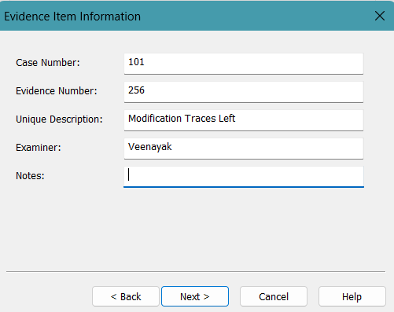

Objective : Perform Forencic Analysis on Files Created in Windows system and Identify the Traces left behind later 
-------------------------------------------------------------------------
1. File Creation
2. File Extension Modification + Move (one.txt)
3. Normal Deletion    (two txt)
4. Shift Deletion     (three txt)
5. File Movement      just move 
-------------------------------------------------------------------------
Evidence Item Infoemation 


----------------------------------------------------------------------


----------------------------------------------------------------------------------------------
Activities Performed 

Activity 1 – Change Extension
Rename: one.txt to one.py
Analysis on Change of Extension  


Activity 2 – Normal Delete
Delete: two.txt using Delete key. It goes to: Recycle Bin
Expected Artifact:
$Recycle.Bin


Activity 3 – Shift Delete
Delete: three.txt
using: Shift + Delete
Expected Artifact: No Recycle Bin Entry File recoverable from MFT / Unallocated Space

Activity 4 – Move File
Move: four.txt from: C:\ForensicsLab\ to C:\ForensicsLab\Moved\

Expected Artifact:
MFT record updated
Recent file references remain
-----------------------------------------------------------------------------------------------
Step 4: Create Forensic Image

After ALL activities are complete: create Disk Image using Ftk Image 
FTK Generates MD5 and SHA1 as Shown Below 

Hash Calculation(Data Integrity)

---------------------------------------------------------------------------------------------

# Analyze Image
```
Analysis of One.txt and four.txt 
```
Analysis of One.txt and four.txt 


Snapshot 1 shows when the they are created and modified 
According to Snapshot four.txt is is being moved form CyberFlabs to CF2
and one.txt doesnt exist just a broken link but we can see its extension is being changed from .txt to .py and it is moved form CyberFlabs to CF2 can be seen in below snapshoot \


---------------------------------------------------------

```
Analysis of two.txt i.e Normal delete 
```
As Two.txt is deleted normally without deleting from Recycling we can see the file still existed as shown in below snapshoot with modified and created timestamp ,  


------------------------------------------------------------------------
Analysis of three.txt shift delete  

as the file is shift deleted there are ni traces in orphan , unallocated  and recent  
-----------------------------------------------------------------------
The investigation successfully identified
multiple file system activities including
extension modification, normal deletion,
permanent deletion, and file relocation.

Forensic artifacts recovered from the image
validated each user action. Hash verification
confirmed evidence integrity, demonstrating
the effectiveness of FTK Imager in forensic
acquisition and analysis.