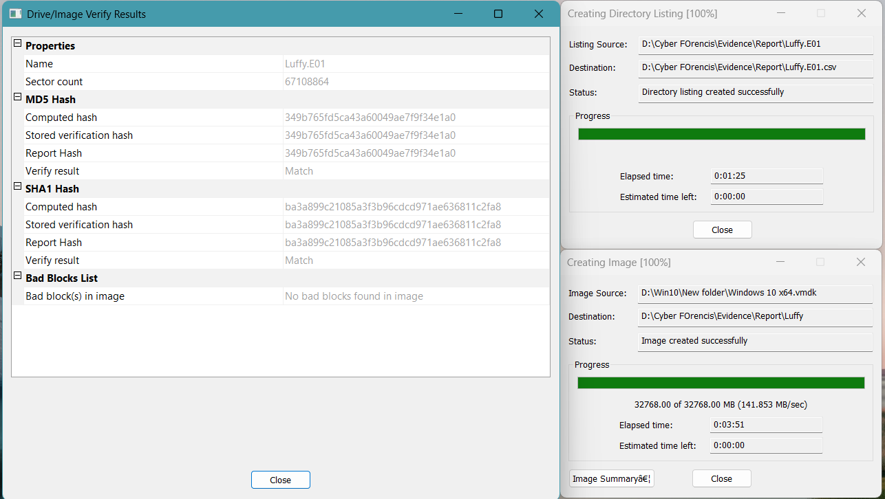
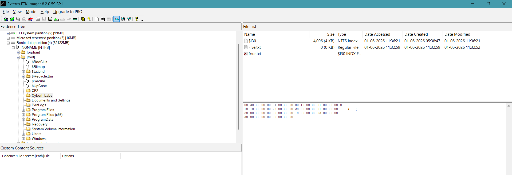
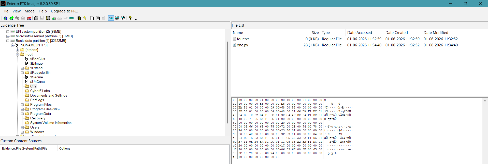
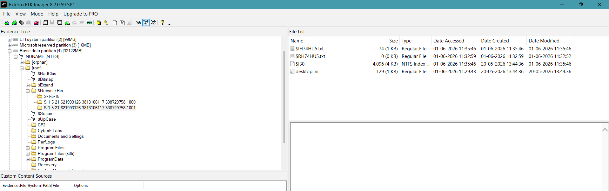

# Digital Forensic Analysis of File System Activities in Windows Using FTK Imager

## Objective

To perform forensic analysis of files created on a Windows system and identify the digital traces left behind after various file system operations including file extension modification, file movement, normal deletion, and permanent deletion.

---

# Scope of Investigation

The following activities were performed on a Windows system:

1. File Creation
2. File Extension Modification and File Movement (`one.txt`)
3. Normal Deletion (`two.txt`)
4. Permanent Deletion using Shift + Delete (`three.txt`)
5. File Movement (`four.txt`)

After completing all activities, a forensic image of the system was acquired using FTK Imager and analyzed to identify the artifacts generated by each action.

---

# Evidence Information

**Evidence Type:** Windows File System Image

**Acquisition Tool:** FTK Imager

**Image Format:** E01

**Verification Method:** MD5 and SHA1 Hash Validation

### Evidence Details

> Insert Screensho wjdd---

# Activities Performed

## Activity 1 – File Extension Modification

The file `one.txt` was renamed to:

```text
one.py
```

This activity simulates an attempt to disguise the original file type by modifying its extension.

### Expected Artifacts

* Modification timestamps
* Recent file references
* Shell link (.lnk) artifacts
* Evidence of file rename operation
* Updated MFT metadata

---

## Activity 2 – Normal Deletion

The file `two.txt` was deleted using the standard **Delete** key.

### Expected Behavior

The file should be moved to:

```text
$Recycle.Bin
```

### Expected Artifacts

* Recycle Bin records
* Original file metadata
* Creation and modification timestamps
* File recovery information

---

## Activity 3 – Permanent Deletion (Shift + Delete)

The file `three.txt` was deleted using:

```text
Shift + Delete
```

### Expected Behavior

The file bypasses the Recycle Bin and is removed directly from the file system.

### Expected Artifacts

* MFT entries
* Unallocated space remnants
* Orphan records (if present)
* Recoverable file fragments

---

## Activity 4 – File Movement

The file `four.txt` was moved from:

```text
C:\CyberFlabs\
```

to

```text
C:\CF2\
```

### Expected Artifacts

* Updated MFT records
* Recent file references
* Shell link artifacts
* Path modification information

---

# Forensic Acquisition

After performing all file system activities, a forensic image was acquired using FTK Imager.

The acquisition process was conducted after all modifications were completed to preserve the final state of the system for examination.

### Acquisition Procedure

1. FTK Imager was launched.
2. A disk image was created.
3. Evidence was saved in E01 format.
4. Image verification was enabled.
5. MD5 and SHA1 hashes were generated automatically.

---

# Hash Calculation (Data Integrity Verification)

FTK Imager generated cryptographic hash values during image acquisition to ensure evidence integrity.

### Generated Hashes

| Hash Type | Value              |
| --------- | ------------------ |
| MD5       | [Insert MD5 Hash]  |
| SHA1      | [Insert SHA1 Hash] |

> Insert Screenshot: Hash Verification




### Observation

The generated hash values can be used to verify that the evidence image has not been altered during acquisition, storage, or analysis.

---

# Forensic Analysis

## Analysis of one.py and four.txt

### Observation

Analysis of the forensic image revealed artifacts associated with both `one.py` and `four.txt`.

> Insert Screenshot: Analysis of one.py and four.txt




### Findings

The timestamps indicate when the files were originally created and subsequently modified.

The investigation revealed that:

* `four.txt` was moved from the original directory (`CyberFlabs`) to the destination directory (`CF2`).
* `one.txt` no longer exists under its original name.
* Artifacts indicate that the file extension was changed from `.txt` to `.py`.
* Evidence suggests that the renamed file was also moved from `CyberFlabs` to `CF2`.

Additional shell link and file system metadata confirm the movement and modification activities.

> Insert Screenshot Showing Movement and Extension Change



### Conclusion

The forensic artifacts successfully demonstrate both file extension modification and file movement operations.

---

## Analysis of two.txt (Normal Deletion)

### Observation

The file `two.txt` was deleted using the standard Delete operation.

> Insert Screenshot: Analysis of two.txt



### Findings

The file was located within Recycle Bin-related artifacts.

The forensic image preserved:

* Original file metadata
* Creation timestamp
* Modification timestamp
* Deletion information

Because the file was deleted normally, it remained recoverable through Recycle Bin records.

### Conclusion

The presence of Recycle Bin artifacts confirms that `two.txt` was deleted using a standard deletion operation rather than a permanent deletion method.

---

## Analysis of three.txt (Permanent Deletion)

### Observation

The file `three.txt` was deleted using Shift + Delete.

### Findings

During examination:

* No Recycle Bin entry was identified.
* No recent file references were recovered.
* No relevant orphan records were identified.
* No recoverable fragments were observed in the analyzed image.

The absence of Recycle Bin artifacts is consistent with permanent deletion behavior.

### Conclusion

The available forensic evidence suggests that `three.txt` was permanently deleted. No recoverable traces were identified within the scope of this analysis.

**Note:** The absence of artifacts does not conclusively prove secure deletion. Additional analysis using advanced recovery tools and examination of unallocated space may yield further results.

---

# Summary of Findings

| File      | Action Performed            | Artifact Identified                | Result               |
| --------- | --------------------------- | ---------------------------------- | -------------------- |
| one.txt   | Extension changed to one.py | Metadata and movement artifacts    | Identified           |
| two.txt   | Normal deletion             | Recycle Bin artifacts              | Identified           |
| three.txt | Shift + Delete              | No significant artifacts recovered | Partially Identified |
| four.txt  | File movement               | Path and metadata changes          | Identified           |

---

# Conclusion

This forensic investigation successfully examined multiple file system activities performed on a Windows system, including file extension modification, standard deletion, permanent deletion, and file relocation.

Analysis of the acquired forensic image revealed artifacts that validated the performed user actions. Metadata records, file movement traces, and Recycle Bin artifacts provided valuable evidence regarding file activity.

The investigation also demonstrated the importance of forensic imaging and hash verification in maintaining evidence integrity. The matching cryptographic hashes generated by FTK Imager confirm that the evidence remained unaltered throughout the acquisition and analysis process.

Overall, the exercise highlights the effectiveness of FTK Imager as a forensic acquisition and analysis tool for investigating Windows file system activities and recovering relevant digital evidence.

**"No relevant artifacts associated with `three.txt` were identified during the scope of this examination. Further analysis using specialized recovery techniques and deeper examination of unallocated space may be required."**


