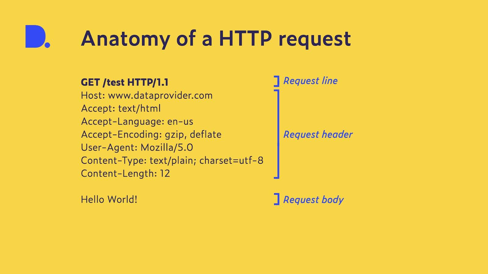
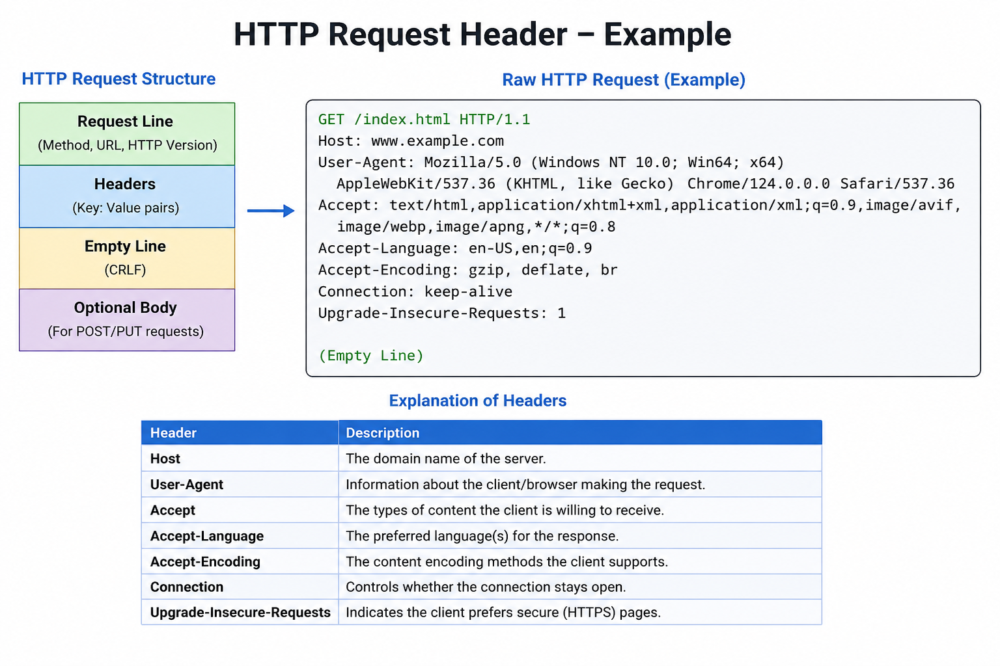
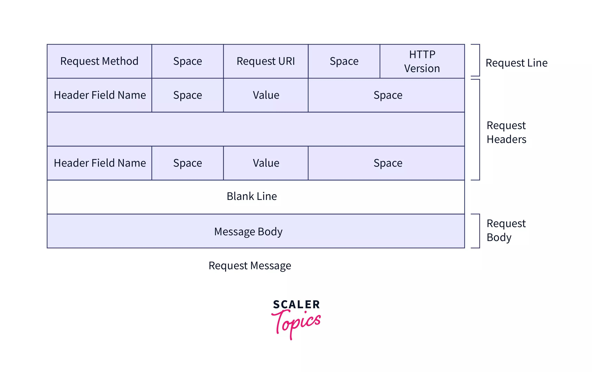

# HTTP Status Codes

HTTP status codes are returned by web servers to indicate request results.

---

# Status Code Categories

| Range | Meaning       |
| ----- | ------------- |
| 1xx   | Informational |
| 2xx   | Success       |
| 3xx   | Redirection   |
| 4xx   | Client Error  |
| 5xx   | Server Error  |

---

# 1xx — Informational Responses

| Code | Meaning             | Description                |
| ---- | ------------------- | -------------------------- |
| 100  | Continue            | Request received, continue |
| 101  | Switching Protocols | Protocol switch accepted   |
| 102  | Processing          | Server processing request  |
| 103  | Early Hints         | Preload resources          |

---

# 2xx — Success Responses

| Code | Meaning                       | Description                  |
| ---- | ----------------------------- | ---------------------------- |
| 200  | OK                            | Request successful           |
| 201  | Created                       | Resource created             |
| 202  | Accepted                      | Request accepted             |
| 203  | Non-Authoritative Information | Modified metadata            |
| 204  | No Content                    | Success, no response body    |
| 205  | Reset Content                 | Reset document view          |
| 206  | Partial Content               | Partial response             |
| 207  | Multi-Status                  | Multiple resource statuses   |
| 208  | Already Reported              | DAV binding already reported |
| 226  | IM Used                       | Instance manipulation        |

---

# 3xx — Redirection Responses

| Code | Meaning            | Description               |
| ---- | ------------------ | ------------------------- |
| 300  | Multiple Choices   | Multiple response options |
| 301  | Moved Permanently  | Permanent redirect        |
| 302  | Found              | Temporary redirect        |
| 303  | See Other          | Redirect using GET        |
| 304  | Not Modified       | Cached version valid      |
| 305  | Use Proxy          | Deprecated proxy usage    |
| 307  | Temporary Redirect | Temporary redirect        |
| 308  | Permanent Redirect | Permanent redirect        |

---

# 4xx — Client Error Responses

| Code | Meaning                         | Description                         |
| ---- | ------------------------------- | ----------------------------------- |
| 400  | Bad Request                     | Invalid request                     |
| 401  | Unauthorized                    | Authentication required             |
| 402  | Payment Required                | Reserved for future                 |
| 403  | Forbidden                       | Access denied                       |
| 404  | Not Found                       | Resource not found                  |
| 405  | Method Not Allowed              | HTTP method blocked                 |
| 406  | Not Acceptable                  | Cannot generate acceptable response |
| 407  | Proxy Authentication Required   | Proxy auth needed                   |
| 408  | Request Timeout                 | Client took too long                |
| 409  | Conflict                        | Request conflict                    |
| 410  | Gone                            | Resource permanently removed        |
| 411  | Length Required                 | Content-Length missing              |
| 412  | Precondition Failed             | Preconditions failed                |
| 413  | Payload Too Large               | Request body too large              |
| 414  | URI Too Long                    | URL too long                        |
| 415  | Unsupported Media Type          | Unsupported file/content type       |
| 416  | Range Not Satisfiable           | Invalid range request               |
| 417  | Expectation Failed              | Expect header failed                |
| 418  | I'm a teapot                    | Joke RFC status                     |
| 421  | Misdirected Request             | Wrong server                        |
| 422  | Unprocessable Entity            | Semantic error                      |
| 423  | Locked                          | Resource locked                     |
| 424  | Failed Dependency               | Dependency failure                  |
| 425  | Too Early                       | Retry later                         |
| 426  | Upgrade Required                | Protocol upgrade needed             |
| 428  | Precondition Required           | Preconditions required              |
                 |
| 431  | Request Header Fields Too Large | Headers too large                   |
| 451  | Unavailable For Legal Reasons   | Blocked legally                     |

---

# 5xx — Server Error Responses

| Code | Meaning                         | Description               |
| ---- | ------------------------------- | ------------------------- |
| 500  | Internal Server Error           | Generic server error      |
| 501  | Not Implemented                 | Feature not supported     |
| 502  | Bad Gateway                     | Invalid upstream response |
| 503  | Service Unavailable             | Server overloaded/down    |
| 504  | Gateway Timeout                 | Upstream timeout          |
| 505  | HTTP Version Not Supported      | Unsupported HTTP version  |
| 506  | Variant Also Negotiates         | Config error              |
| 507  | Insufficient Storage            | Server storage issue      |
| 508  | Loop Detected                   | Infinite loop detected    |
| 510  | Not Extended                    | Extensions required       |
| 511  | Network Authentication Required | Network login required    |

---

# Most Important Status Codes

| Code | Common Meaning      |
| ---- | ------------------- |
| 200  | Success             |
| 201  | Resource created    |
| 301  | Permanent redirect  |
| 302  | Temporary redirect  |
| 400  | Bad request         |
| 401  | Login required      |
| 403  | Forbidden           |
| 404  | Page not found      |
| 500  | Server crash/error  |
| 502  | Bad gateway         |
| 503  | Service unavailable |

---

# Easy Memory Trick

| Category | Remember       |
| -------- | -------------- |
| 1xx      | Info           |
| 2xx      | Success        |
| 3xx      | Redirect       |
| 4xx      | Client mistake |
| 5xx      | Server problem |

---

# Example

```http id="http001"
GET /index.html HTTP/1.1
```

Server Response:

```http id="http002"
HTTP/1.1 200 OK
```

Meaning:

```text id="http003"
Request successful
```


# HTTP REQUEST HEADER





| Request Header               | Response Header       |
| ---------------------------- | --------------------- |
| Sent by client/browser       | Sent by server        |
| Contains browser/client info | Contains server info  |
| Example: `User-Agent`        | Example: `Server`     |
| Example: `Cookie`            | Example: `Set-Cookie` |


# HTTP REQUEST HEADER