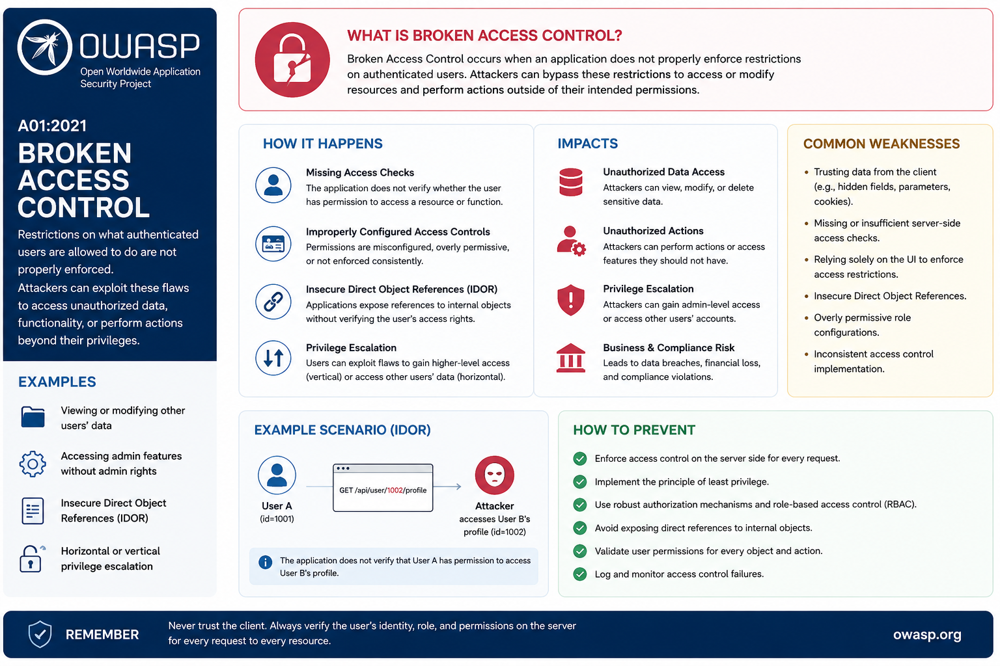
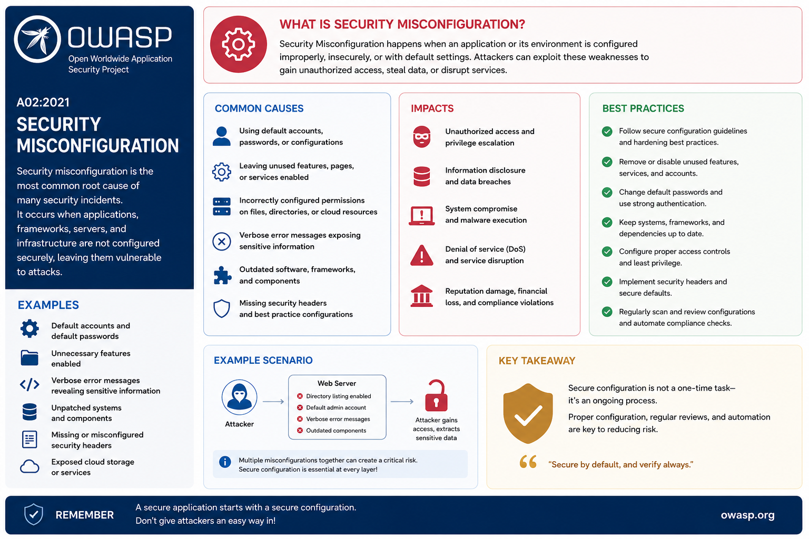

# OWASP Top 10 – 2021 Notes

## What is OWASP?

**OWASP (Open Web Application Security Project)**

OWASP is a non-profit organization dedicated to improving software security. The OWASP community helps organizations develop secure applications by providing tools, resources, and best practices.

One of OWASP’s most well-known resources is the **Top 10**, which is a list of the top 10 application vulnerabilities. This list provides details on the risks, potential impact, and recommended countermeasures for each vulnerability. The Top 10 list is updated approximately every 3–4 years to reflect the evolving security landscape.

### OWASP Top 10

The **OWASP Top 10** is a list of the most critical web application security risks.

### Purpose

* Improve application security awareness
* Help developers write secure code
* Guide penetration testers and security teams
* Reduce common vulnerabilities

---


# OWASP Top 10 – 2021 List ==> refereshed after 3-4  year
| Rank | 2021 OWASP Top 10                          | Example                                      
| ---- | ------------------------------------------ | -------------------------------------------- 
| A01  | Broken Access Control                      | User can access admin pages                  
| A02  | Cryptographic Failures                     | Weak hash like MD5                           
| A03  | Injection                                  | SQL, LDAP, command-line injection            
| A04  | Insecure Design                            | No integrity validation, missing checksum    
| A05  | Security Misconfiguration                  | Default passwords, exposed admin pages (CVE) 
| A06  | Vulnerable and Outdated Components         | Outdated OS, kernel, third-party libraries   
| A07  | Identification and Authentication Failures | Weak passwords, no MFA                       
| A08  | Software and Data Integrity Failures       | Tampered software, unverified updates        
| A09  | Security Logging and Monitoring Failures   | No logs during attack                        
| A10  | Server-Side Request Forgery (SSRF)         | Server fetches unvalidated URL               


A01 : Broken Access Control ==> 
What is is The app for


### Key Changes in OWASP Top 10 2025

| Rank | 2025 Category                             | 2021 Equivalent                            | Key Change                                                                                                                                  |
| ---- | ----------------------------------------- | ------------------------------------------ | ------------------------------------------------------------------------------------------------------------------------------------------- |
| A01  | **Broken Access Control**                 | Broken Access Control                      | Now includes **Server-Side Request Forgery (SSRF)**, which was a separate category in 2021.                                                 |
| A02  | **Security Misconfiguration**             | Security Misconfiguration                  | Surged from **#5 to #2**, reflecting its growing prevalence.                                                                                |
| A03  | **Software Supply Chain Failures**        | *New*                                      | Replaces **Vulnerable and Outdated Components**; now covers the **entire software supply chain**, including build systems and distribution. |
| A04  | **Cryptographic Failures**                | Cryptographic Failures                     | Dropped from **#2 to #4**.                                                                                                                  |
| A05  | **Injection**                             | Injection                                  | Dropped from **#3 to #5**.                                                                                                                  |
| A06  | **Insecure Design**                       | Insecure Design                            | Moved from **#4 to #6**.                                                                                                                    |
| A07  | **Authentication Failures**               | Identification and Authentication Failures | Name slightly updated; remains at **#7**.                                                                                                   |
| A08  | **Software or Data Integrity Failures**   | Software or Data Integrity Failures        | Unchanged in rank.                                                                                                                          |
| A09  | **Security Logging & Alerting Failures**  | Security Logging and Monitoring Failures   | Name updated; remains at **#9**.                                                                                                            |
| A10  | **Mishandling of Exceptional Conditions** | *New*                                      | Focuses on **error handling, graceful degradation, and system resilience**.                                                                 |--

s}
::search[OWASP Top 10 2025 vs 20

---

# A01: Broken Access Control

## Definition

Occurs when users can access resources or perform actions beyond their permissions.



## Examples

* Accessing another user’s account
* Changing URL IDs
* Viewing admin pages without authorization

## Common Attacks

* Privilege escalation
* IDOR (Insecure Direct Object Reference)
* Force browsing

## Prevention

* Implement role-based access control (RBAC)
* Deny access by default
* Use least privilege principle
* Validate permissions server-side

## Example

```url
https://site.com/account?id=1001
```

Changing ID to another user's ID gives unauthorized access.

---

# A02: Cryptographic Failures

## Definition

Failure to protect sensitive data using proper encryption.

## Sensitive Data

* Passwords
* Credit card numbers
* Personal information

## Causes

* Weak encryption
* Using HTTP instead of HTTPS
* Plaintext password storage

## Prevention

* Use HTTPS/TLS
* Use strong encryption algorithms
* Hash passwords using bcrypt/Argon2
* Encrypt sensitive data at rest and in transit

## Example

Storing passwords like:

```text
password123
```

instead of hashed passwords.

---

# A03: Injection

## Definition

Occurs when untrusted data is sent to an interpreter as commands or queries.

## Types

* SQL Injection
* Command Injection
* LDAP Injection
* NoSQL Injection

## SQL Injection Example

```sql
SELECT * FROM users WHERE username='admin' AND password='123';
```

Malicious input:

```sql
' OR '1'='1
```

## Prevention

* Prepared statements
* Parameterized queries
* Input validation
* ORM frameworks

## Impacts

* Database theft
* Authentication bypass
* Remote code execution

---

# A04: Insecure Design

## Definition

Security weaknesses due to poor application design.

## Causes

* Missing threat modeling
* No security architecture
* Insecure workflows

## Examples

* No rate limiting
* Weak password recovery system
* Insecure business logic

## Prevention

* Secure SDLC
* Threat modeling
* Security-by-design principles
* Use secure design patterns

---

# A05: Security Misconfiguration

## Definition

Improperly configured security settings.

## Examples

* Default passwords
* Open cloud storage
* Directory listing enabled
* Unnecessary services running

## Causes

* Incomplete configurations
* Misconfigured HTTP headers
* Debug mode enabled

## Prevention

* Disable unused features
* Regular security hardening
* Use automated configuration management
* Secure cloud configurations

## Example

```text
admin/admin
```

default credentials left unchanged.

---

# A06: Vulnerable and Outdated Components

## Definition

Using software components with known vulnerabilities.

## Examples

* Old libraries
* Unsupported frameworks
* Outdated plugins

## Risks

* Remote code execution
* System compromise
* Data theft

## Prevention

* Regular updates
* Vulnerability scanning
* Remove unused dependencies
* Use trusted sources

## Tools

* Dependency-Check
* Snyk
* npm audit

---

# A07: Identification and Authentication Failures

## Definition

Weak authentication mechanisms allowing attackers to compromise accounts.

## Examples

* Weak passwords
* Session hijacking
* Credential stuffing

## Causes

* No MFA
* Predictable session IDs
* Improper session timeout

## Prevention

* Multi-factor authentication (MFA)
* Strong password policy
* Secure session management
* Account lockout mechanisms

---

# A08: Software and Data Integrity Failures

## Definition

Failures related to software updates, CI/CD pipelines, and code integrity.

## Examples

* Malicious software updates
* Insecure deserialization
* Compromised CI/CD pipeline

## Prevention

* Verify digital signatures
* Use trusted repositories
* Secure CI/CD pipelines
* Integrity checks

## Example

Downloading software from untrusted sources.

---

# A09: Security Logging and Monitoring Failures

## Definition

Insufficient logging and monitoring that delays attack detection.

## Problems

* No audit logs
* Missing alerts
* Poor incident response

## Risks

* Undetected breaches
* Delayed recovery
* Difficulty in forensic analysis

## Prevention

* Centralized logging
* Real-time monitoring
* SIEM solutions
* Incident response plans

## Tools

* Splunk
* ELK Stack
* Wazuh

---

# A10: Server-Side Request Forgery (SSRF)

## Definition

Occurs when a server fetches remote resources without validating user input.

## Example

Application fetches URL provided by attacker:

```text
http://localhost/admin
```

## Risks

* Access internal systems
* Cloud metadata theft
* Network scanning

## Prevention

* Allowlist URLs/domains
* Disable unnecessary outbound requests
* Network segmentation
* Validate and sanitize URLs

---




# Important Terms

| Term          | Meaning                        |
| ------------- | ------------------------------ |
| Vulnerability | Weakness in a system           |
| Exploit       | Method to attack vulnerability |
| Threat        | Potential danger               |
| Risk          | Chance of damage               |
| Patch         | Security fix                   |
| Payload       | Malicious code/data            |

---

# OWASP Secure Coding Best Practices

## Input Validation

* Validate all user input
* Reject invalid characters

## Authentication

* Use MFA
* Strong passwords

## Session Management

* Secure cookies
* Timeout inactive sessions

## Error Handling

* Avoid detailed error messages

## Logging

* Monitor suspicious activities

## Secure Configuration

* Disable default accounts
* Remove unnecessary services

---

# OWASP Testing Methods

| Method                 | Purpose                     |
| ---------------------- | --------------------------- |
| SAST                   | Static code analysis        |
| DAST                   | Dynamic application testing |
| Pen Testing            | Simulated attacks           |
| Vulnerability Scanning | Detect weaknesses           |

---

# Difference Between 2017 and 2021 OWASP

| 2017                    | 2021                                       |
| ----------------------- | ------------------------------------------ |
| Sensitive Data Exposure | Cryptographic Failures                     |
| Broken Authentication   | Identification and Authentication Failures |
| XXE                     | Merged into Security Misconfiguration      |
| New Category            | Insecure Design                            |
| New Category            | Software and Data Integrity Failures       |
| New Category            | SSRF                                       |

---

# Interview Questions and Answers

## 1. What is OWASP?

OWASP is a non-profit organization focused on web application security.

## 2. What is the OWASP Top 10?

A list of the top 10 critical web application security risks.

## 3. What is SQL Injection?

An attack where malicious SQL code is injected into queries.

## 4. What is Broken Access Control?

Users gaining unauthorized access to resources.

## 5. What is MFA?

Multi-Factor Authentication adds extra verification beyond passwords.

## 6. What is SSRF?

An attacker tricks the server into making unauthorized requests.

## 7. What is Security Misconfiguration?

Improper security settings that expose vulnerabilities.

## 8. Difference between Authentication and Authorization?

* Authentication → Verifies identity
* Authorization → Verifies permissions

---

# Important MCQs

## 1.

Which OWASP vulnerability is most related to SQL Injection?

A. Broken Access Control
B. Injection
C. SSRF
D. Cryptographic Failure

✅ Answer: B

---

## 2.

Which attack accesses unauthorized resources?

A. SSRF
B. Broken Access Control
C. XSS
D. CSRF

✅ Answer: B

---

## 3.

HTTPS mainly protects against:

A. Injection
B. Data theft
C. Buffer overflow
D. Brute force

✅ Answer: B

---

## 4.

Which vulnerability involves outdated libraries?

A. A06
B. A03
C. A08
D. A10

✅ Answer: A

---

## 5.

Which OWASP category includes weak passwords?

A. Security Misconfiguration
B. Injection
C. Identification and Authentication Failures
D. SSRF

✅ Answer: C

---

# One-Liner Revision Points

* OWASP = Open Worldwide Application Security Project
* A01 is Broken Access Control
* SQL Injection belongs to A03 Injection
* HTTPS prevents data exposure
* MFA improves authentication security
* SSRF targets internal server resources
* Least privilege reduces attack impact
* Security Misconfiguration is very common
* Logging helps detect attacks
* Vulnerable libraries can compromise systems

---

# Exam Tips

## Remember Order Using Shortcut

```text
BAC CID VISA SIS
```

Expanded:

* Broken Access Control
* Authentication failures
* Cryptographic failures
* Injection
* Design flaws
* Vulnerable components
* Integrity failures
* Security logging failures
* SSRF

---

# Real-World Examples

| Vulnerability         | Example                          |
| --------------------- | -------------------------------- |
| Broken Access Control | Accessing another user’s profile |
| Injection             | SQL Injection login bypass       |
| Misconfiguration      | Open database server             |
| SSRF                  | Accessing AWS metadata           |
| Vulnerable Components | Using old Log4j                  |

---

# Important Tools Used in OWASP Security

| Tool       | Purpose                |
| ---------- | ---------------------- |
| Burp Suite | Web security testing   |
| OWASP ZAP  | Vulnerability scanning |
| Nikto      | Web server scanning    |
| Nmap       | Network scanning       |
| Metasploit | Exploitation framework |

---

# Final Important Points

## Most Dangerous Vulnerabilities

* Broken Access Control
* Injection
* Authentication Failures

## Best Defenses

* Input validation
* Least privilege
* Encryption
* MFA
* Secure coding
* Regular updates

## Frequently Asked Exam Topics

* SQL Injection
* Authentication vs Authorization
* SSRF
* Security Misconfiguration
* Cryptographic Failures
* OWASP Tools
* Secure coding practices
