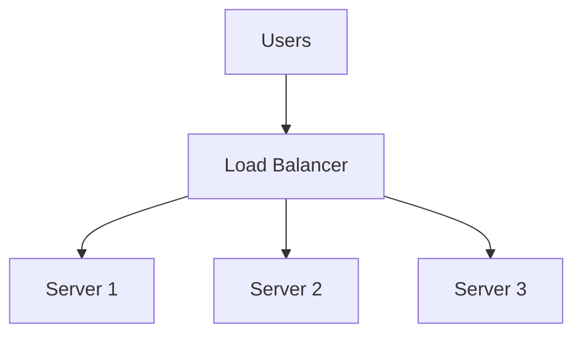
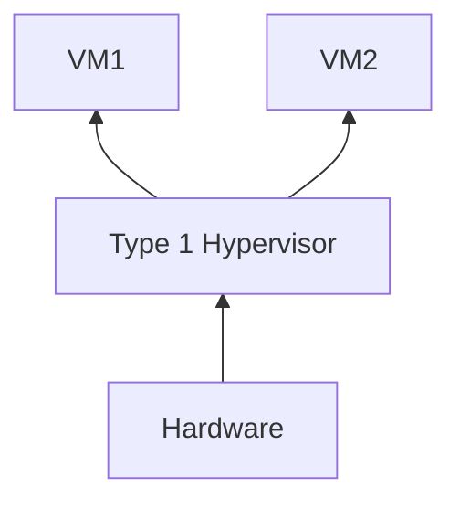
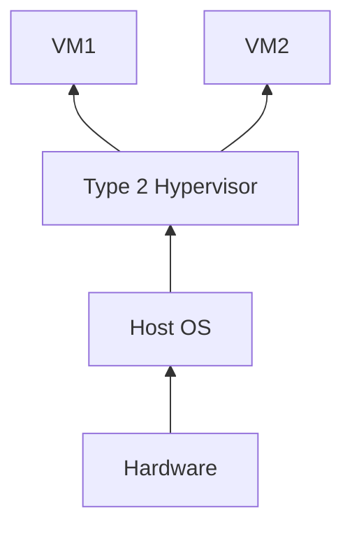
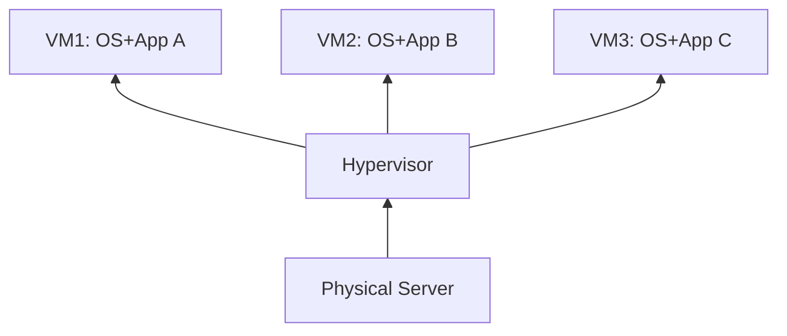
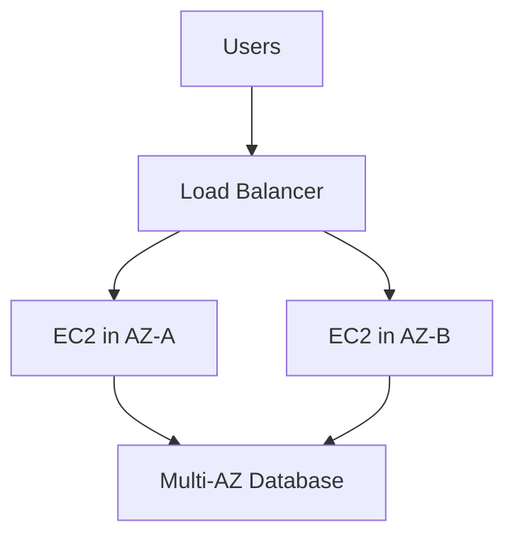

# Cloud Computing Module — Deployment, Scaling, Virtualization, Service Models & AWS EC2
### Exam + Interview Ready Notes

---

## SECTION 0: CLOUD COMPUTING BASICS

### What is Cloud Computing?
Delivery of computing resources — **servers, storage, databases, networking, software, analytics** — **over the internet** ("the cloud") instead of on local computers or data centres.

Instead of buying/maintaining physical hardware, users **rent and scale resources on demand** from a cloud provider (AWS, Azure, GCP).

### 5 Core Characteristics (VERY frequently asked — memorize)

| Characteristic | Meaning | Example |
|---|---|---|
| **On-demand self-service** | Provision resources whenever needed, no human interaction with provider | Launch a VM on AWS with a few clicks, anytime |
| **Broad network access** | Services accessible from anywhere via internet | Access app from laptop, phone, tablet |
| **Resource pooling** | Compute/storage/network resources shared among many users (multi-tenancy) | Multiple customers share the same physical servers |
| **Scalability & elasticity** | Resources scale up/down automatically as workload changes | Auto-add servers during high traffic |
| **Pay-as-you-go pricing** | Pay only for what you use | Monthly cloud bill based on usage |

**Memory trick (NIST 5 Characteristics):** **"O-B-R-S-P"** → **O**n-demand, **B**road access, **R**esource pooling, **S**calability/elasticity, **P**ay-as-you-go.

---

### On-Premises vs On-Demand (Cloud) — Cost & Scaling Example

**Scenario:** Website traffic (users) grows over 5 years; each server handles 100 users.

#### On-Premises Deployment (Buy Servers Upfront)

| Year | Users | Servers Needed (users ÷ 100) |
|---|---|---|
| 1st | 2,000 | 20 |
| 2nd | 2,000 | 20 |
| 3rd | 3,000 | 30 |
| 4th | 3,000 | 30 |
| 5th | 500 | 5 (but you already **own** 30 servers — wasted capacity) |

- Must **buy for peak capacity in advance** (e.g., provisioned for 30 servers even in low-demand years)
- **CapEx** = huge upfront cost to buy servers (e.g., ₹5L one-time)
- **OpEx** ≈ ongoing maintenance cost (e.g., ₹14L/year in this scenario)
- Even when demand **drops** (Year 5: only 500 users need 5 servers), you're stuck maintaining/paying for the 30 servers you bought → **wasted resources & cost**

#### On-Demand (Cloud) Deployment — Pay Only for What's Used

Assume: 1 Virtual Machine (VM) = ₹12,000/year, 1 server load = 100 users.

| Year | Users | Servers/VMs Needed | Cost (₹12K × servers) |
|---|---|---|---|
| 1st | 2,000 | 20 | ₹12K × 20 = ₹2.4L |
| 2nd | 2,000 | 20 | ₹12K × 20 = ₹2.4L |
| 3rd | 3,000 | 30 | ₹12K × 30 = ₹3.6L |
| 4th | 3,000 | 30 | ₹12K × 30 = ₹3.6L |
| 5th | 500 | 5 | ₹12K × 5 = ₹60K |

- **CapEx = ₹0** (no hardware purchase)
- **OpEx** = pay only for VMs actually used each year → total ≈ ₹12.6L over 5 years (scales DOWN in low-demand years, unlike on-prem)
- **Total cost is lower and more efficient** than on-prem because you're not paying to maintain unused servers when demand drops.

> ⚠️ **Key exam takeaway:** On-premises = pay for **peak capacity always**, even when demand falls (wasteful). On-demand/Cloud = pay **only for what's actually used** each period — this is the core financial argument for cloud elasticity.

---

### What is a Data Centre?
A facility housing a **large number of computer servers and related IT infrastructure** (storage, networking, cooling, power) used to **store, process, and distribute data and applications**.

> Think of it as the **"factory"** where all computing power and data of an organization/cloud provider lives. It is the **physical infrastructure backbone of the cloud** — cloud providers run their **hypervisors** on top of data centre hardware.

### Components of a Data Centre

| Component | Purpose |
|---|---|
| **Servers** | Main computing machines — run apps, store data |
| **Storage Systems** | Databases, file servers, storage arrays |
| **Networking Equipment** | Routers, switches, firewalls — connectivity & security |
| **Power Supply** | Backup generators, UPS — 24/7 operation |
| **Cooling Systems** | AC, liquid cooling — prevent overheating |
| **Security Systems** | Physical (guards, cameras, biometric) + Cybersecurity |
| **Monitoring Systems** | Track server health, performance, energy usage |

**Memory trick:** **"S-S-N-P-C-S-M"** → Servers, Storage, Networking, Power, Cooling, Security, Monitoring.

### Types of Data Centres

| Type | Description |
|---|---|
| **Enterprise Data Centre** | Owned & operated by a single organization for its own use (like a **private cloud**) |
| **Colocation (Colo)** | Companies **rent space, power, cooling** in a third-party facility (they bring their own servers) |
| **Cloud Data Centre** | Operated by cloud providers (AWS, Azure, GCP) to deliver cloud services |
| **Edge Data Centre** | Smaller facilities located **closer to users** to reduce latency (similar concept to Edge Locations) |

---

### Key Terminologies (High-Yield Definitions)

| Term | Definition | Example |
|---|---|---|
| **Scalability** | Ability of a system to **handle increasing workload by adding resources** (vertical = bigger machine, horizontal = more machines) | E-commerce site adds more servers during a festive sale |
| **Elasticity** | Ability of a system to **automatically scale resources up or down in real time** as needed | Ride-sharing app auto-adds compute during rush hour, releases it after |
| **Availability** | Degree to which a system is **operational & accessible when needed**, usually expressed as % uptime | "99.9% availability" — cloud provider guarantees app stays online almost always |
| **On-Demand Service** | Cloud feature letting users **provision/use resources instantly**, without human interaction with the provider | Launching a new VM on AWS in a few clicks, anytime |

> ⚠️ **Exam trap — Scalability vs Elasticity (frequently confused, very important):**
> - **Scalability** = the **capacity/ability to grow** (can be manual or planned; may or may not be automatic)
> - **Elasticity** = **dynamic, automatic** adjustment (scale up AND down, in real time, based on demand)
> - **Memory trick:** "Scalability = CAN grow. Elasticity = grows and shrinks AUTOMATICALLY, like a rubber band."

---

## SECTION 1: DEPLOYMENT & ENVIRONMENTS

### What is Deployment?
Making an application available to run in a specific environment.
```
Dev → Test → Deploy to Production (end users)
```

### Types of Deployment — Quick Compare

| Feature | Physical (Traditional) | Virtual Machine | Container |
|---|---|---|---|
| OS | One OS | Separate OS per VM | Shares host kernel |
| Resource usage | High | Medium–High | Low |
| Startup time | Slow | Minutes | Seconds |
| Isolation | Physical | Strong (OS-level) | Process-level |
| Portability | Low | Medium | High |
| Scaling | Difficult | Moderate | Easy |

**Memory trick:** Physical = heaviest & slowest, Container = lightest & fastest, VM = middle ground.

> ⚠️ **Exam trap:** Traditional deployment is NOT obsolete — banks, govt, defence still use it for control/security.

**Layers:**
- **Traditional**: Physical Server → OS → App1, App2, libraries
- **Virtualized**: Physical Server → Hypervisor → VM1/VM2/VM3 (each own OS)
- **Container**: Physical/Virtual Server → Container Engine → Containers (share host kernel)

Tools: Docker, Podman, Kubernetes (orchestration).

---

### Application Environments (Pipeline)
```
Development → Testing → Staging/Pre-production → Production
```

| Environment | Purpose | Notes |
|---|---|---|
| **Development** | Devs build/modify app | Frequent changes/errors normal |
| **Testing** | QA tests app | Functional + Non-functional testing |
| **Staging/Pre-prod** | Final testing, UAT, near-identical to prod | Uses **test data**, not real data |
| **Production** | Live app for real users | Needs HA, security, backups, monitoring, DR |

**Testing types:**

| Type | Question it answers |
|---|---|
| Functional Testing | Does the feature **work correctly**? (login, register, order) |
| Non-functional Testing | **How well** does it work? (performance, load, stress, security, usability) |

---

### High Availability (HA) & Cluster
- **HA** = app stays accessible even if a server fails.
```
Users → Load Balancer → App Server 1
                      → App Server 2
                             ↓
                      Database Cluster
```
- **Cluster** = group of nodes working together → HA + load distribution + fault tolerance + easy scaling.

---

### Traditional Deployment — Step-by-Step
1. Buy Hardware (servers, storage, routers, switches, firewalls)
2. Set up Data Centre (racks, power, cooling, physical security)
3. Install OS & Software
4. Configure Network (IP, DNS, routing, firewall, LB)
5. Deploy Application
6. Ongoing Maintenance (patches, backups, monitoring)

**Infrastructure** = all resources needed to run an app (servers, storage, network, OS, DB, LB, firewalls, monitoring, power/cooling).

---

### CapEx vs OpEx

| CapEx (Capital Expenditure) | OpEx (Operational Expenditure) |
|---|---|
| Large **upfront** cost | **Recurring** cost |
| Buying assets (servers, data centre) | Paying to operate (electricity, salaries, cloud bill) |
| High in traditional deployment | Common in cloud |
| Eg: Buy server ₹5,00,000 | Eg: Pay ₹10,000/month cloud |

**Viva one-liner:** CapEx = "buy it once", OpEx = "pay as you go."

---

### Limitations of Traditional Deployment
1. **No elasticity** — scaling takes days/weeks (buy → wait → install → configure → deploy)
2. **High upfront cost**
3. **Slow deployment**
4. **Risky failure handling** — single server failure can stop everything
5. **Limited innovation speed** — devs wait on infra team

---

## SECTION 2: SCALING

### What is Scaling?
Increasing/decreasing system resources (CPU, RAM, storage, network, #servers, DB capacity) based on traffic/workload.

**Example:** Site gets 1,000 users/day normally, 50,000 during sale → without scaling: slow, failed requests, crashes, lost business.

### Two Types

| Vertical Scaling | Horizontal Scaling |
|---|---|
| Increase **one machine's** power | Add **more machines** |
| Scale **up/down** | Scale **out/in** |
| Eg: 4GB RAM → 16GB RAM | Eg: 1 server → 4 servers |
| LB usually **not** required | LB usually **required** |
| Easier to implement | More complex |
| Has hardware limit | Supports large growth |

**Memory trick:** 
- Vertical = "UP/DOWN" (like a lift, one building gets taller)
- Horizontal = "OUT/IN" (like adding more buildings sideways)

---

### 1. Vertical Scaling
- **Scale up** = increase resources; **Scale down** = decrease resources
- Example: EC2 `t3.small → t3.large` (same server, more CPU/RAM)
- ⚠️ Adding servers/LB is **NOT** vertical scaling — that's horizontal.

**Advantages:** Simple, few/no app code changes, good for monolithic apps, easier maintenance, common first step for databases.

**Disadvantages:** Hardware limit (ceiling), possible downtime (instance stop/restart), single point of failure, not suited for massive growth, powerful machines can be expensive.

---

### 2. Horizontal Scaling
- **Scale out** = add servers; **Scale in** = remove servers

- **Kubernetes example:** `replicas: 3 → replicas: 6` via **HPA** (Horizontal Pod Autoscaler) based on CPU/memory/request rate/custom metrics.

**Advantages:** Supports large growth, high availability, minimal downtime, automatic scaling (AWS ASG, K8s HPA, Azure VMSS), better performance under load.

**Disadvantages:**
1. Complex architecture (multiple servers, LB, networking, service discovery, shared storage, health checks)
2. Needs more DevOps knowledge (auto-scaling, monitoring, CI/CD, IaC)
3. App must be **stateless** (sessions in Redis/shared DB/distributed cache, not local server)
4. Code changes needed (remove local session dependency, shared storage, concurrency handling)
5. Data consistency challenges (replication delay, conflicting updates, stale data)
6. More monitoring required (CPU, memory, response time, error rate, DB connections)
7. Cost increases with number of resources (but scale-in can reduce cost)

> ⚠️ **Exam trap:** "Horizontal scaling cost always increases exponentially" — **FALSE**. It increases with resource count; auto scale-in reduces cost when traffic drops.

---

### Vertical vs Horizontal — Worked Example
Starting: 4 CPU, 8GB RAM
- **Vertical:** 4 CPU/8GB → 16 CPU/32GB (same machine upgraded)
- **Horizontal:** 1 server → 4 servers (each still 4 CPU/8GB)

### Scaling Roles (Viva favorite)

| Role | Responsibility |
|---|---|
| Developer | Make app stateless, safe for multiple instances |
| DevOps Engineer | Configure servers, K8s, LB, auto-scaling |
| DB Administrator | Replication, performance, consistency |
| Network Engineer | Networking, routing, load distribution |
| Monitoring/SRE | Availability, performance, failures |

### Quick Revision Table

| Method | Increase | Decrease | Example |
|---|---|---|---|
| Vertical | Scale up | Scale down | RAM 8GB→16GB |
| Horizontal | Scale out | Scale in | Servers 2→5 |

---

## SECTION 3: VIRTUALIZATION

**Virtualization** = creating a virtual version of a physical resource (data, desktop, application, hardware/server, storage, network).

| Type | What's virtualized | Example |
|---|---|---|
| Data virtualization | Data from multiple sources | Unified dashboard |
| Desktop virtualization | Full desktop environment | VDI, RDS |
| Application virtualization | Individual application | MS RemoteApp |
| Hardware virtualization | Complete computer system | VMware ESXi VM |

---

### 1. Data Virtualization
Combines data from different sources → **one logical view**, without physically moving all data.

```
Application/Dashboard → Data Virtualization Layer → MySQL, PostgreSQL, REST API, Files
```

**4 key operations:**
1. **Abstraction** — hides location, DB type, format, auth method
2. **Transformation** — converts different date/data formats into one common format
3. **Federation** — combines query results from multiple sources (MySQL + PostgreSQL + API = unified report)
4. **Delivery** — via REST/GraphQL/SQL/Dashboards/JSON/XML

**Limitation:** Performance depends on original sources; if source is slow/down, virtualized query also suffers.

> ⚠️ Data virtualization does **NOT** permanently merge data into one DB — it's a logical combined view.

---

### 2. Desktop Virtualization
Separates user's desktop OS from physical device. Desktop runs on server/VM/cloud; user connects via **endpoint** (laptop, thin client, tablet).

#### Types:

| Type | Description | Pros | Cons |
|---|---|---|---|
| **VDI** (Virtual Desktop Infrastructure) | Each user → dedicated VM | Better isolation, high customization | More CPU/RAM/storage, more licences |
| **RDS** (Remote Desktop Services) | Multiple users share one server OS | Better resource use, cheaper | Less customization, one user's load affects others |
| **Client-side** | VM runs locally (VirtualBox/VMware Workstation) | Good for testing/labs | Needs local resources |
| **Cloud-based (DaaS)** | Desktop hosted & managed in cloud | Accessible anywhere, less infra | Internet dependent, subscription cost |

**VDI vs RDS memory trick:** VDI = "1 user 1 full VM" (dedicated), RDS = "many users share 1 OS" (session-based/shared hosted).

| Feature | VDI | RDS |
|---|---|---|
| Desktop | Dedicated VM | Shared server session |
| OS | Separate per user | Shared |
| Customization | High | Limited |
| Cost | Higher | Lower |

---

### 3. Application Virtualization
Packages/hosts app to run isolated **without full install** on user's OS.

| Type | How it works | Example |
|---|---|---|
| **Remote App** | App runs on remote server, only UI shown | MS RemoteApp, Citrix |
| **Streaming** | Components downloaded on demand | Reduces install time |
| **Encapsulation-based** | App + dependencies packaged together, isolated on local device | VMware ThinApp |

> Note: App virtualization still needs compatible CPU/OS — it's NOT fully hardware-independent.

**App vs Desktop Virtualization:**

| Application Virtualization | Desktop Virtualization |
|---|---|
| Virtualizes ONE app | Provides ENTIRE desktop |
| Fewer resources | More resources |
| Eg: RemoteApp | Eg: VDI |

---

### 4. Hardware Virtualization
Creates **Virtual Machines (VMs)** on physical hardware via a **hypervisor** (VMM — Virtual Machine Monitor).

**VM contains:** vCPU, vRAM, vDisk, vNIC, Guest OS, libraries, apps.

**Hypervisor responsibilities:** create/delete VMs, allocate CPU/RAM, create virtual disk/network, isolate VMs, start/stop/pause, snapshots, manage hardware access.

#### Type 1 vs Type 2 Hypervisor (VERY IMPORTANT — frequently asked)

| Feature | Type 1 (Bare-metal) | Type 2 (Hosted) |
|---|---|---|
| Runs on | Physical hardware directly | Host OS |
| Performance | Higher | Lower |
| Usage | Production, data centres | Dev/testing, personal use |
| Examples | VMware ESXi, Hyper-V Server, Xen, KVM | VirtualBox, VMware Workstation, Fusion, Parallels |
| If host OS crashes | N/A (no host OS) | ALL VMs stop |




**Memory trick:** Type 1 = "1 layer between hardware & VM" (bare-metal, no host OS). Type 2 = "2 layers" (host OS + hypervisor app).

> ⚠️ Exam trap: Oracle VM Server for x86 = Type 1. Solaris Zones = OS-level virtualization (NOT Type 2 hypervisor).

**Hardware support for virtualization:**
- **Intel VT-x / AMD-V** — CPU-level virtualization support (enable in BIOS/UEFI)
- **IOMMU** (Intel VT-d / AMD-Vi) — controls VM access to physical I/O devices, improves isolation/security
- **SR-IOV** — one physical NIC → multiple virtual NICs (better network performance)

---

### Type 1 vs Type 2 Hypervisor — Detailed Architecture Diagram

```
TYPE 1 — BARE METAL                          TYPE II — HOSTED
→ Used by cloud providers                    → Used by end users / developers / testers

VM                    VM                      VM                      VM
┌────────────┐  ┌────────────┐               ┌────────────┐  ┌────────────┐
│    App     │  │    App     │               │    App     │  │    App     │
│ Lib/Frame  │  │ Lib/Frame  │               │ Lib/Frame  │  │ Lib/Frame  │
│ Guest OS   │  │ Guest OS   │               │ Guest OS   │  │ Guest OS   │
│ vHardware  │  │ vHardware  │               │ vHardware  │  │ vHardware  │
└─────┬──────┘  └─────┬──────┘               └─────┬──────┘  └─────┬──────┘
      ↓                ↓                            ↓                ↓
┌───────────────────────────────┐            ┌───────────────────────────────┐
│ vStorage │ vCPU │ vRAM │ vNIC │  Virtual   │ vStorage │ vCPU │ vRAM │ vNIC │  Virtual
│ vAudio   │      │      │      │  hardware  │ vAudio   │      │      │      │  hardware
└───────────────────────────────┘  components └───────────────────────────────┘  components
              ↓                                              ↓
     ┌─────────────────┐  Xen, VMware ESXi           ┌─────────────────┐  VMware Workstation,
     │   Hypervisor    │  (customized/minimalistic  │   Hypervisor    │  VirtualBox, Parallels
     ├─────────────────┤   Linux OS-kernel)          └────────┬────────┘
     │ HAL → Device    │                                       ↓
     │     drivers     │                             ┌──────────────────────┐  Host OS →
     └────────┬────────┘                             │ OS → Kernel          │  Windows, Linux,
              ↓                                       ├──────────────────────┤  macOS
   ┌────────────────────────┐  * Core i9 CPU 2.3GHz   │ HAL → Device drivers │
   │ Storage │ CPU │ Memory │    8 cores              └────────┬─────────────┘
   │ Audio   │     │ NIC    │  * 16 GB RAM                     ↓
   └────────────────────────┘  * 1 TB disk           ┌────────────────────────┐  * Core i9 CPU 2.3GHz
        Physical hardware                            │ Storage │ CPU │ Memory │    8 cores
                                                       │ Audio   │     │ NIC    │  * 16 GB RAM
                                                       └────────────────────────┘  * 1 TB disk
                                                            Physical hardware
```

**Key architectural difference:**
- **Type 1 (Bare-metal):** `Physical Hardware → Hypervisor (with HAL/device drivers) → VMs`. Hypervisor talks directly to hardware via its own **HAL (Hardware Abstraction Layer)** and device drivers. No general-purpose host OS in between.
- **Type II (Hosted):** `Physical Hardware → Host OS (Windows/Linux/macOS, with its own HAL/device drivers) → Hypervisor (installed as an app) → VMs`. Hypervisor relies on the host OS to reach hardware.

**Each VM (both types) contains (top → bottom):** App → Libraries/Frameworks → Guest OS → vHardware (virtual hardware).

**Virtual hardware components layer (below the VMs):** vStorage, vAudio, vCPU, vRAM, vNIC — allocated to VMs by the hypervisor.

**Same underlying physical hardware in both cases:** Storage, CPU, Memory, Audio, NIC — e.g. Core i9 CPU @ 2.3GHz 8 cores, 16GB RAM, 1TB disk.

| Aspect | Type 1 (Bare-metal) | Type II (Hosted) |
|---|---|---|
| Sits on | Physical hardware directly | Host Operating System |
| Used by | Cloud providers | End users, developers, testers |
| Hardware access layer | Hypervisor's own HAL + device drivers | Host OS's HAL + device drivers |
| Examples | Xen, VMware ESXi (run on customized/minimalistic Linux OS-kernel) | VMware Workstation, VirtualBox, Parallels |
| Host OS needed? | No | Yes (Windows, Linux, macOS) |

---

### Storage Virtualization

**Definition:** Pooling physical storage from **multiple network storage devices** into what **appears to be a single storage device**, managed from a **central console**.

- Commonly used in **SAN (Storage Area Networks)**.
- Applications use storage without worrying about: **where** it resides, **what interface** it provides, **how** it's implemented, **which platform**, or **how much** is available.

```
Multiple physical storage devices (SAN/NAS) → Storage Virtualization Layer → Appears as ONE large logical storage device
```

**Benefits:**
1. Makes **remote storage devices appear local**
2. **Multiple smaller volumes** appear as **one single large volume**
3. Data is **spread across multiple physical disks** → improves **reliability & performance**
4. **All operating systems** can use the same storage device
5. Provides **high availability, disaster recovery, improved performance, and easier sharing**
6. Improves **scalability** — storage can grow without disrupting applications

**Memory trick:** Storage virtualization = "many disks pretending to be one disk" (opposite direction of VDI, which is "one server pretending to be many desktops").

> ⚠️ Exam trap: Storage virtualization is about **pooling storage devices**, not about virtualizing a single server's disk into VMs — don't confuse with vDisk under Hardware Virtualization.

---

### Data Virtualization (Recap — Detailed Definition)

**Definition:** The process of **aggregating data from different sources** to develop a **single, logical, virtual view** of information — accessible by front-end tools (apps, dashboards, portals) **without needing to know the data's exact storage location**.

**Process involves 4 steps:** **Abstracting → Transforming → Federating → Delivering** data from disparate sources.

**Main goal:** Provide a **single point of access** to data aggregated from a wide range of sources.

**Benefits:**
1. **Abstraction** of technical aspects — hides APIs, language, location, storage structure
2. Ability to **connect multiple data sources** from a single location
3. Ability to **combine data result sets** across multiple sources (**data federation**)
4. Ability to **deliver data as requested** by users

> Same core concept as covered earlier — this version emphasizes the 4-step process (Abstract → Transform → Federate → Deliver) as the standard exam definition.

---

### Virtualized Deployment
Apps run inside VMs instead of directly on separate physical servers.

- **Isolation:** App A can't read App B's memory (mostly, unless hypervisor vulnerable)
- **Disposable VMs:** created quickly, temporary use, deleted/recreated from template — common in cloud/automation

---

### Advantages of Virtualization
1. **Lower hardware costs** — multiple VMs on one server → fewer physical machines
2. **Better resource utilization** — servers often use only small % of CPU/RAM
3. **Easier disaster recovery** — VM config/disk files backed up/replicated
4. **Easier testing** — snapshot → test → restore if failed
5. **Faster provisioning** — VM from template in minutes vs days for physical
6. **Easier migration** — Cold (stopped then moved) vs Live (moved with ~no downtime)
7. **Improved productivity** — less hardware management, more time for automation/security

> ⚠️ **Important correction:** **Snapshot ≠ Backup**. Snapshot = quick rollback point; Backup = stored separately, multiple recovery points, tested regularly, ideally offsite. Snapshots aren't auto-created unless scheduled.

### Limitations of Virtualization
- Powerful host = expensive
- Needs specialized hypervisor admin knowledge
- One host failure affects multiple VMs
- Resource over-allocation reduces performance
- High licensing costs
- VM images use lots of storage
- Hypervisor vulnerabilities = security risk
- VMs heavier than containers (full OS each)

### VM vs Container (Recap Table)

| VM | Container |
|---|---|
| Complete guest OS | Shares host OS kernel |
| Heavier | Lighter |
| Minutes/seconds to start | Seconds |
| Strong OS-level isolation | Process-level isolation |
| Different guest OS possible | Must match host kernel |
| Managed by hypervisor | Managed by container engine |

---

## SECTION 4: CLOUD SERVICE MODELS (IaaS / PaaS / SaaS)

Describes **how much provider manages vs how much customer manages**.

### Responsibility Table (MOST IMPORTANT TABLE — MEMORIZE)

| Layer | On-prem | IaaS | PaaS | SaaS |
|---|---|---|---|---|
| Application | You | You | You | Provider |
| Data | You | You | You | Mostly Provider (you manage access) |
| Runtime | You | You | Provider | Provider |
| Middleware | You | You | Provider | Provider |
| OS | You | You | Provider | Provider |
| Virtualization | You | Provider | Provider | Provider |
| Servers | You | Provider | Provider | Provider |
| Storage | You | Provider | Provider | Provider |
| Networking | You | Provider | Provider | Provider |
| Data Centre | You | Provider | Provider | Provider |

**Memory trick:** Going On-prem → IaaS → PaaS → SaaS, provider takes over layers **bottom-up**: DC → Network → Storage → Servers → Virtualization → OS → Middleware → Runtime → (finally) App & Data.

---

### 1. IaaS (Infrastructure as a Service)
Virtualized computing resources over internet: VMs, CPU/RAM, storage, virtual networks, firewalls, IPs, LBs.

**Examples:** Amazon EC2, Azure VMs, Google Compute Engine, DigitalOcean Droplets

**Provider manages:** data centre, physical servers, storage/network hardware, virtualization
**Customer manages:** OS, patches, software, runtime, app, data, some network/firewall config

**Users:** DevOps engineers, cloud engineers, sysadmins, network engineers

**Benefits:** No hardware purchase, on-demand resources, flexible config, remote mgmt (CLI/API/Terraform), pay-per-use

**Limitations:** Must manage OS yourself, patches are your job, needs skilled staff, misconfig risk, costs can grow if unmonitored

---

### 2. PaaS (Platform as a Service)
Complete platform for developing/deploying/running apps — you give code, provider manages the rest.

**Examples:** Google App Engine, AWS Elastic Beanstalk, Azure App Service, Heroku, Red Hat OpenShift

> ⚠️ Exam trap: **Amazon S3 is storage, NOT a general PaaS** — it's just one component.

**Provider manages:** DC, network, storage, servers, virtualization, OS, middleware, runtime, platform updates
**Customer manages:** App code, config, data, user access, app-level security

**Users:** Software developers, dev teams, startups

**Benefits:** Faster development & deployment (git push to deploy), built-in scaling/logging/monitoring/CI/CD, less infra management

**Limitations:** Less OS control, limited language/runtime support, vendor lock-in risk, migration difficulty, provider updates may affect app

> Data security = **shared responsibility**: provider protects platform, customer protects data/credentials/access rules. Backups aren't always automatic.

---

### 3. SaaS (Software as a Service)
Complete ready-to-use software application via internet.

**Examples:** Gmail, Google Workspace, Microsoft 365, Salesforce, Dropbox, Zoom, Slack

**Provider manages:** everything (infra, OS, runtime, app, updates, availability, security, backups)
**Customer manages:** user accounts, permissions, app settings, data entered, safe usage

**Users:** End users, employees, students, business teams

**Benefits:** No install, no infra mgmt, auto updates, access anywhere, easy collaboration

**Limitations:** Limited customization, internet-dependent, provider controls update schedule, data on provider's systems, subscription cost, outages affect everyone

---

### IaaS vs PaaS vs SaaS — Master Table

| Feature | IaaS | PaaS | SaaS |
|---|---|---|---|
| Full form | Infrastructure as a Service | Platform as a Service | Software as a Service |
| Main users | DevOps/Ops | Developers | End users |
| You receive | Virtual infra | App platform | Complete app |
| Control | Highest | Medium | Lowest |
| You manage | OS, runtime, apps, data | Apps, data | Users, settings, data usage |
| Example | Amazon EC2 | Google App Engine | Gmail |
| Technical knowledge needed | High | Medium | Low |

### 🍕 Pizza Analogy (great for viva)
- **On-prem** = Cook at home (everything yours)
- **IaaS** = Rent kitchen + oven, you cook (Provider: kitchen; You: ingredients+recipe+cooking)
- **PaaS** = Kitchen + ingredients provided, you finish recipe (Provider: kitchen+platform; You: code+data)
- **SaaS** = Order ready-made pizza (Provider: everything; You: just eat/use)

---

### Major Cloud Service Categories (with AWS examples)

| Category | AWS Examples |
|---|---|
| Compute | EC2 (VMs), Lambda (serverless), ECS (containers), EKS (K8s) |
| Storage | EBS (block), S3 (object), EFS (file), S3 Glacier (archive) |
| Database | RDS (relational: MySQL/Postgres), DynamoDB (NoSQL), ElastiCache (Redis) |
| Security/Identity | IAM (users/roles/policies), KMS (encryption keys), Secrets Manager, Cognito, WAF |
| Media | Video conversion, live streaming, CDN |
| Machine Learning | SageMaker, Bedrock |
| Cost Management | Cost Explorer, Budgets, Cost & Usage Reports |
| App Integration | SQS (queue), SNS (notifications), EventBridge, Step Functions, API Gateway |

> ⚠️ Exam trap: It's **IAM (Identity and Access Management)**, NOT "FAM".

---

### Cloud Computing — Advantages & Disadvantages

**Advantages:** Lower initial cost, faster resource creation, flexible scaling, auto updates, better accessibility, improved compatibility (same version/format for all), HA across AZ/Region, large (not unlimited) storage, backup/DR tools.

**Disadvantages:** Internet dependency, slow-connection performance issues, limited control (PaaS/SaaS), security/privacy concerns (shared responsibility), data loss risk, vendor lock-in, unexpected costs, provider outages possible.

> ⚠️ Common myths: Cloud is NOT always cheaper. Cloud storage is NOT literally unlimited. Data on cloud is NOT automatically insecure OR automatically secure — depends on configuration.

**Common Providers:** AWS, Azure, GCP, Oracle Cloud (OCI), IBM Cloud, Alibaba Cloud, DigitalOcean, Rackspace

---

## SECTION 5: AWS GLOBAL INFRASTRUCTURE & EC2

### AWS Infrastructure Hierarchy
```
AWS Global Infrastructure
        ↓
     Region
        ↓
Availability Zones (AZ)
        ↓
Physical Data Centres
        ↓
Servers, storage, networking
```

| Component | Meaning | Example |
|---|---|---|
| Region | Separate geographical AWS area | eu-west-1 (Ireland) |
| Availability Zone | Isolated location inside a Region | eu-west-1a |
| Data Centre | Physical building | AWS-managed facility |
| Edge Location | Site near users, low latency | CloudFront location |

---

### 1. AWS Region
Separate geographical area. Choose based on: distance to users, service availability, price, data-residency, compliance, DR design.

| Region Name | Code |
|---|---|
| Asia Pacific – Mumbai | ap-south-1 |
| Europe – Ireland | eu-west-1 |
| US East – N. Virginia | us-east-1 |
| Asia Pacific – Singapore | ap-southeast-1 |

> ⚠️ Regions are **isolated** — AWS does NOT auto-copy resources between Regions.

---

### 2. Availability Zone (AZ)
Isolated infra location inside a Region. **An AZ can be ONE OR MORE data centres** (with redundant power/network/cooling).

**Naming:** `Region code + letter` → e.g. `eu-west-1a`, `eu-west-1b`, `eu-west-1c`

> ⚠️ **CRITICAL EXAM TRAP:** `eu-west-1a` in YOUR account ≠ same physical location as `eu-west-1a` in ANOTHER account! AWS randomizes AZ letter mapping per account. For cross-account designs, use **AZ ID** (e.g. `euw1-az1`) — this IS consistent across accounts.

**AZ and VPC:**
- A **VPC** belongs to ONE Region, can span MULTIPLE AZs.
- A **subnet** belongs to only ONE AZ.
```
VPC: 10.0.0.0/16
├── Public subnet:  10.0.1.0/24 → eu-west-1a
├── Private subnet: 10.0.2.0/24 → eu-west-1a
├── Public subnet:  10.0.3.0/24 → eu-west-1b
└── Private subnet: 10.0.4.0/24 → eu-west-1b
```

**Why multiple AZs?** → HA, fault tolerance, DR protection, less location dependency.


---

### 3. Edge Locations
AWS sites close to end users (aka **Points of Presence/PoPs**). Different from AZ!

| Availability Zone | Edge Location |
|---|---|
| Runs Regional resources (EC2) | Serves users near their location |
| Inside an AWS Region | Distributed across many cities |
| App infrastructure | Caching, DNS, acceleration |
| Eg: eu-west-1a | Eg: CloudFront edge site |

**CloudFront** (AWS CDN) caches content (images, CSS, JS, videos) at Edge Locations.

**Cache Miss flow:** Request → nearest Edge Location → not cached → fetch from origin → send to user → cache it.
**Cache Hit flow:** Next request → Edge Location already has it → serves directly (fast!).

**Route 53** = AWS DNS service. Translates domain → IP (`www.example.com → 203.0.113.10`). Answers from nearby location for speed.

**Edge Location uses:** CloudFront caching, Route 53 DNS, Global Accelerator, S3 Transfer Acceleration, edge security/DDoS protection.

---

### 4. Ways to Access AWS

| Method | Used by | Description |
|---|---|---|
| Management Console | Beginners/admins | Web browser UI |
| AWS CLI | Ops/DevOps | Terminal commands (`aws ec2 describe-instances`) |
| AWS SDK | Developers | Code-based (boto3 for Python) |
| AWS API | Tools/apps | Direct programmatic calls |
| IaC (Terraform, CloudFormation) | Cloud/DevOps teams | Automated, repeatable, version-controlled infra |

```python
import boto3
ec2 = boto3.client("ec2")
response = ec2.describe_instances()
```
```hcl
resource "aws_instance" "web" {
  ami           = "ami-xxxxxxxx"
  instance_type = "t3.micro"
}
```

---

### 5. Amazon EC2 (Elastic Compute Cloud)
Virtual server in AWS Cloud. **"Elastic"** = resources can change on demand (create/stop/start/resize/terminate).

| Physical Server | EC2 Instance |
|---|---|
| Buy hardware | Created on demand |
| Days to set up | Minutes to launch |
| Hard to resize | Change instance type easily |
| You maintain | AWS maintains |
| Big upfront cost | Usage-based pricing |

**Main EC2 components:** Region/AZ, AMI, instance type, VPC/subnet, network interface, Security Group, storage, key pair, IAM role (if needed).

---

### 6. AMI (Amazon Machine Image)
**Blueprint** to create EC2 instances — NOT a running VM itself, provides software/config to boot one.

**AMI contains:** OS, preinstalled software, config files, web server, dependencies, security/monitoring agents.

**AMI components:**
1. **Root Volume Template** — OS, boot files, apps (based on EBS snapshot for EBS-backed AMI)
2. **Launch Permissions** — Private / Shared with accounts / Public
3. **Block Device Mapping** — defines storage volumes to attach (root disk, extra EBS, device names, delete-on-termination)

> ⚠️ **AMIs are Regional** — an AMI in Mumbai is NOT auto-available in Ireland. Must **copy** it across Regions (for DR, multi-Region, moving closer to users).

**Compatibility factors:** CPU architecture (x86_64/arm64), virtualization type, OS, root volume type, boot mode.

#### EBS-backed vs Instance-store-backed AMI

| Feature | EBS-backed | Instance-store-backed |
|---|---|---|
| Storage | Network-attached EBS | Physical host disk |
| Stop & start | ✅ Supported | ❌ Not supported |
| Data after stop | Persists | Lost |
| Snapshot | ✅ Yes | Not like EBS |
| Recovery | Easier | Harder |
| Common use | Most workloads | Temporary high-speed data |

> Note: Instance-store data survives **reboot** but NOT stop/hibernate/terminate. Most modern deployments = EBS-backed.

---

### 7. EC2 Instance Types

**Naming example:** `m7g.large`

| Part | Meaning |
|---|---|
| m | Family |
| 7 | Generation |
| g | Processor/feature |
| large | Size |

**Common suffixes:**

| Suffix | Meaning |
|---|---|
| g | Graviton (ARM) |
| i | Intel |
| a | AMD |
| d | Local instance-store disk |
| n | Higher network performance |
| e | Extra capacity |
| metal | Bare-metal |

#### Instance Categories

| Category | Family | Use Case |
|---|---|---|
| General Purpose | M, T, A | Web servers, dev, small/medium DB, app servers |
| Compute Optimized | C | Scientific modelling, video encoding, batch, game servers |
| Memory Optimized | R, X, U, Z | In-memory DB, large DB, SAP, real-time processing |
| Storage Optimized | I, D, H | NoSQL DB, data warehousing, Hadoop, log processing |
| Accelerated Computing | P (GPU compute/ML), G (Graphics), F (FPGA), Inf (inference), Trn (training) | ML, rendering, video, genomics |
| High Performance Computing | HPC families | Weather modelling, CFD, simulations |

**T family = burstable:** low usage earns CPU credits, high usage spends them. Good for bastion hosts, test envs, low-traffic apps.
> ⚠️ T ≠ always cheapest.

#### Legacy/Notes Instance Table (corrected)

| Type | Category | Strength | Use |
|---|---|---|---|
| M5 | General purpose | Balanced | App servers |
| C5 | Compute optimized | More CPU | Analytics |
| H1 | Storage optimized | High throughput | MapReduce |
| R4 | Memory optimized | More RAM | Caching |
| X1 | Memory optimized | Very large memory | In-memory DB |
| I3 | Storage optimized | High local SSD IOPS | NoSQL |
| G3 | Accelerated | Graphics GPU | 3D rendering |
| P3 | Accelerated | Compute GPU | ML |
| F1 | Accelerated | FPGA | Genomics |
| T2 | Burstable general | CPU credits | Small web servers |

---

### 8. Security Groups (SG) — HIGH-YIELD TOPIC

**Stateful virtual firewall** attached to EC2's **ENI** (Elastic Network Interface).

**Rule components:** Protocol, Port, Source/Destination, Description.

**Common inbound rules:**

| Purpose | Protocol | Port | Recommended Source |
|---|---|---|---|
| SSH | TCP | 22 | Your trusted IP (NOT 0.0.0.0/0) |
| HTTP | TCP | 80 | 0.0.0.0/0 if public |
| HTTPS | TCP | 443 | 0.0.0.0/0 if public |
| RDP | TCP | 3389 | Your trusted IP |
| PostgreSQL | TCP | 5432 | App Security Group |
| MySQL | TCP | 3306 | App Security Group |

**Key rules:**
- **Allow-only** — no explicit deny; unmatched = implicitly denied.
- **Default (new custom SG):** No inbound allowed initially; outbound allowed to all initially.
- **Stateful:** allow inbound SSH → response traffic auto-allowed (no need for separate outbound rule).
- **Multiple SGs combine (union of allow rules)** — SG-A allows SSH + SG-B allows HTTPS = both allowed.
- **Default quota: 5 Security Groups per ENI** (not per instance!) — can be increased.
- Same SG does **NOT** auto-allow inter-instance communication — need self-referencing inbound rule (`Source: sg-xxxx`).

#### Security Group vs Network ACL

| Security Group | Network ACL |
|---|---|
| ENI/resource level | Subnet level |
| Stateful | Stateless |
| Allow only | Allow AND deny |
| All rules combined | Rules processed by number |
| Return traffic auto-allowed | Return traffic needs explicit rule |

---

### 9. EC2 Key Pairs

**Public key** — AWS stores it, places in instance (`~/.ssh/authorized_keys` on Linux)
**Private key** — YOU store securely. NEVER share/commit to Git/email.

**PEM** = Privacy-Enhanced Mail format (`.pem` file). Windows PuTTY may need `.ppk`.

| Key type | Linux EC2 | Windows EC2 |
|---|---|---|
| RSA | ✅ | ✅ |
| ED25519 | ✅ | ❌ (not for Windows password decrypt) |

**Connect to Linux:**
```bash
chmod 400 project-key.pem
ssh -i project-key.pem ubuntu@PUBLIC_IP      # Ubuntu AMI
ssh -i project-key.pem ec2-user@PUBLIC_IP    # Amazon Linux
```

**Connect to Windows:**
1. Launch with RSA key pair
2. AWS generates Administrator password
3. Private key decrypts that password
4. Allow RDP (3389) from trusted IP
5. Connect via RDP, change password after first login

**Key pair NOT always required** — alternatives: **Systems Manager Session Manager** (browser/CLI shell, no exposed SSH port), **EC2 Instance Connect**, imported SSH keys.

> ⚠️ **Private key downloadable ONLY ONCE** at creation. If lost: use Session Manager, Instance Connect, add new key to authorized_keys, AWS recovery runbook, create AMI + new instance, or attach EBS volume to recovery instance.
> Key pairs are also **Regional** — import public key into another Region to reuse.

---

### 10. Complete EC2 Launch Flow (Checklist)
1. Select Region
2. Enter instance name
3. Select AMI
4. Select instance type
5. Select/create key pair
6. Select VPC
7. Select subnet & AZ
8. Configure public/private addressing
9. Configure Security Group
10. Configure EBS storage
11. Attach IAM role (if needed)
12. Add user data (startup automation)
13. Launch
14. Connect (SSH/RDP/Instance Connect/Session Manager)

---

## 🎯 CRITICAL EXAM-TRAP CORRECTIONS TABLE

| ❌ Wrong Belief | ✅ Correct Fact |
|---|---|
| AZ is one physical data centre | AZ = one or MORE data centres |
| VPC resources all hosted inside an AZ | VPC spans a Region; subnet = one AZ |
| Edge Location used like an AZ | Edge Locations = caching/DNS/acceleration, not compute hosting |
| AZ letter `a` = same location for everyone | AZ letters randomized per AWS account; use AZ ID for consistency |
| T instance = cheapest | T = burstable general purpose (uses CPU credits) |
| F instance = "fast" | F = FPGA acceleration |
| P instance = "picture" | P = GPU compute (ML) |
| 5 Security Groups per EC2 instance | 5 SGs per **network interface** (default, can increase) |
| Same SG auto-allows communication | Need self-referencing inbound rule |
| Key pair always compulsory | Session Manager/Instance Connect are alternatives |
| Linux instance has no password | Most Linux AMIs disable password SSH by default (uses key-based auth) |
| Instance-store data is permanent | Temporary — lost on stop/terminate (survives only reboot) |
| M5/C5/R4/T2 etc. are the latest gen | These are OLDER generations; newer ones may perform better |
| S3 is a PaaS | S3 = object storage service (IaaS-type), not general PaaS |
| Cloud storage is unlimited | Highly scalable but NOT literally unlimited — pay per usage |
| Snapshot = backup | Snapshot = quick rollback; Backup = separate, tested, multiple recovery points |

---

## 🗣️ VIVA / INTERVIEW Q&A

**Q1: Difference between vertical and horizontal scaling?**
A: Vertical = increase power of ONE machine (scale up/down); Horizontal = add/remove MACHINES (scale out/in). Horizontal offers better HA but needs stateless apps.

**Q2: Why must apps be stateless for horizontal scaling?**
A: Because requests can land on any server behind the LB; if session data is stored locally, users get inconsistent behavior. Solution: store sessions in Redis/shared DB/distributed cache.

**Q3: Type 1 vs Type 2 hypervisor — give an example each.**
A: Type 1 (bare-metal, runs directly on hardware) — VMware ESXi. Type 2 (hosted, runs on host OS) — VirtualBox.

**Q4: What's the difference between IaaS, PaaS, SaaS in one line each?**
A: IaaS = rent infrastructure (EC2), PaaS = deploy code on managed platform (Elastic Beanstalk), SaaS = use ready software (Gmail).

**Q5: Is an AMI a running VM?**
A: No — it's a blueprint/template used to LAUNCH an EC2 instance.

**Q6: Are Security Groups stateful or stateless? What about NACLs?**
A: Security Groups = stateful (return traffic auto-allowed). NACLs = stateless (need explicit rules both directions), operate at subnet level.

**Q7: Can `eu-west-1a` refer to different physical locations for different AWS accounts?**
A: Yes — AWS randomizes AZ-letter-to-physical-location mapping per account. Use AZ ID for consistent cross-account reference.

**Q8: What happens to instance-store data when you stop an EC2 instance?**
A: It's lost (instance-store is temporary, tied to host hardware). EBS-backed root volumes persist through stop/start.

**Q9: What is the "shared responsibility model"?**
A: Cloud provider secures the underlying infrastructure/platform; customer is responsible for securing their data, access, configuration (responsibility split varies by IaaS/PaaS/SaaS).

**Q10: Why is EC2 called "Elastic"?**
A: Because compute capacity can be increased/decreased on demand — create, resize, add/remove instances quickly, unlike physical hardware.

---

## 📋 ONE-PAGE CHEAT SHEET

- **Cloud computing 5 traits:** On-demand self-service, Broad network access, Resource pooling, Scalability & elasticity, Pay-as-you-go
- **Scalability** = capacity to grow (can be manual) | **Elasticity** = automatic real-time scale up/down
- **On-prem costing** = pay for peak capacity always (wasteful when demand drops) | **On-demand/cloud costing** = pay only for what's used (efficient)
- **Data Centre** = physical infra backbone of cloud; components = Servers, Storage, Networking, Power, Cooling, Security, Monitoring
- **Deployment types:** Physical → VM → Container (increasing speed & portability, decreasing overhead)
- **Env pipeline:** Dev → Test (functional/non-functional) → Staging (prod-like, test data) → Production
- **CapEx** = upfront buy | **OpEx** = recurring pay
- **Scaling:** Vertical = up/down (one machine) | Horizontal = out/in (many machines, needs LB + stateless app)
- **Virtualization types:** Data, Desktop (VDI=dedicated VM, RDS=shared session), Application, Hardware, **Storage** (pools multiple physical storage devices → appears as one, central console, used in SAN)
- **Hypervisor:** Type 1 = bare-metal (prod) | Type 2 = hosted (dev/test)
- **Snapshot ≠ Backup**
- **Service models:** IaaS (infra, you manage OS+) → PaaS (platform, you manage app+data) → SaaS (full app, you manage users+data)
- **AWS hierarchy:** Global Infra → Region → AZ (1+ data centres) → hardware
- **Edge Location** ≠ AZ (caching/DNS vs compute)
- **AMI** = blueprint (Regional, not auto-copied across regions)
- **EBS-backed** = persists on stop; **Instance-store** = lost on stop
- **Security Group** = stateful, allow-only, ENI-level, 5 per ENI default
- **Key pair**: public key on AWS, private key with you, downloadable only once, Regional resource

---
*Notes compiled for CDAC DITISS exam prep and interview revision.*

---

## Obsidian Navigation

- [[00 - Syllabus and Interview Checklist|Syllabus and Interview Checklist]]
- [[Index|Vault Index and Reading Order]]
- Related: [[06 - Ansible YAML and Configuration Management|Ansible YAML and Configuration Management]]
- Related: [[07 - Terraform and Infrastructure as Code|Terraform and Infrastructure as Code]]
