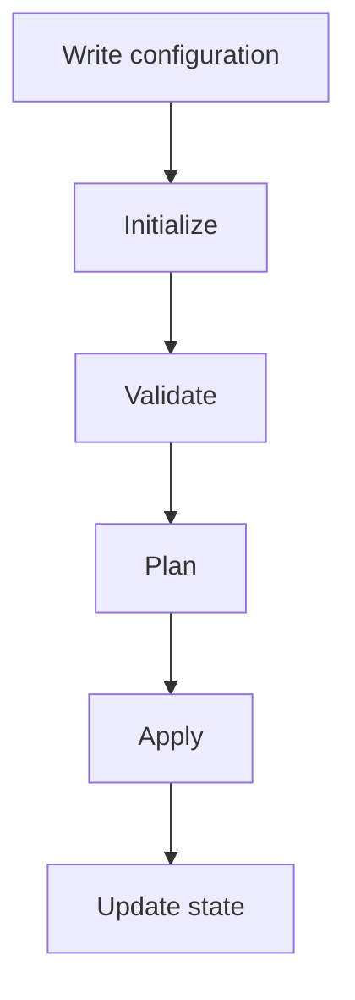

# Infrastructure as Code (IaC) & Terraform — Complete Revision Notes

---

## PART 1: INFRASTRUCTURE AS CODE (IaC)

### 1.1 What is IaC?

**Definition:** Managing and provisioning infrastructure using **code/config files** instead of manually clicking through AWS Console / Azure Portal / running individual CLI commands.

> ⚠️ Important: IaC code does NOT store the physical infrastructure. It stores the **definition/instructions** to create it.

**Infrastructure components typically covered by IaC:**

```
VPC, Subnets, IGW, NAT Gateway, Route Tables, Security Groups,
EC2/VMs, Load Balancers, Databases, Kubernetes clusters,
Storage, DNS, IAM roles, Monitoring resources
```

### 1.2 Manual vs IaC — Quick Comparison

| Manual Method | IaC Method |
|---|---|
| Click through AWS Console step by step | Write code (`.tf`, `.yaml`) |
| Repeat everything for QA/Prod | Reuse same code with different variables |
| Error-prone, inconsistent | Consistent, repeatable |
| Slow | Fast |

**Flow (IaC):**
```
IaC file → Terraform → AWS API → Infrastructure
```

### 1.3 Furniture Analogy (easy way to remember)

| Analogy | IaC Equivalent |
|---|---|
| Assembly instructions | IaC code |
| Furniture | Infrastructure |
| Carpenter | Terraform / Ansible / CloudFormation |

### 1.4 Why IaC Exists — Problems It Solves

| Problem | Explanation |
|---|---|
| **Manual errors** | Wrong subnet, open port, missed encryption, wrong instance type |
| **Poor change tracking** | Manual SG change → unclear who/what/why/when |
| **Environment inconsistency** | Dev/QA/Prod configured differently by accident (= **configuration drift**) |
| **Slow scaling** | Adding 10 servers manually = repeat steps 10 times |
| **Slow disaster recovery** | Rebuilding from memory/screenshots is slow; IaC = machine-readable rebuild instructions |

> **Configuration drift** = *unplanned* differences between environments (intentional size differences are fine).

### 1.5 Desired State Model

You declare **what you want**:
```
1 VPC, 2 public subnets, 2 private subnets, 3 EC2, 1 LB, 1 DB
```
Tool compares:
```
Desired State  ↔  Actual Infrastructure
```
Then decides: **Create / Update / Replace / Delete / No change**

### 1.6 Declarative vs Imperative

| Declarative | Imperative |
|---|---|
| Describes **what** you want | Describes **how** to do it |
| Tool decides the operations | You define operation order |
| Focuses on desired end state | Focuses on individual commands |
| Example: **Terraform**, CloudFormation, K8s manifests, Puppet | Example: **Bash scripts**, manual CLI |

**Declarative example:**
```hcl
resource "aws_instance" "backend" {
  count = 3
}
```
= "I want 3 instances." Terraform figures out how.

**Imperative example:**
```
Create VPC → Create subnet → Create IGW → Attach IGW → Create route → Launch EC2
```

### 1.7 Idempotency

**Definition:** Running the same code multiple times gives the **same end result** (no duplicate resources).

```
1st apply → Creates resources
2nd apply → No changes
3rd apply → No changes
```

> ⚠️ Correction: Most Ansible modules are idempotent, but **not all** modules/commands/playbooks guarantee it automatically.

### 1.8 Configuration Drift (Detail)

Drift = real infrastructure ≠ IaC config (usually due to manual console changes).

```
Terraform code : Allow HTTPS (443)
Actual AWS SG  : Allow SSH (22)   ← DRIFT
```

> ⚠️ Correction: The **state file alone does not manage drift**. Terraform detects drift during `refresh`/`plan` by comparing config + state + live provider API data.

### 1.9 Benefits of IaC (Top 10 — great for interviews)

| # | Benefit | Key Point |
|---|---|---|
| 1 | Consistency | Same module → Dev/QA/Stage/Prod (different variable values) |
| 2 | Speed | Full environment built fast |
| 3 | Repeatability | Same code → new account, new region, DR, temp env |
| 4 | Version Control | Git tracks who/what/when/why |
| 5 | Collaboration | PR review by Dev/DevOps/Security/DBA |
| 6 | Auditability | Git + pipeline logs = compliance evidence |
| 7 | Reusability | Terraform modules / Ansible roles |
| 8 | Scalability | Change `instance_count` variable (Note: IaC ≠ auto-scaling; ASG/HPA handle runtime scaling) |
| 9 | Cost Efficiency | Smaller dev resources, delete temp envs, tagging (but bad code can also increase cost fast!) |
| 10 | Documentation | Code documents infra, but still needs architecture docs separately |

### 1.10 Types of IaC Tools

| Type | Purpose | Examples |
|---|---|---|
| **Provisioning** | Creates infrastructure | Terraform, CloudFormation, Pulumi |
| **Configuration Management** | Configures existing servers | Ansible, Puppet, Chef, SaltStack |
| **Container Orchestration Config** | Defines container workloads | Kubernetes manifests |
| **K8s Packaging/Customization** | Packages/modifies manifests | Helm, Kustomize |
| **Policy as Code** | Enforces security/governance | OPA, Sentinel, CloudFormation Guard |

*(Categories overlap: Ansible can create cloud resources; Terraform can do light config; K8s manifests manage workloads, not the underlying cloud network.)*

---

## PART 2: TERRAFORM vs OTHER TOOLS

### 2.1 Terraform vs Ansible

| Terraform | Ansible |
|---|---|
| **Provisions** infrastructure (creates VPC, EC2, etc.) | **Configures** servers/software (installs Nginx, etc.) |
| Uses **HCL** | Uses **YAML** |
| Maintains **state** | Usually no Terraform-style state |
| Declarative provisioning | Config management + automation |
| Example: Create EC2 | Example: Install Nginx on that EC2 |

**Interview line:**
> "Terraform normally creates infrastructure, while Ansible normally configures servers and software."

**Together (common real-world pattern):**
```
Terraform → Creates Infra (VPC, EC2, SG, EKS, RDS)
                ↓
Ansible   → Configures Software (OS, Docker, Nginx, users, agents)
```

### 2.2 Ansible Key Concepts

- **Agentless** — connects via SSH (Linux), WinRM/PSRP (Windows), APIs (cloud/network devices)

| Component | Purpose |
|---|---|
| Control node | Machine running Ansible |
| Managed node | Server being configured |
| Inventory | List of managed servers |
| Module | Performs one action |
| Playbook | YAML automation file |
| Role | Reusable automation structure |

```yaml
- name: Configure web servers
  hosts: webservers
  become: true
  tasks:
    - name: Install Nginx
      ansible.builtin.package:
        name: nginx
        state: present
    - name: Start Nginx
      ansible.builtin.service:
        name: nginx
        state: started
        enabled: true
```

### 2.3 Ansible vs Puppet/Chef

| Ansible | Puppet / Chef |
|---|---|
| Generally agentless | Generally agent-based |
| Push-oriented | Often pull-based enforcement |
| YAML playbooks | Own DSL (Puppet lang / Ruby DSL) |
| Great for ad-hoc automation | Strong continuous enforcement (enterprise fleets) |

### 2.4 Terraform vs CloudFormation

| Terraform | CloudFormation |
|---|---|
| Multi-cloud (many providers) | AWS-only |
| HCL | YAML/JSON |
| You configure the state backend | AWS manages stack state |
| `terraform plan` | Change Sets |
| Provider-based | Deep native AWS integration |

**CloudFormation key terms:**

| Term | Meaning |
|---|---|
| Template | YAML/JSON resource definition |
| Stack | Group of resources managed together |
| Change Set | Preview of proposed changes |
| Drift Detection | Finds changes made outside CFN |

### 2.5 Pulumi

Uses **general-purpose languages**: Python, TypeScript, JavaScript, Go, C#, Java — gives you loops, functions, classes, conditions, real testing tools.

```python
vpc = aws.ec2.Vpc("project-vpc", cidr_block="10.0.0.0/16")
```

### 2.6 Kubernetes IaC — Helm & Kustomize

```yaml
apiVersion: apps/v1
kind: Deployment
metadata:
  name: backend
spec:
  replicas: 3
```
K8s controllers continuously reconcile actual state → desired state.

| Tool | Purpose |
|---|---|
| **Helm** | Packages multiple manifests into a reusable **Chart** (Deployment, Service, ConfigMap, Ingress, ServiceAccount, values file) |
| **Kustomize** | Applies **overlays** on top of base YAML |

```
Base K8s YAML
├── Dev overlay
├── Pre-prod overlay
└── Prod overlay
```

### 2.7 Policy as Code (PaC)

Security/governance/cost rules written as machine-readable code.

**Example rules:**
- Block SSH from `0.0.0.0/0`
- Require DB encryption
- Prevent public S3 buckets
- Require `Environment` tag
- Allow only approved regions
- Require backups for production

**Tools:** OPA (Open Policy Agent), HashiCorp Sentinel, AWS CloudFormation Guard, Kyverno, Gatekeeper

### 2.8 Master Comparison Table

| Tool | Main Purpose | Format | Common Users |
|---|---|---|---|
| Terraform | Infra provisioning | HCL | DevOps/Cloud engineers |
| CloudFormation | AWS infra provisioning | YAML/JSON | AWS engineers |
| Ansible | Server config & automation | YAML | SysAdmins/DevOps |
| Puppet | Continuous config mgmt | Puppet lang | Enterprise ops |
| Chef | Config management | Ruby DSL | Enterprise ops |
| Pulumi | Infra provisioning | Programming langs | Developers/DevOps |
| K8s manifests | Container workloads | YAML | K8s engineers |
| Helm | K8s packaging | Templates/YAML | DevOps/Platform |
| Kustomize | K8s overlays | YAML | K8s teams |
| OPA/Sentinel | Policy enforcement | Policy language | Security/Platform |

---

## PART 3: TERRAFORM — CORE CONCEPTS

### 3.1 What is Terraform?

- IaC **provisioning** tool by **HashiCorp**
- Uses **HCL** (HashiCorp Configuration Language)
- Config files use extension **`.tf`**
- Manages: VMs, VPC/subnets, storage, SGs, LBs, DBs, K8s clusters, DNS, IAM, some SaaS, some on-prem

**Is Terraform Cloud-Agnostic?**
> ⚠️ Common misconception: workflow (init/plan/apply) is the same across clouds, but **resource code is provider-specific**:
```hcl
aws_instance                    # AWS
azurerm_linux_virtual_machine   # Azure
google_compute_instance         # GCP
```
All represent VMs, but different arguments/schemas.

### 3.2 Terraform Architecture (3 Main Parts)

```
┌─────────────────────┐
│ Terraform            │  ← .tf code (what you write — desired state)
│ Configuration        │
└──────────┬───────────┘
           ▼
┌─────────────────────┐
│ Terraform Core        │  ← reads config+state, builds dependency graph,
│                        │    creates plan, decides order, talks to providers
└──────────┬───────────┘
           ▼
┌─────────────────────┐
│ Providers              │  ← plugins (AWS, Azure, GCP, K8s, Docker, GitHub...)
└──────────┬───────────┘
           ▼
        Platform APIs → Real Resources
```

**Terraform CLI vs Terraform Core (important distinction):**

| Terraform CLI | Terraform Core |
|---|---|
| The `terraform` command you type | Internal engine: parses HCL, manages state, builds plans, coordinates providers |
| User-facing | Does the actual "thinking" |

> ⚠️ Licensing correction: current Terraform releases are **source-available**, not OSI open-source.

### 3.3 Core Workflow

```
Write → Init → Validate → Plan → Apply → (Destroy if needed)
```



#### Step 1: Write
Files: `main.tf`, `variables.tf`, `outputs.tf`, `providers.tf`

#### Step 2: `terraform init`
- Downloads providers
- Downloads modules
- Initializes state backend
- Creates/updates `.terraform.lock.hcl`
- Creates local `.terraform/` directory (not committed to Git)

> Run after: cloning project, changing providers, adding modules, changing backend. Safe to re-run.

**Dependency lock file (`.terraform.lock.hcl`):**
- Records selected provider versions + checksums
- **Should be committed to Git** (ensures team/CI use same provider versions)
- ⚠️ Different from **state locking** — this locks provider *version selection*, not state.

#### Step 3: `terraform fmt` — formats code (`-recursive` for subfolders, `-check` to verify without rewriting)

#### Step 4: `terraform validate`
Checks: syntax, required arguments, invalid references, internal consistency.
**Does NOT check:** AWS permissions, quotas, account restrictions, whether apply will succeed.

> ⚠️ No such flag as `terraform validate -a recursive` — validate each module separately via CI script if needed.

#### Step 5: `terraform plan`
Preview of proposed changes — **does not modify real infra**.

| Symbol | Meaning |
|---|---|
| `+` | Create |
| `~` | Update in place |
| `-` | Destroy |
| `-/+` | Destroy & recreate (replace) |
| `<=` | Read a data source |

**Internally, plan does:**
```
1. Read all .tf files
2. Load state
3. Init provider configs
4. Query providers for current resource info
5. Refresh knowledge of existing infra
6. Build dependency graph
7. Compare desired config vs actual infra
8. Calculate required operations
9. Display execution plan
```

**Is plan a true "dry run"?**
> ⚠️ Commonly called dry run, but NOT a perfect guarantee — some values unknown until apply; infra can change between plan & apply; permission/quota failures possible at apply time.

**Safe production pattern:**
```bash
terraform plan -out=tfplan
terraform show tfplan
terraform apply tfplan
```

#### Step 6: `terraform apply`
1. Creates/loads plan → 2. Shows changes → 3. Asks approval →
4. Locks state → 5. Calls provider APIs → 6. Updates state → 7. Releases lock

> ⚠️ `apply` does MORE than create/update — it can also **replace and destroy**.

#### Step 7: `terraform destroy`
Deletes everything managed by current config + state (including imported resources) — **not just files in the folder**. Use `terraform plan -destroy` to preview first.

### 3.4 Other Important Commands

| Command | Purpose |
|---|---|
| `terraform import ADDRESS ID` | Bind an *existing* remote resource to a Terraform resource address (does NOT create it) |
| `terraform console` | Interactive expression tester |
| `terraform plan -refresh-only` / `apply -refresh-only` | ✅ Replaces deprecated `terraform refresh` — updates state only, not real infra |
| `terraform state list` | List resources in state |
| `terraform state show ADDRESS` | Show one resource's state |
| `terraform output [-json]` | Show output values |
| `terraform graph` | Generate dependency graph |
| `terraform workspace list` | List workspaces |
| `terraform providers` | Show required providers |
| `terraform version` | Show Terraform version |

> ⚠️ `terraform refresh` is **deprecated** — use refresh-only plan/apply instead.

### 3.5 Declarative Nature

```hcl
resource "aws_instance" "backend" {
  count         = 3
  instance_type = "t3.micro"
}
```
= "3 instances should exist." Terraform decides which to create/update/replace and in what order. You don't write individual API calls.

### 3.6 Providers

A **provider** = plugin connecting Terraform to an external platform's API (auth, API calls, resource/data schemas, CRUD operations).

```hcl
terraform {
  required_providers {
    aws = {
      source  = "hashicorp/aws"
      version = "~> 6.0"
    }
  }
}

provider "aws" {
  region = "ap-south-1"
}
```

| Block | Purpose |
|---|---|
| `required_providers` (inside `terraform{}`) | Source + version constraint |
| `provider "aws" {}` | Region, profile, auth settings |

> ⚠️ Correction: Provider *version* goes in `required_providers`, not directly in the `provider` block.

**Version operators:**

| Operator | Meaning |
|---|---|
| `= 1.10.0` | Exact version only |
| `>= 1.10.0` | This or newer |
| `< 2.0.0` | Older than 2.0 |
| `~> 6.0` | Compatible 6.x |
| `~> 6.2.0` | Compatible 6.2.x only |

**Multiple provider configs (aliases)** — for multi-region/multi-account:
```hcl
provider "aws" { region = "ap-south-1" }               # default
provider "aws" { alias = "us_east"; region = "us-east-1" }

resource "aws_vpc" "virginia" {
  provider   = aws.us_east
  cidr_block = "10.1.0.0/16"
}
```

**Authentication — never hardcode:**
```hcl
# ❌ Avoid
access_key = "..."
secret_key = "..."
```
✅ Prefer: IAM role, EC2 instance profile, CLI profile, env vars, OIDC federation.

> ⚠️ "Terraform can manage anything with an API" is misleading — it needs a **suitable provider** (official or custom) for that API.
```
API exists + Provider exists → Terraform can manage it
API exists + No provider     → Custom provider needed
```

### 3.7 HCL Block Structure

```hcl
BLOCK_TYPE "LABEL_1" "LABEL_2" {
  argument = value
  nested_block {
    argument = value
  }
}
```

> ⚠️ Always use straight quotes `" "` — smart quotes `“ ”` cause syntax errors.

| Block | Purpose |
|---|---|
| `terraform` | Terraform's own settings (version, providers, backend) |
| `provider` | Connection to a platform |
| `resource` | Create/manage infrastructure |
| `data` | Read existing info (no creation) |
| `variable` | Accept input |
| `output` | Expose result info |
| `module` | Reusable code |
| `locals` | Reusable internal values |

### 3.8 Resource Block

```hcl
resource "aws_instance" "web_server" {
  ami           = "ami-xxxxxxxx"
  instance_type = "t3.micro"
  tags = { Name = "web-server" }
}
```

| Part | Meaning |
|---|---|
| `resource` | Block type |
| `aws_instance` | Resource type (`aws` = provider prefix, `instance` = resource) |
| `web_server` | **Local** name (Terraform's internal name, not the AWS display name) |

Full address: `aws_instance.web_server` → reference attribute: `aws_instance.web_server.id`

> Type + local name must be unique **within a module** (not globally).

**Implicit dependency via reference:**
```hcl
resource "aws_vpc" "main" { cidr_block = "10.0.0.0/16" }
resource "aws_subnet" "public" {
  vpc_id     = aws_vpc.main.id     # ← creates dependency: VPC first, then subnet
  cidr_block = "10.0.1.0/24"
}
```

### 3.9 Data Block (Resource vs Data)

| `resource` | `data` |
|---|---|
| Creates/manages something | Only reads info |
| Terraform "owns" its lifecycle | Doesn't manage lifecycle of what it reads |
| Example: create VPC | Example: find default VPC |

```hcl
data "aws_vpc" "default" {
  default = true
}

resource "aws_subnet" "example" {
  vpc_id     = data.aws_vpc.default.id
  cidr_block = "172.31.200.0/24"
}
```
Use cases: find existing VPC, latest AMI, current account ID, existing subnet, secret reference, resources managed by *another* Terraform config.

### 3.10 Variable Block

```hcl
variable "aws_region" {
  type        = string
  description = "AWS Region"
  default     = "us-east-1"
}
provider "aws" { region = var.aws_region }
```

**Variable arguments:**

| Argument | Purpose |
|---|---|
| `type` | Data type |
| `description` | Explains variable |
| `default` | Fallback value |
| `sensitive` | Hides from CLI output (⚠️ still visible in state!) |
| `nullable` | Allow/disallow `null` |
| `validation` | Custom rule check |

**Types:**
```hcl
string          → "t3.micro"
number          → 3
bool            → true
list(string)    → ["ap-south-1a", "ap-south-1b"]
set(number)     → [80, 443]
map(string)     → { Project = "AnzenOps" }
object({...})   → { engine = "postgres", storage_gb = 20 }
any             → use sparingly
```

**Validation example:**
```hcl
variable "environment" {
  type = string
  validation {
    condition     = contains(["development", "staging", "production"], var.environment)
    error_message = "Environment must be development, staging, or production."
  }
}
```

**Supplying values (in order of typical precedence — CLI > env var > tfvars > default):**
```bash
terraform plan -var-file="production.tfvars"
terraform plan -var="aws_region=ap-south-1"
export TF_VAR_aws_region="ap-south-1"     # Linux/macOS
$env:TF_VAR_aws_region = "ap-south-1"     # PowerShell
```

### 3.11 Output Block

```hcl
output "vpc_id" {
  description = "ID of the project VPC"
  value       = aws_vpc.main.id
}
```
```bash
terraform output              # all outputs
terraform output vpc_id       # one output
terraform output -json        # machine-readable
```
Child module → parent access: `module.network.vpc_id`

`sensitive = true` on output hides console display but **value may still be in state**.

### 3.12 Terraform State

**File:** `terraform.tfstate` (JSON internally)

**Main purpose:** maps Terraform resource addresses ↔ real remote object IDs.
```
aws_vpc.main → vpc-0abc123def456
```

> ⚠️ Big correction: State is **NOT** "the exact current infrastructure." It's Terraform's mapping/metadata database. During `plan`, Terraform also **queries the provider API** to check real infra.

```
Configuration = Desired state (what you wrote)
State         = Terraform's mapping + recorded data
Provider API  = Actual real-world infrastructure
```
All three are used together to build a plan.

**What state can contain:** resource IDs, IPs, attributes, dependencies, metadata, outputs, **sensitive data**.

**Why state matters:** prevents duplicate resource creation — Terraform recognizes an existing resource already belongs to an address and skips recreating it if nothing changed.

#### Local vs Remote State

| Local State | Remote State |
|---|---|
| `terraform.tfstate` on your machine | Stored in S3 / Azure Storage / GCS / HCP Terraform |
| Can be lost | Centrally protected |
| Can't be shared safely by team | Safe team access |
| CI/CD can't manage it safely | CI/CD-friendly |
| May expose sensitive data | Can be encrypted & access-restricted |

#### S3 Backend Example (current best practice)
```hcl
terraform {
  backend "s3" {
    bucket       = "company-terraform-state"
    key          = "production/network/terraform.tfstate"
    region       = "ap-south-1"
    encrypt      = true
    use_lockfile = true
  }
}
```
> ⚠️ **Correction to older notes:** "S3 + DynamoDB" locking is the **old** design. Current Terraform uses **`use_lockfile = true`** for S3-native locking. DynamoDB locking is now **deprecated**.

**Also enable:** S3 versioning, block public access, strong IAM policy, encryption, separate state per environment.

#### State Locking
```
Engineer A: apply → state locked
Engineer B: apply → must wait
Engineer A: finishes → lock released
```
Prevents simultaneous writes/corruption. Avoid `-lock=false`.

#### State Security Rules (memorize for exam)
- ❌ Never commit `terraform.tfstate` to Git
- ❌ Never edit state manually
- ✅ Use remote backend
- ✅ Encrypt state
- ✅ Enable locking
- ✅ Enable versioning/backup
- ✅ Restrict IAM access

### 3.13 Modules

A **module** = reusable collection of resources.

```hcl
module "network" {
  source      = "./modules/vpc"
  vpc_cidr    = "10.0.0.0/16"
  environment = "production"
}
```
Reuse for multiple envs:
```hcl
module "development_network" { source = "./modules/vpc"; vpc_cidr = "10.1.0.0/16" }
module "production_network"  { source = "./modules/vpc"; vpc_cidr = "10.2.0.0/16" }
```
**Benefits:** less duplication, standard architecture, easier maintenance, consistent environments, faster provisioning.

### 3.14 Dependency Graph & Parallelism

```
VPC → Subnet → EC2      (sequential — dependent)
S3 bucket 1              (parallel — independent)
S3 bucket 2              (parallel — independent)
```
> ⚠️ Correction: Terraform does **NOT** always create sequentially — it builds a dependency graph and runs **independent resources in parallel**.

**VPC change ≠ always full recreation** (common wrong exam note):

| Case | What Happens |
|---|---|
| Tag-only change | In-place update (`~`), no recreation |
| Change requiring replacement | Must destroy dependents first → destroy VPC → recreate VPC → recreate subnets/instances (risky, downtime) |
| Only `count` changes (e.g., 3→5 VMs) | Just adds new VMs; VPC untouched |

Always run `terraform plan` before applying to verify actual impact.

### 3.15 CRUD Mapping

| Terraform Action | API Concept | Example (EC2) |
|---|---|---|
| Create | Create | `RunInstances` |
| Read | Read | `DescribeInstances` |
| Modify | Update | (relevant update API) |
| Destroy | Delete | `TerminateInstances` |

### 3.16 Recommended Project Structure

```
terraform-project/
├── terraform.tf        (required Terraform + provider versions)
├── providers.tf         (provider configs)
├── backend.tf            (remote state backend)
├── variables.tf           (input variables)
├── main.tf                 (resources)
├── data.tf                  (data sources)
├── outputs.tf                (outputs)
├── development.tfvars
└── modules/
    └── vpc/
        ├── main.tf
        ├── variables.tf
        └── outputs.tf
```
> Filenames are for human organization only — Terraform combines all `.tf` files in a directory into one root module and orders operations by **dependency**, not filename.

### 3.17 Import Workflow

```bash
# 1. Write a matching resource block first
resource "aws_instance" "existing" {
  ami           = "ami-xxxxxxxx"
  instance_type = "t3.micro"
}

# 2. Import
terraform import aws_instance.existing i-0123456789abcdef
```
> Import only **binds** an existing resource to Terraform state — it does NOT mean Terraform created it. Always run `plan` after import to check for unwanted diffs, then carefully align code.

---

## PART 4: BEST PRACTICES (Exam Favorites)

### Code Practices
- Use reusable Terraform modules & Ansible roles
- Use variables, not hardcoded values
- Use outputs for key info
- Format & validate before commit (`fmt`, `validate`)
- Git + PR review mandatory
- Pin provider/module versions

### Security Practices
- Store secrets in **Vault / AWS Secrets Manager / SSM Parameter Store / CI-CD secrets**
- Never hardcode `access_key`, `secret_key`, `password`
- Prefer IAM roles, temporary creds, OIDC, least privilege

### State Practices
- Remote backend + encryption + locking + versioning
- Never commit or manually edit state
- Separate state per environment

### Operational Practices
```bash
terraform fmt -check
terraform validate
terraform plan
```
- Review every destroy/replace carefully
- Apply only a **reviewed, saved plan**
- Test in dev first, use CI/CD validation & security scanning
- Monitor drift, back up data, enable DB deletion protection

### Tagging Practices
```hcl
tags = {
  Project     = "AnzenOps"
  Environment = "Production"
  Owner       = "DevOps"
  CostCenter  = "DITISS"
}
```
Helps: cost tracking, ownership, automation, search, security policy, cleanup.

### Environment Isolation
```
infrastructure/
├── modules/
│   ├── vpc/
│   ├── eks/
│   └── database/
└── environments/
    ├── development/
    ├── qa/
    ├── preproduction/
    └── production/
```
Each environment should have separate: state files, credentials, permissions, variables, networks, resource names — ideally separate AWS accounts.

---

## PART 5: PROS, CONS & ROLLBACK

### Pros
Faster creation • Fewer manual errors • Consistency • Repeatability • Version control • Collaboration • Audit history • Reusable modules • Easier drift detection • Faster DR • Policy enforcement • Automated testing

> ⚠️ IaC reduces errors but doesn't eliminate them — **bad code can automate the same mistake across many resources.**

### Cons

| Con | Detail |
|---|---|
| Learning curve | Cloud + syntax + state + modules + dependencies + permissions + CI/CD |
| State management | Must be protected, shared, locked correctly |
| Large blast radius | e.g. `count = 0` could destroy every instance in that block! |
| Secret handling | Secrets can leak into `.tf`, `.tfvars`, state, plan files, CI/CD logs |
| Debugging difficulty | Could be syntax, API, provider bug, IAM, quota, dependency, network issue |

### Is Rollback Easy? — NO, not fully automatic

**Normal rollback steps:**
```
1. Revert Git commit
2. Run new plan
3. Review proposed changes
4. Apply
```
**But rollback does NOT restore:** deleted DB data, deleted files, changed schemas, removed secrets, unsupported old resource types.

> ⚠️ Key exam line: "Restoring an old Terraform state file is NOT the same as restoring actual infrastructure."

**Still required in production:** backups, snapshots, deletion protection, blue-green deployments, DR procedures.

---

## PART 6: IMPORTANT CORRECTIONS SUMMARY (High-Yield for Exam)

| Common Wrong Belief | Correct Understanding |
|---|---|
| Terraform manages anything with an API | Needs a suitable **provider** (official/custom) |
| Terraform is fully cloud-independent | Same workflow, but resource code is **provider-specific** |
| `terraform plan` is a perfect dry run | It's a preview; some values/failures only known at apply |
| State = exact current infrastructure | State = mapping + metadata; provider API gives live truth |
| State alone manages drift | Drift detected via refresh/plan using config+state+API together |
| Terraform always creates sequentially | Runs **independent resources in parallel** via dependency graph |
| Provider version goes in `provider` block | Goes in `required_providers` (inside `terraform{}`) |
| Resource name unique globally | Unique only **within a module** |
| Data source only reads manually created resources | Can query **any** supported provider data |
| `validate -a recursive` exists | ❌ No such flag |
| `apply` only creates/updates | Can also **replace and destroy** |
| `destroy` deletes only resources "created in this folder" | Deletes everything in **current state**, including imports |
| `import` creates a resource | Only **binds** existing resource to state |
| `terraform refresh` is the way to go | **Deprecated** — use `plan -refresh-only` / `apply -refresh-only` |
| S3 + DynamoDB is current locking standard | Modern approach: S3 native lock via `use_lockfile = true` |
| Backend = full disaster recovery | Backend protects **state only**; infra/data still need separate backups |
| Changing any VPC property recreates the VPC | Depends on property — some are in-place updates |

---

## PART 7: EXAM ONE-LINERS / QUICK RECALL

- **IaC** = managing infra via code, not manual console clicks.
- **Idempotency** = same code run multiple times → same result, no duplicates.
- **Configuration drift** = unplanned mismatch between code and real infra.
- **Declarative** = describe *what*; **Imperative** = describe *how*.
- **Terraform** = provisioning tool (HashiCorp, HCL, `.tf` files).
- **Ansible** = configuration management tool (agentless, YAML playbooks).
- **State file** = maps Terraform resource addresses to real resource IDs.
- **Provider** = plugin that lets Terraform talk to a platform's API.
- **Module** = reusable group of resources.
- **Plan** = preview of changes (dry run, but not a total guarantee).
- **Apply** = executes the plan (create/update/replace/destroy).
- **Backend** = where state is stored (e.g., S3), may support locking.
- **Dependency graph** = determines order + enables parallel execution.
- **`.terraform.lock.hcl`** = locks **provider versions**, not state.
- **State locking** = prevents two people/pipelines editing state simultaneously.
- **Terraform CLI ≠ Terraform Core** — CLI is the interface, Core is the engine.

---

## PART 8: INTERVIEW-READY SUMMARY ANSWERS

**Q: What is Infrastructure as Code?**
> "Infrastructure as Code is the practice of defining and managing infrastructure using machine-readable code instead of manual configuration. Tools such as Terraform and CloudFormation provision cloud resources, while Ansible, Puppet and Chef commonly configure servers and applications. IaC provides automation, consistency, repeatability, version control, collaboration and auditability. Important practices include remote encrypted state, state locking, plan review, secret management, modular code and separate environments."

**Q: What is Terraform?**
> "Terraform is a declarative Infrastructure as Code provisioning tool created by HashiCorp. It uses HCL configuration files and provider plugins to manage cloud, on-premises and supported SaaS resources. Terraform follows an init, plan and apply workflow, maintains state to map configuration resources to real infrastructure, creates resources according to dependency order, and supports reusable modules for consistent deployments."

**Q: Terraform vs Ansible — how do you decide which to use?**
> "Terraform provisions the infrastructure layer (VPC, EC2, EKS, RDS); Ansible configures what runs on top of it (OS packages, Docker, Nginx, application setup, security agents). In practice they're used together — Terraform first, Ansible second."

**Q: How does Terraform know what order to create resources in?**
> "It builds a dependency graph from resource references (e.g., a subnet referencing a VPC's ID). Resources with dependencies are created in order; independent resources can be created in parallel."

**Q: Why shouldn't you commit terraform.tfstate to Git?**
> "State can contain sensitive data — IPs, resource IDs, generated credentials, and other sensitive attributes. It should be stored in an encrypted, access-restricted remote backend with locking and versioning instead."

---

*Notes consolidated from: IaC overview, Terraform fundamentals, Terraform working process/state, and Terraform configuration structure/commands.*

---

## Obsidian Navigation

- [[00 - Syllabus and Interview Checklist|Syllabus and Interview Checklist]]
- [[Index|Vault Index and Reading Order]]
- Related: [[05 - AWS Cloud Computing Virtualization and Data Center|AWS Cloud Computing, Virtualization, and Data Center]]
- Related: [[06 - Ansible YAML and Configuration Management|Ansible YAML and Configuration Management]]
