# HTTP Evolution - Interview Notes (0.9 -> 1.0 -> 1.1 -> 2 -> 3)

## What is HTTP?

- HTTP (HyperText Transfer Protocol) is the application-layer protocol used to transfer data between a client (browser, API client) and a server.
- Created by Tim Berners-Lee and his team at CERN around 1989-1991, originally to transfer simple hypertext documents in a small, trusted environment.
- Over time it evolved to efficiently carry large images, video, JSON APIs, file downloads, etc., while keeping its core semantics (methods, status codes, headers) largely stable.

**Content evolution (good one-liner for interviews):** HTTP started out carrying **only plain text** (HTML pages). As the web grew, it had to support **images, audio, video, and arbitrary file transfer** - this is exactly why `Content-Type` and `Content-Length` headers became necessary starting with HTTP/1.0.

---

## Timeline at a Glance

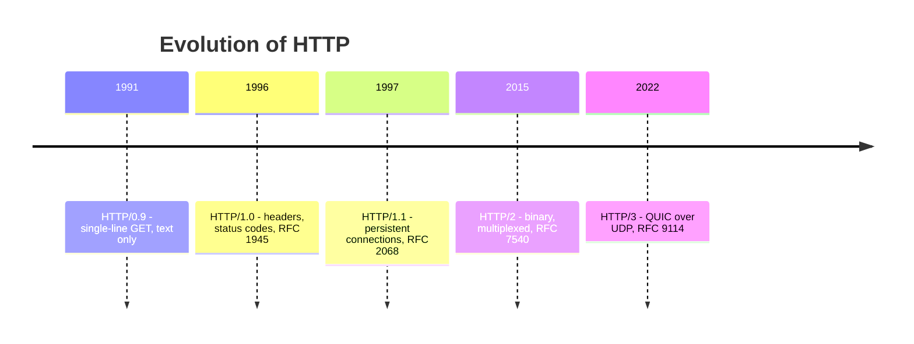

---

## Version Timeline (Quick Recall)

| Version  | RFC                                 | Year                      | Key Idea                    |
| -------- | ----------------------------------- | ------------------------- | --------------------------- |
| HTTP/0.9 | None (informal)                     | ~1990-91                  | Single-line GET, no headers |
| HTTP/1.0 | RFC 1945                            | 1996                      | Headers + status codes      |
| HTTP/1.1 | RFC 2068 -> RFC 2616 -> RFC 9110/9112 | 1997 (updated 1999, 2022) | Persistent connections      |
| HTTP/2   | RFC 7540                            | 2015                      | Binary, multiplexed         |
| HTTP/3   | RFC 9114                            | 2022                      | Runs over QUIC/UDP          |

---

## HTTP/0.9 - The "One-Line" Protocol

**Context:** Earliest experimental HTTP, used with the first web browsers/servers, pre-standardization.

**Characteristics:**

- Only one method existed: `GET`. No `POST`, `HEAD`, etc.
- The entire request was a single line, e.g. `GET /path` - no HTTP version included.
- No headers in the request or response; the server returned the raw HTML body directly.
- No status line or status codes - errors could only be communicated through HTML content itself.
- Limited to plain HTML text; there was no concept of content-type negotiation or binary formats.

**Limitations:**

- No caching control, no content-type, no virtual hosting, no authentication, no extensibility via headers.
- Every response was just raw bytes with zero metadata, making automation or advanced features practically impossible.

---

## HTTP/1.0 - Extensibility Begins (1996)

**Standardized as:** RFC 1945 (May 1996) - it formalized common practice already in use by existing implementations.

**Key improvements over 0.9:**

- HTTP version added to the request line: `GET /index.html HTTP/1.0`.
- Introduced request/response **headers**, enabling metadata like `Content-Type`, `Content-Length`, `User-Agent`.
- Added a **status line and status codes** (e.g., `HTTP/1.0 200 OK`, `404 Not Found`) for machine-readable success/failure.
- Supported multiple methods: `GET`, `HEAD`, `POST`.
- `Content-Type` allowed images, video, and application data - not just HTML.

**Limitations:**

- Connections were typically **non-persistent** - one new TCP (and, for HTTPS, TLS) handshake per request, causing high latency.
- Caching and virtual hosting existed but were basic compared to HTTP/1.1.

**HTTPS context:** Netscape introduced SSL in the mid-1990s; HTTPS at this stage meant HTTP/1.0 running over SSL/TLS for confidentiality and integrity.

**Connection steps for one request (the classic interview walk-through):**

1. **TCP handshake** - `SYN -> SYN/ACK -> ACK`.
2. **Certificate check / TLS (SSL) handshake** - server presents its certificate, client verifies it against a trusted CA.
3. **Key exchange** - client and server agree on a shared session key (RSA or (EC)DHE) to encrypt the rest of the conversation.
4. **Data transfer** - the actual HTTP request/response is sent over the now-encrypted channel.
5. _(HTTP/1.0 problem):_ connection closes after this - **every single request repeats steps 1-4 from scratch**, which is the main reason HTTP/1.1 made connections persistent.

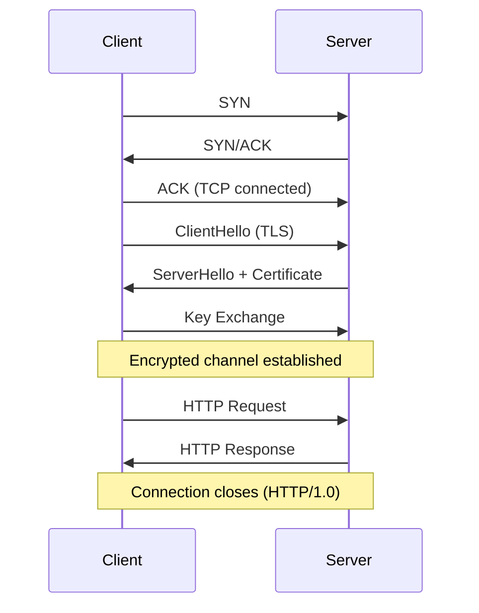

---

## HTTP Connection Closing (by Version)

TCP flags (`FIN`/`RST`) close the _transport_ connection - but each HTTP version has its own _application-layer_ signal for when a connection should be closed, layered on top of that.

**HTTP/1.0** - closes by default after every response (no persistence). To opt into reuse, both sides had to explicitly send `Connection: keep-alive`.

**HTTP/1.1** - persistent by default. Closes when:

- Either side sends the `Connection: close` header, or
- The connection sits idle past a timeout, or
- An error occurs.

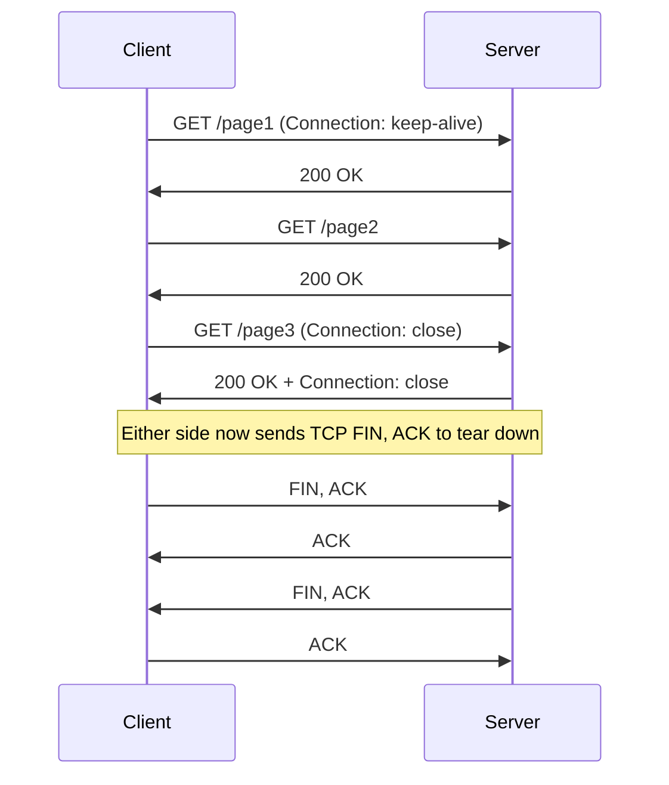

**HTTP/2** - uses a `GOAWAY` frame instead of relying on `Connection: close` (that header is actually disallowed in HTTP/2). The server announces it won't accept new streams, lets existing in-flight streams finish, then the underlying TCP connection closes.

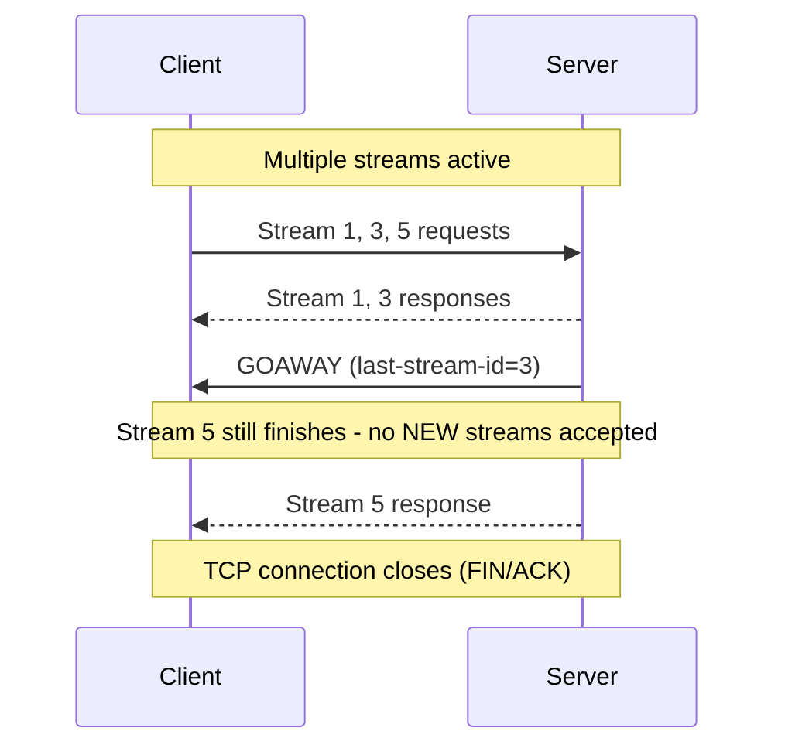

**HTTP/3** - since there's no TCP, closing works differently:

- A single stream can be closed independently (`STREAM` with a `FIN` bit) without affecting others.
- The whole QUIC connection is closed with a `CONNECTION_CLOSE` frame, which can carry an application-level error code/reason - this replaces the TCP FIN/RST handshake entirely.

**One-line summary for interviews:** _Closing happens at two layers - TCP closes the pipe (`FIN`/`RST`), while HTTP decides **when** to close it (`Connection: close` in 1.x, `GOAWAY` in HTTP/2, `CONNECTION_CLOSE` in HTTP/3 since QUIC has no separate TCP layer to close)._

---

## HTTP/1.1 - The Long-Lived Workhorse (1997)

**Standardized as:** RFC 2068 (Jan 1997), refined by RFC 2616 (1999). Today its wire format is RFC 9112 and its semantics are RFC 9110.

It remained the dominant version of HTTP on the web for **over 15 years** before HTTP/2 arrived.

**Major features:**

- **Persistent connections by default** - a single TCP connection can serve multiple request/response pairs, so there's **no repeated TCP/TLS handshake** for every object on a page (the big fix over HTTP/1.0).
- **Pipelining** - client can send multiple requests back-to-back without waiting for each response (intended to cut latency).
- **Chunked transfer encoding** - see full explanation below.
- **Better caching** - headers like `Cache-Control`, `ETag`, and validators for more precise cache rules.
- **Mandatory `Host` header** - enables name-based virtual hosting (many domains on one IP).
- **Congestion control improvements** - since one TCP connection now carries many requests, TCP's congestion-control behaviour (slow start, window scaling) matters more and is used more efficiently than opening a fresh, "cold" connection per request as in HTTP/1.0.

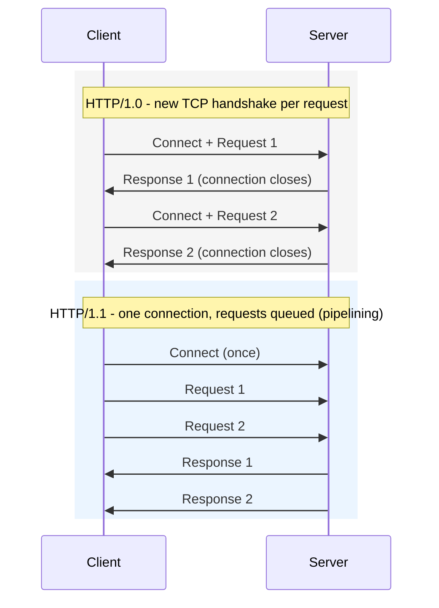

**Head-of-line (HOL) blocking & workaround:**

- Pipelining's drawback: if one response is slow, every later response on that connection is stuck behind it (application-layer HOL blocking).
- Browsers worked around this by opening several parallel TCP connections per origin (commonly 4-6) and using domain sharding.

**TLS handshake flow over HTTP/1.x (good interview talking point):**

1. TCP 3-way handshake: `SYN -> SYN/ACK -> ACK`.
2. TLS handshake: negotiate protocol version + cipher suite, exchange keys (RSA or (EC)DHE), verify server certificate, optionally authenticate client.
3. Once TLS is established, encrypted HTTP/1.x requests/responses flow over the secure channel.

---

## Chunked Transfer Encoding

**What it is:**
In normal HTTP, the server sends `Content-Length` to tell the client how many bytes the body has. But sometimes the server **cannot know the total size before sending** (e.g., streaming data, dynamic reports, live logs). In these cases, HTTP/1.1 uses **chunked transfer encoding**.

Instead of `Content-Length`, the server sends:

```http
Transfer-Encoding: chunked
```

The body is sent as a series of **chunks**, each formatted as:

1. Chunk size in **hex** + `\r\n`
2. Chunk data (that many bytes)
3. `\r\n`

The response ends with a **zero-length chunk** to signal end of body:

```text
0\r\n
\r\n
```

**Example on the wire:**

```http
HTTP/1.1 200 OK
Transfer-Encoding: chunked

7\r\n
Mozilla\r\n
9\r\n
Developer\r\n
7\r\n
Network\r\n
0\r\n
\r\n
```

_(Chunk sizes: `7` = "Mozilla", `9` = "Developer", `7` = "Network", `0` = end)_

**When is it used?**

- Live log streaming, server-sent events, dynamic page rendering, large file downloads where total size isn't known upfront.
- The client knows the response is finished only when it receives the `0\r\n\r\n` terminator - not from a byte count.

---

## HTTP/2 - Binary, Multiplexed HTTP (2015)

**Standardized as:** RFC 7540 (May 2015), based on Google's experimental **SPDY** protocol - but keeps HTTP semantics (methods, URLs, headers, status codes) unchanged.

**Key features:**

- **Binary framing layer** - messages are encoded as binary frames instead of human-readable text, improving parsing efficiency and extensibility.
- **Full multiplexing** - multiple streams share one TCP connection, with frames interleaved; this removes HTTP/1.1's application-layer HOL blocking.
- **Stream prioritization** - client can assign priority/dependency to streams (e.g., load CSS before images).
- **Header compression (HPACK)** - compresses repetitive headers (cookies, user-agent, etc.), cutting overhead significantly. **Important contrast:** in HTTP/1.x, only the **body** could be compressed (e.g. via `Content-Encoding: gzip`) - headers were always sent as plain repeated text on every request. HPACK in HTTP/2 is the first version to compress the **headers** too.
- **Server push** - server can proactively push resources (CSS/JS) into the client's cache before they're explicitly requested.

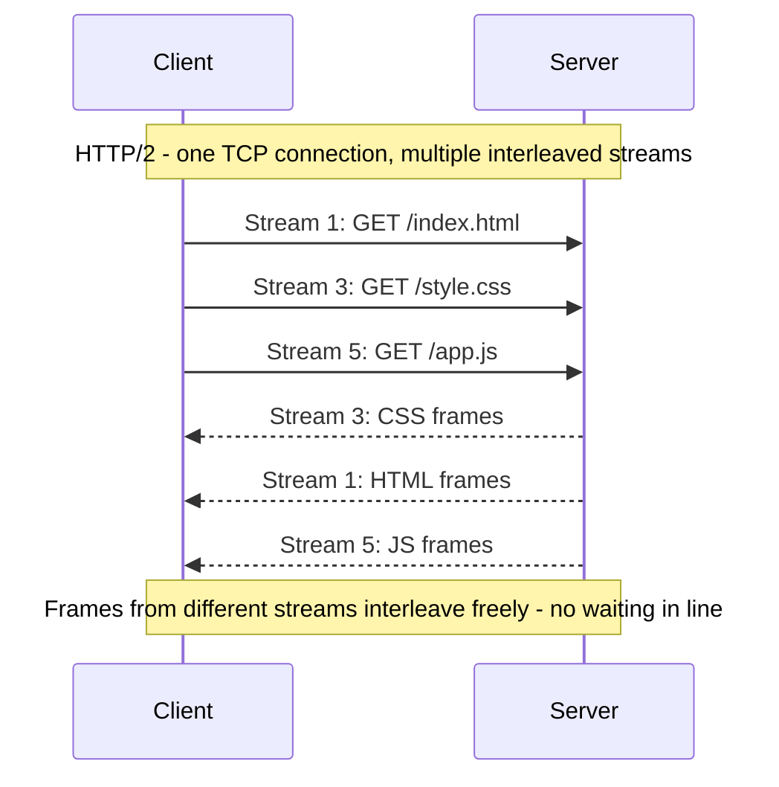

**Remaining limitation:**

- Streams are multiplexed at the HTTP layer but still share **one TCP connection**. If a TCP segment is lost, _all_ streams stall waiting for retransmission - this is **transport-layer HOL blocking**, and it's the main reason HTTP/3 exists.

---

## HTTP/3 - HTTP over QUIC/UDP (2022)

**Standardized as:** RFC 9114 (June 2022). Runs over **QUIC**, a transport protocol built on UDP (RFC 9000 for transport, RFC 9001 for QUIC + TLS 1.3).

**Origin:** QUIC was originally designed and deployed by **Google** (used internally in Chrome and Google's own services) before being handed over to the IETF, which standardized it as RFC 9000 - the same pattern as SPDY -> HTTP/2.

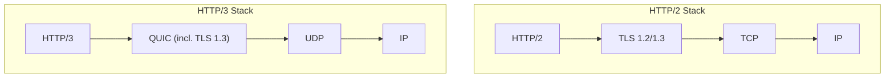

**Core concepts:**

- **QUIC replaces TCP** - retransmission, congestion control, and reliability are implemented in user space over UDP, not in the kernel's TCP stack.
- **No transport-layer HOL blocking** - QUIC multiplexes independent streams within one connection; packet loss on one stream does not block the others.
- **Mandatory TLS 1.3** - QUIC integrates TLS 1.3 directly; all HTTP/3 traffic is encrypted, with no plaintext mode.

**Performance features:**

- **Faster connection setup** - QUIC combines the transport and crypto handshakes, typically achieving **1-RTT** for new connections and **0-RTT** for resumed sessions.
- **Connection migration** - QUIC connections are identified by Connection IDs (not IP/port), so a device can switch networks (Wi-Fi -> 4G) without dropping the connection.
- **Better mobile/wireless performance** - per-stream loss isolation makes HTTP/3 more robust on lossy, high-latency mobile networks.

**Deployment status:** Supported by major browsers (Chrome, Edge, Firefox) and most CDNs; a significant share of web traffic has shifted from HTTP/2 to HTTP/3 since 2022.

---

## How QUIC Ensures Reliable Data Transfer

UDP on its own is unreliable - no ordering, no retransmission, no delivery guarantee. QUIC re-implements all of TCP's reliability mechanisms **in user space**, per-stream, on top of UDP. Here's exactly how:

### 1. Packet Numbering (always increasing)

Every QUIC packet gets a **monotonically increasing packet number** - never reused, even on retransmission. This is a key improvement over TCP sequence numbers, which reuse the same number for retransmitted data and make it hard to distinguish "original" from "retransmit".

- TCP problem: ACK for seq=500 - was that the original or the retransmit? (the **retransmission ambiguity problem**)
- QUIC fix: each retransmit gets a **new, higher packet number**, so the sender always knows exactly which packet was acknowledged.

### 2. Stream Offsets (ordering within a stream)

Packet numbers alone don't define ordering of data. QUIC uses **stream offsets** (like TCP sequence numbers, but per-stream) to reassemble data in the correct order within each stream, independently of other streams.

```
Stream 1: [offset 0-99] [offset 100-199] [offset 200-299]
Stream 3: [offset 0-49] [offset 50-99]
  -> loss of a Stream 1 packet does NOT stall Stream 3
```

### 3. ACKs and Retransmission

- Receiver sends **ACK frames** listing which packet numbers were received.
- QUIC supports **SACK-like selective acknowledgement by default** - it can ACK non-contiguous ranges (e.g., "got 1-5 and 8-10, missing 6-7"), so the sender only retransmits the specific missing packets, not everything after the gap.
- Lost packets are detected via **ACK delay + packet number gaps**, then retransmitted with a new packet number.

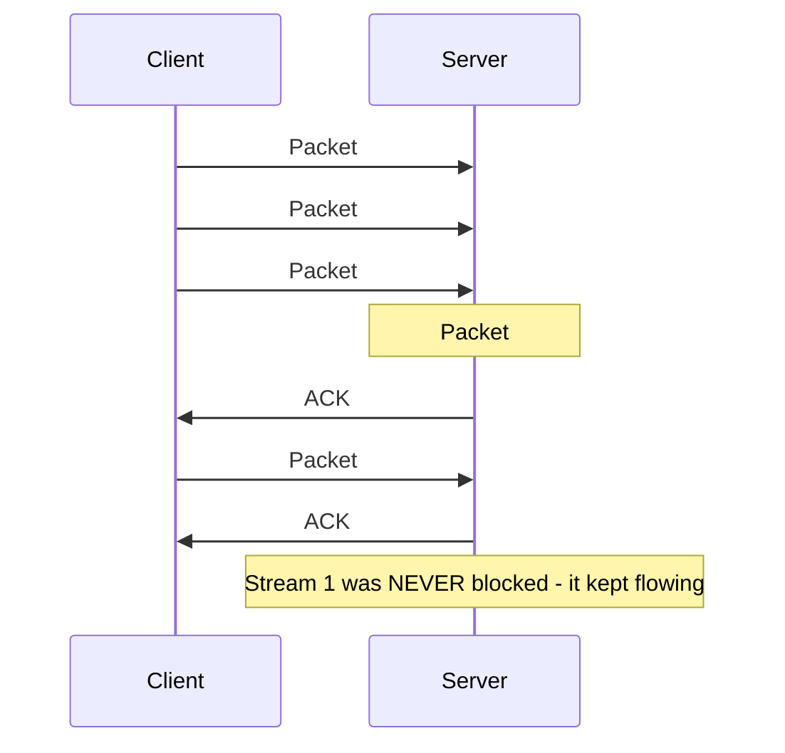

### 4. Congestion Control (in user space)

QUIC implements congestion control algorithms (default: **CUBIC** or **BBR**, same as modern TCP) entirely in user space. This means:

- It can be **updated without OS kernel patches** - just update the QUIC library.
- Different connections or applications can use different congestion control algorithms simultaneously.

### 5. Flow Control (two levels)

QUIC has flow control at **two levels**, unlike TCP which only has connection-level flow control:

| Level                | What it controls                                     |
| -------------------- | ---------------------------------------------------- |
| **Stream-level**     | How much data can be buffered per individual stream  |
| **Connection-level** | Total data across all streams on one QUIC connection |

This prevents a single fast stream from starving others, and prevents the receiver's buffer from being overwhelmed overall.

### 6. Connection Migration (no reconnect needed)

TCP identifies a connection by the 4-tuple: `src IP + src port + dst IP + dst port`. Change any one of those (e.g., switch from Wi-Fi to 4G) and TCP breaks - you need a full new handshake.

QUIC uses **Connection IDs** instead. When the network changes:

- The same Connection ID continues on the new network path.
- QUIC performs a **path validation** (sends a `PATH_CHALLENGE`, waits for `PATH_RESPONSE`) to verify the new path works.
- No new handshake, no data loss, seamless to the application.

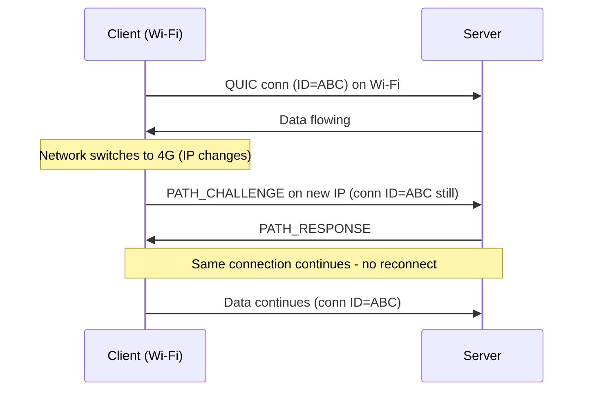

### 7. 0-RTT Resumption

For sessions that were previously established, QUIC + TLS 1.3 allows the client to send application data on the **very first packet** (0 round trips before data) using a cached session ticket. This skips the handshake entirely for returning connections.

> **Tradeoff:** 0-RTT data is vulnerable to **replay attacks** (an attacker could replay the first packet), so safe usage is limited to idempotent requests (e.g., `GET`, not `POST`).

---

## HTTP Methods

| Method    | Purpose                                                               | Safe? | Idempotent? | Has Body?                 |
| --------- | --------------------------------------------------------------------- | ----- | ----------- | ------------------------- |
| `GET`     | Retrieve a resource                                                   | Yes   | Yes         | No (request body ignored) |
| `HEAD`    | Like GET, but headers only - no response body                         | Yes   | Yes         | No                        |
| `POST`    | Create a resource / submit data                                       | No    | No          | Yes                       |
| `PUT`     | Replace a resource entirely                                           | No    | Yes         | Yes                       |
| `PATCH`   | Partially update a resource                                           | No    | No          | Yes                       |
| `DELETE`  | Remove a resource                                                     | No    | Yes         | Usually no                |
| `OPTIONS` | Ask server which methods/headers are allowed (used in CORS preflight) | Yes   | Yes         | No                        |
| `TRACE`   | Echoes back the request for debugging (rarely used, security risk)    | Yes   | Yes         | No                        |
| `CONNECT` | Establish a tunnel to the server (used for HTTPS via proxies)         | No    | No          | No                        |

- **Safe** = doesn't change server state (read-only).
- **Idempotent** = calling it once or N times has the same effect on the server (`GET`, `PUT`, `DELETE` are idempotent; `POST` and `PATCH` are not).
- **Interview trap:** `PUT` vs `POST` - `PUT` is idempotent (same request repeated = same result, e.g. "set resource to X"), `POST` is not (repeating it can create duplicates, e.g. "create a new order").

---

## HTTP Status Codes

| Class   | Range   | Meaning       | Common Codes                                                                                                                               |
| ------- | ------- | ------------- | ------------------------------------------------------------------------------------------------------------------------------------------ |
| **1xx** | 100-199 | Informational | `100 Continue`, `101 Switching Protocols`                                                                                                  |
| **2xx** | 200-299 | Success       | `200 OK`, `201 Created`, `202 Accepted`, `204 No Content`                                                                                  |
| **3xx** | 300-399 | Redirection   | `301 Moved Permanently`, `302 Found`, `304 Not Modified`, `307 Temporary Redirect`                                                         |
| **4xx** | 400-499 | Client error  | `400 Bad Request`, `401 Unauthorized`, `403 Forbidden`, `404 Not Found`, `405 Method Not Allowed`, `409 Conflict`, `429 Too Many Requests` |
| **5xx** | 500-599 | Server error  | `500 Internal Server Error`, `502 Bad Gateway`, `503 Service Unavailable`, `504 Gateway Timeout`                                           |

**Quick distinctions interviewers love to ask:**

- `401 Unauthorized` vs `403 Forbidden` - 401 = "you haven't authenticated" (no/invalid credentials), 403 = "you're authenticated, but not allowed."
- `301` vs `302` - 301 is permanent (browsers/search engines cache the redirect), 302 is temporary (re-check the original URL next time).
- `502` vs `503` vs `504` - 502 = upstream server sent an invalid response, 503 = server is overloaded/down for maintenance, 504 = upstream server took too long to respond.

---

## TCP Flags (Control Bits)

| Flag  | Name                      | Purpose                                                                                                |
| ----- | ------------------------- | ------------------------------------------------------------------------------------------------------ |
| `SYN` | Synchronize               | Initiates a connection, synchronizes sequence numbers                                                  |
| `ACK` | Acknowledge               | Confirms receipt of data/segment                                                                       |
| `FIN` | Finish                    | Politely requests connection termination (no more data to send)                                        |
| `RST` | Reset                     | Abruptly terminates a connection (e.g., port closed, error)                                            |
| `PSH` | Push                      | Tells the receiver to push buffered data to the application immediately, don't wait to fill the buffer |
| `URG` | Urgent                    | Marks data as urgent - process it ahead of the queue (rarely used today)                               |
| `ECE` | ECN-Echo                  | Signals that the network experienced congestion (Explicit Congestion Notification)                     |
| `CWR` | Congestion Window Reduced | Sender confirms it has reduced its congestion window in response to `ECE`                              |

**Connection lifecycle, flag by flag:**

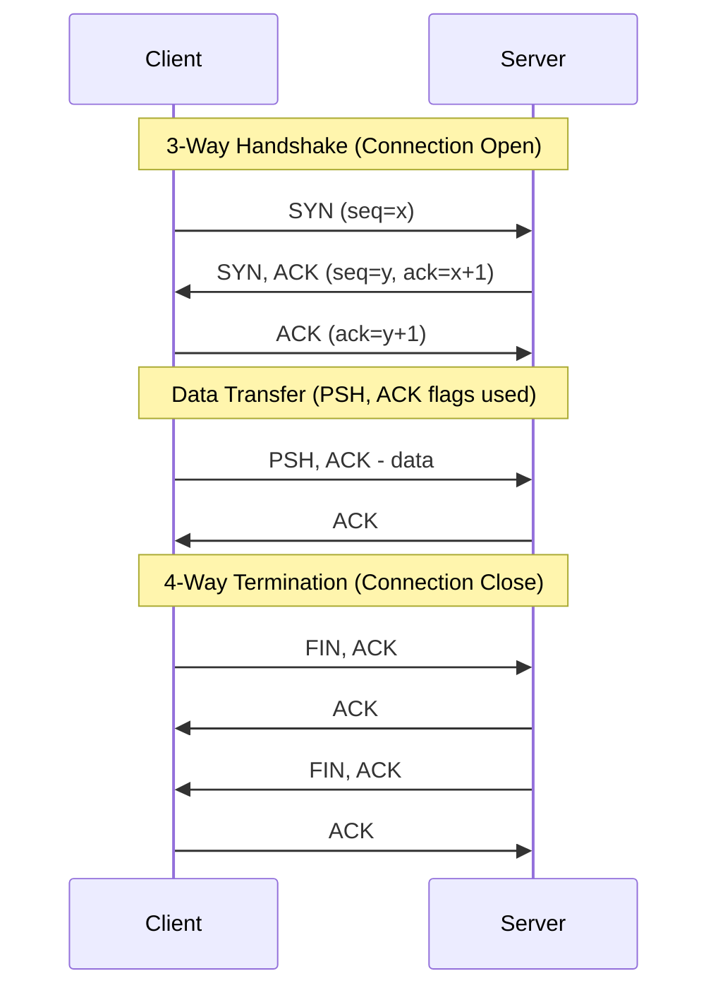

- **Handshake uses:** `SYN` -> `SYN, ACK` -> `ACK` (3-way).
- **Graceful close uses:** `FIN, ACK` from each side -> 4 messages total (sometimes optimized to 3 if combined).
- **Abrupt close uses:** a single `RST` from either side - skips the polite FIN exchange entirely (e.g., connecting to a closed port, or a crashed application).

---

## Likely Interview Questions

1. **What problem did each HTTP version solve over the previous one?**
   - 0.9 -> 1.0: added headers, status codes, methods.
   - 1.0 -> 1.1: added persistent connections, pipelining, caching, virtual hosting.
   - 1.1 -> 2: solved app-layer HOL blocking via multiplexing + binary framing.
   - 2 -> 3: solved transport-layer HOL blocking by replacing TCP with QUIC/UDP.

2. **What is Head-of-Line blocking, and at which layer does it occur in HTTP/1.1 vs HTTP/2?**
   - HTTP/1.1: application layer (pipelining stalls behind one slow response).
   - HTTP/2: transport layer (shared single TCP connection stalls on packet loss).
   - HTTP/3: solved via QUIC's independent per-stream delivery over UDP.

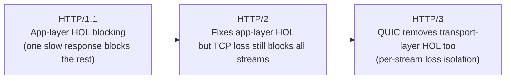

3. **Why does HTTP/3 use UDP instead of TCP?**
   - To avoid TCP's in-order, single-stream delivery guarantee, which causes HOL blocking when multiplexing. QUIC re-implements reliability and congestion control over UDP per-stream.

4. **What is HPACK and why does it matter?**
   - Header compression in HTTP/2 that reduces overhead from repetitive headers (cookies, user-agent) sent on every request.

5. **What is 0-RTT and why is it useful?**
   - Lets a client resume a previous QUIC/TLS 1.3 session and send data on the very first packet, cutting connection setup latency - especially valuable on high-latency/mobile networks.

---

## Important HTTP Request and Response Headers

### Common Request Headers

| Header            | Purpose                                                                    |
| ----------------- | -------------------------------------------------------------------------- |
| `Accept`          | Media types the client will accept (e.g., `text/html`, `application/json`) |
| `User-Agent`      | Client software info (browser name, version, OS)                           |
| `Authorization`   | Credentials for authentication (e.g., `Basic`, `Bearer <token>`)           |
| `Host`            | Domain name of the server - **mandatory in HTTP/1.1**                      |
| `Cookie`          | Stored cookies sent to the server (`name=value` pairs)                     |
| `Referer`         | URL of the page that linked to the current request                         |
| `Accept-Encoding` | Compression algorithms the client accepts (e.g., `gzip`, `deflate`, `br`)  |
| `Connection`      | Controls connection persistence (`keep-alive` or `close`)                  |

### Common Response Headers

| Header             | Purpose                                                                                                                                         |
| ------------------ | ----------------------------------------------------------------------------------------------------------------------------------------------- |
| `Content-Type`     | Media type of the response body (e.g., `text/html`, `image/png`, `application/json`)                                                            |
| `Content-Length`   | Size of the response body in bytes                                                                                                              |
| `Cache-Control`    | Caching directives: `max-age`, `no-cache`, `no-store`, `public`, `private`                                                                      |
| `ETag`             | Unique identifier for a specific version of a resource (used for cache validation)                                                              |
| `Last-Modified`    | Timestamp of when the resource was last changed                                                                                                 |
| `Set-Cookie`       | Sends cookies from server to client                                                                                                             |
| `Location`         | Used with `301`/`302` redirects to indicate the new URL                                                                                         |
| `Server`           | Software running on the origin server (e.g., `nginx/1.24`)                                                                                      |
| `Date`             | Date and time when the response was generated                                                                                                   |
| `Content-Encoding` | Compression used on the body (e.g., `gzip`) - note this is **body compression**, different from HPACK which is **header compression** in HTTP/2 |

**Interview note on compression scope:**

- `Content-Encoding: gzip` - compresses the **body** only. Works in HTTP/1.x and HTTP/2.
- **HPACK** - compresses the **headers** in HTTP/2. Not available in HTTP/1.x at all.

---

## Sources

- MDN Web Docs - Evolution of HTTP
- HTTP Archive / HPBN.co - High Performance Browser Networking
- RFC 1945, RFC 2068, RFC 2616, RFC 7540, RFC 9000, RFC 9001, RFC 9110, RFC 9112, RFC 9114
