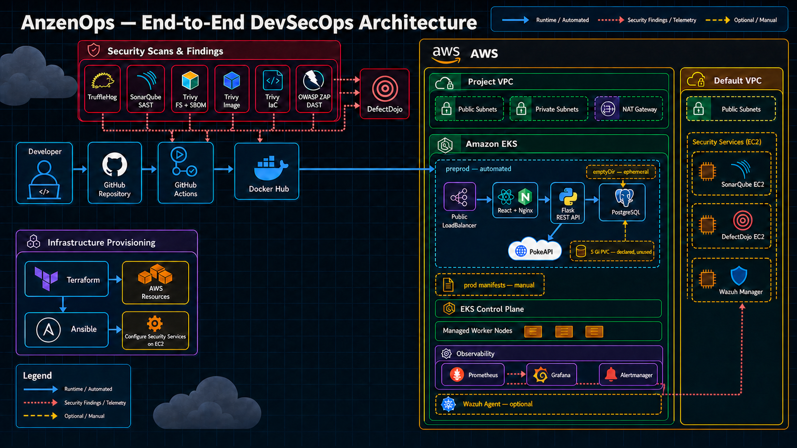

# AnzenOps architecture

AnzenOps is a three-tier React, Flask, and PostgreSQL application delivered through a security-focused GitHub Actions pipeline to AWS EKS. Terraform provisions the AWS infrastructure, Ansible configures the standalone security services, and Kubernetes runs the application and observability stack.



[Open the editable diagrams.net source](./anzenops-architecture.drawio)

## Legend and implementation notes

| Visual                  | Meaning                                                         |
| ----------------------- | --------------------------------------------------------------- |
| Solid arrow             | Runtime traffic, build dependency, or automated deployment flow |
| Fine dotted arrow       | Security findings, metrics, alerts, or runtime telemetry        |
| Long dashed amber arrow | Optional component, unused resource, or manual deployment path  |
| Blue                    | CI/CD pipeline                                                  |
| Green                   | Application runtime                                             |
| Purple                  | Monitoring and observability                                    |
| Red                     | Security tooling                                                |
| Amber                   | AWS infrastructure or an implementation caveat                  |

- The GitHub Actions workflow deploys only the `preprod` namespace. Production manifests exist, but the production workflow stage is commented out.
- Both PostgreSQL deployment manifests declare an `emptyDir` volume. Their 5 Gi PVC manifests exist but are not referenced by the pods, so database data is currently ephemeral.
- Prometheus and Grafana are installed only when `GRAFANA_ADMIN_PASSWORD` is configured. Their current data storage is also ephemeral.
- Wazuh is optional: agents run as a privileged DaemonSet on EKS nodes and communicate with the separate Wazuh EC2 manager over its public address.
- SonarQube, DefectDojo, and Wazuh are provisioned in the default VPC, separate from the project VPC used by EKS.

## Project architecture and overall flow

AnzenOps combines a three-tier web application with infrastructure automation, continuous security testing, deployment automation, vulnerability management, and runtime monitoring. The architecture is divided into four main areas:

1. **Application layer:** React and Nginx provide the user interface, Flask implements the API and application logic, and PostgreSQL stores users and Pokémon squads.
2. **Delivery layer:** GitHub Actions builds and tests the application, publishes its container images, and deploys the preproduction environment.
3. **Cloud platform layer:** Terraform provisions AWS networking, EKS, managed worker nodes, and the EC2 instances used by the security tools. Ansible installs and configures the tools on those instances.
4. **Security and observability layer:** TruffleHog, SonarQube, Trivy, OWASP ZAP, DefectDojo, Prometheus, Grafana, Alertmanager, and optionally Wazuh cover the application from source code through runtime.

### Runtime request flow

The frontend Kubernetes Service is an AWS-facing `LoadBalancer`. A normal application request follows this path:

```text
Application user
    → AWS LoadBalancer on port 80
    → React application served by Nginx
    → Nginx proxies same-origin /api requests
    → Internal Flask Service on port 5000
    → PostgreSQL Service on port 5432
```

The browser never needs to resolve the backend's Kubernetes service name. It calls `/api` on the frontend origin, and Nginx forwards the request to `http://backend:5000`. The Flask service uses SQLAlchemy to store user and squad data in PostgreSQL. When Pokémon catalogue, statistics, species, move, or sprite data is needed, Flask makes outbound HTTPS requests to PokeAPI and its sprite CDN.

Authentication is handled by the Flask API. Registration hashes the password before saving it. Login verifies the hash and returns a JWT. Protected squad endpoints require that JWT and use its identity to isolate each user's data.

### Infrastructure provisioning flow

The provisioning script runs the two independent Terraform projects in parallel:

- The **EKS project** creates the project VPC, public and private subnets, NAT gateway, EKS control plane, and managed EC2 node group.
- The **security-tools project** creates separate EC2 instances for SonarQube, DefectDojo, and Wazuh in the AWS default VPC.

After Terraform completes, the script updates kubeconfig, discovers the public addresses of the tool instances, builds an Ansible inventory, and runs the three Ansible playbooks in parallel. It then creates the SonarQube and DefectDojo API credentials used by GitHub Actions and generates the Wazuh agent manifest with the current Wazuh public address.

### CI/CD and DevSecOps flow

A push or pull request to a configured branch starts the following process:

1. **Validate:** GitHub Actions checks out the repository, verifies Docker, and validates the Docker Compose configuration.
2. **Scan secrets:** TruffleHog examines the Git history for verified leaked credentials before the application is built.
3. **Analyze source:** SonarQube performs static application security testing and code-quality analysis. Its report is imported into DefectDojo.
4. **Scan dependencies and produce an SBOM:** Trivy examines the repository and creates a CycloneDX software bill of materials. The report is stored as a workflow artifact and imported into DefectDojo.
5. **Build and test containers:** Docker Compose builds the database, backend, and frontend images. The runner starts all three and waits for the frontend readiness check to succeed.
6. **Publish:** The images are pushed to Docker Hub using GitHub secrets.
7. **Scan published images:** Trivy scans each container image, and the resulting CycloneDX reports are imported into DefectDojo.
8. **Scan infrastructure code:** Trivy checks the Terraform, Kubernetes, and container configuration for high- and critical-severity misconfigurations. Results are imported into DefectDojo.
9. **Deploy preproduction:** The workflow authenticates to AWS, discovers the EKS cluster, updates kubeconfig, and applies the `preprod` Kubernetes manifests.
10. **Run DAST:** After the public LoadBalancer becomes available, OWASP ZAP performs a baseline scan against the running frontend. Its report is saved and imported into DefectDojo.
11. **Install monitoring:** When the Grafana administrator password is configured, Helm installs Prometheus, Grafana, Alertmanager, node-exporter, and kube-state-metrics.
12. **Clean up:** The DAST job removes the temporary preproduction resources after testing. Production deployment remains a separate manual path because the production workflow and OPA security-gate jobs are currently commented out.

DefectDojo is the central record for SonarQube, SBOM, image, IaC, and ZAP results. Reimporting into stable test names enables deduplication, closes findings that no longer appear, and prevents a new test from being created on every workflow run.

## Security measures implemented

The project applies defense in depth: different controls protect source code, dependencies, container images, infrastructure definitions, the running application, credentials, and the underlying nodes.

| Security area          | Implemented measure                                                                                                           | Purpose                                                                                 |
| ---------------------- | ----------------------------------------------------------------------------------------------------------------------------- | --------------------------------------------------------------------------------------- |
| Secrets                | TruffleHog scans Git history for verified credentials                                                                         | Prevent leaked keys and tokens from reaching build or deployment stages                 |
| Source code            | SonarQube SAST and code-quality analysis                                                                                      | Detect insecure patterns, bugs, and maintainability issues before deployment            |
| Dependencies           | Trivy filesystem scan and CycloneDX SBOM                                                                                      | Identify vulnerable packages and maintain an inventory of shipped components            |
| Containers             | Trivy scans all three published Docker images                                                                                 | Detect operating-system and application-package vulnerabilities in deployable artifacts |
| Infrastructure as code | Trivy configuration scanning                                                                                                  | Find unsafe Terraform, Kubernetes, and container configuration before it is applied     |
| Running application    | OWASP ZAP baseline DAST                                                                                                       | Test the public application for runtime web vulnerabilities and unsafe HTTP behavior    |
| Findings management    | DefectDojo reimport, deduplication, and finding lifecycle management                                                          | Centralize results from different tools and make remediation trackable                  |
| Authentication         | JWT-protected Flask endpoints                                                                                                 | Require authentication before reading or updating a user's squad                        |
| Password storage       | Bcrypt password hashing                                                                                                       | Avoid storing reusable plaintext passwords in PostgreSQL                                |
| Configuration secrets  | Runtime environment variables, Kubernetes Secrets, and GitHub Actions secrets                                                 | Keep operational credentials out of application source code and container images        |
| Startup safety         | Flask fails at startup when `DATABASE_URL` or `JWT_SECRET_KEY` is missing                                                     | Prevent an accidentally unconfigured backend from running                               |
| Input controls         | Required credentials, unique usernames, list-shaped squad payloads, and a five-member squad limit                             | Reject malformed or invalid application requests                                        |
| Workload resilience    | CPU/memory requests and limits, readiness/liveness probes, and HPAs                                                           | Limit resource exhaustion, remove unhealthy pods from service, and scale during load    |
| AWS identity           | EKS IRSA support and GitHub-managed AWS credentials                                                                           | Support scoped AWS access without baking cloud credentials into images                  |
| Data at rest           | Encrypted gp3 root volumes for the security-tool EC2 instances                                                                | Protect EC2 volume data if the underlying storage is exposed                            |
| Monitoring             | Prometheus, Grafana, Alertmanager, node-exporter, and kube-state-metrics                                                      | Detect availability, resource, node, and workload anomalies                             |
| Runtime security       | Optional Wazuh agents with file-integrity monitoring, log collection, rootcheck, vulnerability detection, and active response | Detect changes and suspicious activity that build-time scanners cannot see              |

Not every scan currently blocks the pipeline. TruffleHog and failed build/deployment commands can stop execution, but the IaC scan explicitly uses a zero exit code and several report-producing scans are primarily visibility controls. DefectDojo therefore supports triage and remediation, but a future policy gate is still needed to enforce a consistent release threshold.

### Known security limitations

The project intentionally documents its current gaps instead of presenting the environment as production hardened:

- The EKS public endpoint allows `0.0.0.0/0`, and the worker and security-tool security groups currently allow broad inbound traffic. These rules should be restricted to trusted CIDRs and required ports.
- SonarQube and DefectDojo are addressed over HTTP. TLS termination and private connectivity should be added for production use.
- Kubernetes Secret manifests contain base64-encoded demonstration values. Base64 is not encryption; production secrets should come from a managed secret store or an external-secrets solution.
- Container deployments use mutable `latest` tags. Immutable image digests or versioned tags would improve provenance and rollback safety.
- The database uses `emptyDir`, while the declared PVC is unused. This causes data loss when the database pod is replaced and is unsuitable for production.
- Prometheus and Grafana persistence is disabled, so monitoring history can also be lost during pod replacement.
- Wazuh agents run privileged and mount host paths. This is necessary for the demonstrated host monitoring but increases impact if an agent is compromised; permissions should be minimized and the deployment carefully controlled.
- The `/api/zap-canary` endpoint contains intentional reflected XSS for DAST verification. It must be removed before treating the application as production safe.
- The OPA security-gate and automated production-deployment jobs are placeholders and are not active.

## Why security was necessary

Security is required because the project crosses several trust boundaries and processes assets that attackers commonly target: source code, CI/CD credentials, Docker images, a public web endpoint, cloud infrastructure, Kubernetes nodes, user passwords, JWTs, and database records. A weakness in any one layer can become a path into the others.

### Protecting users and application data

The application stores login credentials and user-specific squad data. Without password hashing, authentication, and authorization, an attacker could recover passwords, impersonate users, or read and modify another user's records. Bcrypt reduces the usefulness of a stolen password database, while JWT-protected endpoints ensure that squad operations are associated with an authenticated identity.

### Protecting the software supply chain

Modern applications include code from package registries, base container images, build actions, and external services. A vulnerability does not have to originate in this repository to affect the deployed system. SBOM generation plus dependency and image scanning improve visibility into what is built and deployed. Secret scanning also prevents an accidentally committed cloud key or API token from becoming a direct infrastructure compromise.

### Protecting cloud and Kubernetes infrastructure

Terraform and Kubernetes make infrastructure repeatable, but they also make unsafe settings repeatable. A single permissive security group, exposed service, privileged container, or missing resource boundary can affect every deployment. IaC scanning identifies these problems before provisioning, while Kubernetes probes, resource limits, namespaces, and autoscaling reduce the operational impact of unhealthy or overloaded workloads.

### Finding different classes of vulnerability

No single security tool can see the entire system:

- SAST examines code without running it.
- Dependency and image scans examine known vulnerable components.
- IaC scanning examines deployment configuration.
- DAST tests the behavior of the live public application.
- Runtime monitoring observes changes and attacks after deployment.

Using these controls together reduces blind spots. For example, SonarQube may identify an unsafe code pattern, but ZAP can demonstrate whether it is exploitable through HTTP, while Wazuh can detect suspicious changes that occur only after a pod or node is running.

### Reducing remediation cost and deployment risk

Finding a leaked secret or vulnerable dependency during CI is faster and safer than discovering it after production deployment. Automated checks give developers feedback close to the change that introduced the problem. Centralizing reports in DefectDojo also provides ownership, deduplication, historical visibility, and a measurable remediation process instead of leaving separate reports scattered across workflow logs.

The objective is therefore not only to add scanning tools. It is to make security part of the delivery lifecycle: prevent obvious issues early, verify the built artifacts, test the deployed application, observe the running environment, and retain the findings needed to improve the next release.
