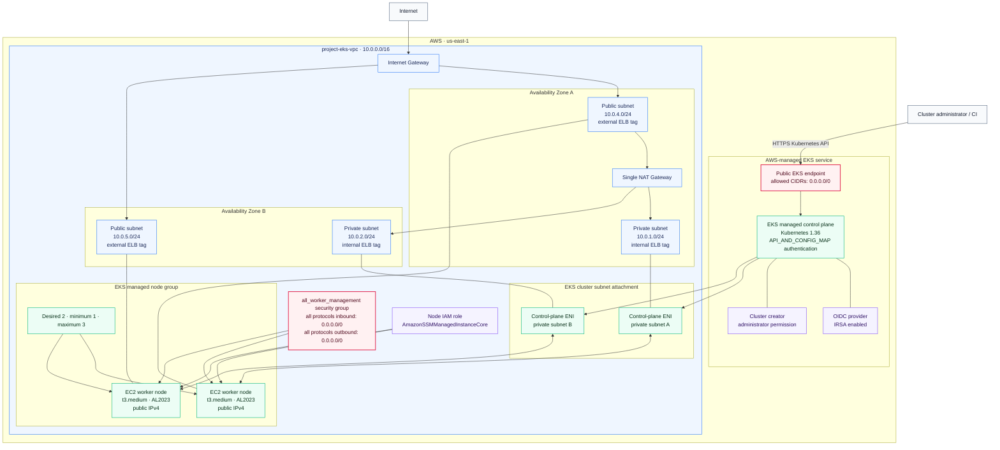

# Amazon EKS infrastructure architecture

This diagram documents the infrastructure created by [`infra/terraform/eks`](../infra/terraform/eks/). It represents the current Terraform configuration, including its public-access settings and worker-node placement.

[Open the editable diagrams.net source](./eks-architecture.drawio)

## Architecture summary

- Terraform creates the VPC from `10.0.0.0/16` across two availability zones, with two public and two private `/24` subnets.
- The VPC module creates one shared NAT gateway. Private-subnet egress therefore depends on that single gateway and its availability zone.
- The EKS module attaches the cluster to the two private subnets. AWS places the control-plane networking interfaces in those subnets.
- Both public and private EKS API access are enabled. The public endpoint currently accepts connections from `0.0.0.0/0`.
- The managed node group overrides the cluster subnet selection and runs in the two public subnets. Nodes receive public IP addresses.
- The node group uses Amazon Linux 2023, `t3.medium` instances, a desired size of two, and a scaling range of one to three nodes.
- Public subnets are tagged for external load balancers; private subnets are tagged for internal load balancers.
- IRSA is enabled through the cluster OIDC provider. The worker-node IAM role also receives `AmazonSSMManagedInstanceCore`.
- DNS support, DNS hostnames, and public-IP mapping are enabled for the VPC.

## Security observations

The drawing intentionally includes the current permissive settings. For a production environment, restrict the EKS public endpoint to trusted CIDRs or use private access only, move worker nodes to private subnets, and replace the worker security group's unrestricted inbound rule with the minimum ports and sources required by EKS and the deployed workloads.
