# Prometheus and Grafana integration with Amazon EKS

AnzenOps deploys Prometheus, Grafana, and Alertmanager into the EKS cluster using the `kube-prometheus-stack` Helm chart. These components run in the dedicated `monitoring` namespace and observe the cluster, worker nodes, Kubernetes resources, and deployed workloads.

## Integration architecture

```mermaid
flowchart TB
    ADMIN[Administrator]
    NLB[AWS internet-facing NLB]

    subgraph EKS[Amazon EKS cluster]
        direction TB

        subgraph APP[Application namespaces]
            FE[Frontend pods]
            BE[Backend pods]
            DB[PostgreSQL pod]
        end

        subgraph NODES[EKS worker nodes]
            NODEEXP[node-exporter DaemonSet]
            KUBELET[Kubelet metrics]
        end

        KAPI[Kubernetes API server]

        subgraph MON[monitoring namespace]
            KSM[kube-state-metrics]
            PROM[Prometheus]
            GRAFANA[Grafana Service and Pod]
            ALERT[Alertmanager]
            OPERATOR[Prometheus Operator]

            OPERATOR -->|manages| PROM
            NODEEXP -. host metrics .-> PROM
            KUBELET -. container and node metrics .-> PROM
            KAPI -. cluster API metrics .-> PROM
            KSM -. Kubernetes object metrics .-> PROM
            FE -. workload health .-> PROM
            BE -. workload health .-> PROM
            DB -. workload health .-> PROM
            PROM -->|PromQL data source| GRAFANA
            PROM -->|firing alerts| ALERT
        end
    end

    ADMIN -->|HTTP| NLB
    NLB --> GRAFANA

    classDef aws fill:#fff7ed,stroke:#f59e0b,color:#431407;
    classDef monitor fill:#f5f3ff,stroke:#8b5cf6,color:#2e1065;
    classDef app fill:#ecfdf5,stroke:#10b981,color:#052e16;
    classDef external fill:#f8fafc,stroke:#64748b,color:#0f172a;

    class NLB aws;
    class PROM,GRAFANA,ALERT,OPERATOR,KSM,NODEEXP monitor;
    class FE,BE,DB,KUBELET,KAPI app;
    class ADMIN external;
```



## Deployment flow

Monitoring is deployed after the application has been installed in the `preprod` namespace. The `Deploy_Monitoring` GitHub Actions job performs the following steps:

1. Authenticates with AWS using GitHub Actions secrets.
2. Discovers the EKS cluster and updates kubeconfig.
3. Checks whether `GRAFANA_ADMIN_PASSWORD` is configured.
4. Installs Helm.
5. Runs [`deploy_monitoring.sh`](../deploy_monitoring.sh).
6. Runs [`verify_monitoring.sh`](../verify_monitoring.sh) to check Prometheus and Grafana.

If the Grafana password secret is missing, the workflow skips the monitoring deployment instead of installing Grafana with an unknown password.

The deployment script creates the namespace and Grafana credentials:

```bash
kubectl create namespace monitoring \
  --dry-run=client -o yaml | kubectl apply -f -

kubectl create secret generic grafana-admin-secret \
  --namespace monitoring \
  --from-literal=admin-user="$GRAFANA_ADMIN_USER" \
  --from-literal=admin-password="$GRAFANA_ADMIN_PASSWORD" \
  --dry-run=client -o yaml | kubectl apply -f -
```

It then installs or upgrades the monitoring stack:

```bash
helm upgrade --install monitoring \
  prometheus-community/kube-prometheus-stack \
  --namespace monitoring \
  --version 62.7.0 \
  -f k8s/monitoring/monitoring-values.yaml \
  --wait \
  --timeout 10m
```

The Helm configuration is stored in [`monitoring-values.yaml`](../k8s/monitoring/monitoring-values.yaml).

## Components installed in EKS

### Prometheus Operator

The Prometheus Operator manages Prometheus, Alertmanager, monitoring rules, and scrape-target definitions. It uses Kubernetes custom resources such as `ServiceMonitor`, `PodMonitor`, and `PrometheusRule` to configure monitoring through Kubernetes-native objects.

### Prometheus

Prometheus performs the main monitoring work:

1. Discovers metric targets in the cluster.
2. Scrapes the targets over HTTP at regular intervals.
3. Stores the returned values as time-series data.
4. answers PromQL queries from Grafana and administrators.
5. Evaluates alerting rules.
6. Sends firing alerts to Alertmanager.

Prometheus is configured with a 15-day retention period and the following resource boundaries:

```yaml
resources:
  requests:
    cpu: 250m
    memory: 512Mi
  limits:
    cpu: "1"
    memory: 1Gi
```

The selectors allow `ServiceMonitor`, `PodMonitor`, and rule resources to be discovered across namespaces:

```yaml
serviceMonitorSelectorNilUsesHelmValues: false
podMonitorSelectorNilUsesHelmValues: false
ruleSelectorNilUsesHelmValues: false
```

### node-exporter

The chart deploys node-exporter as a DaemonSet, which means one exporter runs on each EKS worker node. It exposes host-level metrics including:

- CPU utilization and load.
- Memory usage.
- Filesystem capacity and usage.
- Disk I/O.
- Network traffic.
- Operating-system statistics.

Prometheus scrapes every node-exporter instance and stores the results.

### kube-state-metrics

`kube-state-metrics` queries the Kubernetes API and converts Kubernetes object state into Prometheus metrics. It provides information about:

- Nodes, namespaces, and pods.
- Deployments, ReplicaSets, and StatefulSets.
- Desired and available replicas.
- Container states and restart counts.
- Resource requests and limits.
- Services and persistent volumes.
- Horizontal Pod Autoscaler state.

This is different from node-exporter: node-exporter reports operating-system measurements, while kube-state-metrics reports the declared and observed state of Kubernetes resources.

### Managed EKS components

AWS manages the EKS scheduler, controller manager, and etcd outside the worker-node environment. Their endpoints are not directly available in the same way as self-managed Kubernetes control-plane endpoints, so the configuration disables those scrape targets:

```yaml
kubeEtcd:
  enabled: false

kubeControllerManager:
  enabled: false

kubeScheduler:
  enabled: false
```

Prometheus can still collect accessible API-server, kubelet, node, Kubernetes-object, and workload information.

## Grafana integration

Grafana does not collect the metrics directly. The chart provisions Prometheus as a Grafana data source, and Grafana sends PromQL queries to Prometheus when a user opens or refreshes a dashboard.

```text
EKS targets → Prometheus storage → PromQL query → Grafana visualization
```

The Grafana sidecars automatically discover:

- Provisioned data-source definitions.
- Dashboard ConfigMaps labeled `grafana_dashboard=1`.
- Matching dashboards from any namespace.

The repository documents loading the Node Exporter Full dashboard from a local ConfigMap. This avoids downloading dashboard JSON from the internet whenever the Grafana pod starts.

## Accessing Grafana

Grafana is exposed through an internet-facing AWS Network Load Balancer:

```yaml
grafana:
  service:
    type: LoadBalancer
    annotations:
      service.beta.kubernetes.io/aws-load-balancer-type: "nlb"
      service.beta.kubernetes.io/aws-load-balancer-scheme: "internet-facing"
```

The access flow is:

```text
Administrator
    → AWS Network Load Balancer
    → monitoring-grafana Kubernetes Service
    → Grafana pod
    → Prometheus Service
```

The deployment script waits for the LoadBalancer hostname and displays it with:

```bash
kubectl get svc monitoring-grafana \
  --namespace monitoring \
  --output jsonpath='{.status.loadBalancer.ingress[0].hostname}'
```

Grafana retrieves its administrator username and password from `grafana-admin-secret`. The credentials are not stored directly in the Helm values file.

## Alertmanager integration

Prometheus sends alerts produced by its rules to Alertmanager:

```text
Prometheus rule evaluation
    → Firing alert
    → Alertmanager
    → Configured notification receiver
```

Alertmanager groups related alerts, removes duplicates, supports silencing, and routes notifications. The stack installs Alertmanager, but the current repository does not configure an external receiver such as email, Slack, or PagerDuty.

## Verification

The monitoring verification script checks the namespace resources, Prometheus Services, and the Grafana LoadBalancer address. It then forwards the Prometheus Service to local port `9090`:

```bash
kubectl port-forward \
  --namespace monitoring \
  svc/monitoring-prometheus \
  9090:9090
```

The script verifies Prometheus readiness:

```text
http://localhost:9090/-/ready
```

It also executes the PromQL `up` query:

```text
http://localhost:9090/api/v1/query?query=up
```

A successful `up` query confirms that Prometheus is running and has discovered scrape targets.

## Relationship to the application

The current stack monitors whether the frontend, backend, and database Kubernetes workloads are healthy and provides their Kubernetes resource information. However, the Flask application does not currently expose a Prometheus `/metrics` endpoint, and the project does not define an application-specific `ServiceMonitor`.

As a result, Prometheus does not currently collect application-level measurements such as:

- HTTP request rate.
- API response latency.
- HTTP error rate.
- Login failures.
- Database query duration.
- PokeAPI request duration or failures.

Adding those metrics would require instrumenting Flask with a Prometheus client, exposing a metrics endpoint, and creating a `ServiceMonitor` for the backend Service.

## Relationship to the HPAs

The frontend and backend HPAs use Kubernetes CPU and memory resource metrics. They do not query this Prometheus instance.

The HPA path is normally:

```text
Kubelet resource usage
    → Kubernetes Metrics Server
    → metrics.k8s.io API
    → Horizontal Pod Autoscaler
```

`kube-prometheus-stack` does not install Kubernetes Metrics Server, and the repository does not currently provision it. Metrics Server must therefore be installed separately for the resource-based HPAs to receive CPU and memory measurements.

## Current limitations and production improvements

- **Ephemeral Prometheus storage:** the configured 15-day retention applies only while the Prometheus pod's temporary storage remains available. Enable a persistent volume for durable history.
- **Ephemeral Grafana storage:** dashboards and local Grafana state can be lost when the pod is replaced. Enable persistence or keep all dashboards under configuration management.
- **Ephemeral Alertmanager storage:** silences and runtime state can be lost during pod replacement.
- **Public Grafana access:** Grafana is exposed through an internet-facing NLB over HTTP. Production should use TLS, restricted network access, and preferably an authenticated ingress or private access path.
- **No application instrumentation:** add Flask metrics and a `ServiceMonitor` for request-level observability.
- **No external alert receiver:** configure a tested email, Slack, PagerDuty, or equivalent notification route.
- **No Metrics Server deployment:** install Metrics Server so the existing CPU- and memory-based HPAs can function.
