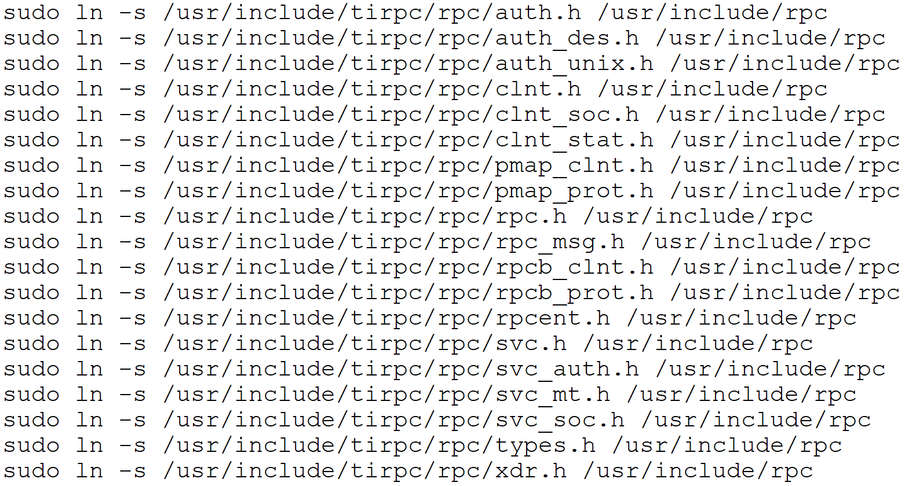

Your notes are correct but contain many typos, incorrect paths, and missing commands. Below is the **complete practical** in the correct sequence with **theory, commands, explanations, and testing**.

---

# Practical: Installing and Configuring Snort IDS on Debian Linux

## Aim

To install and configure **Snort IDS (Intrusion Detection System)** on Debian Linux and detect attacks generated from another Debian machine.

---

# Lab Scenario

| Machine   | OS     | Purpose   |
| --------- | ------ | --------- |
| Machine 1 | Debian | Snort IDS |
| Machine 2 | Debian | Attacker  |

```
+----------------------+              +----------------------+
| Debian (Attacker)    | -----------> | Debian (Snort IDS)   |
|                      |   Network    | Snort Monitoring     |
+----------------------+              +----------------------+
```

---

# Theory

### What is Snort?

Snort is an **Open Source Network Intrusion Detection System (NIDS)**.

It monitors network packets and compares them with predefined rules.

If a packet matches a rule, Snort generates an alert.

---

## Snort Working

```
Network Traffic

        ↓

Network Interface

        ↓

Packet Decoder

        ↓

Preprocessors

        ↓

Detection Engine

        ↓

Rules Match?

      ↓ Yes

Generate Alert

      ↓

Log File / Console
```

---

# Step 1 : Update System

```bash
sudo apt update
```

---

# Step 2 : Install Dependencies

```bash
sudo apt-get install -y \
bison \
ca-certificates \
flex \
gcc \
libdumbnet-dev \
libluajit-5.1-dev \
libnghttp2-dev \
libpcap-dev \
libpcre3-dev \
libssl-dev \
make \
openssl \
wget \
zlib1g-dev \
libtirpc-dev
```

Verify packages

```bash
dpkg -l | grep libpcap
```

---

# Step 3 : Create Source Directory

```bash
sudo mkdir -p /usr/src/snort_src
cd /usr/src/snort_src
```

Check

```bash
ls -l
```

Initially directory will be empty.

---

# Step 4 : Download Source Files

Copy the following files into

```
/usr/src/snort_src
```

Example

```
daq-2.0.7.tar.gz

snort-2.9.xx.tar.gz
```

Check

```bash
ls
```

---

# Step 5 : Install DAQ

Extract

```bash
sudo tar -xzf daq-2.0.7.tar.gz
```

Go inside

```bash
cd daq-2.0.7
```

Configure

```bash
./configure
```

Compile

```bash
make
```

Install

```bash
sudo make install
```

---

# Step 6 : Load DAQ Library

Load shared libraries

```bash
sudo ldconfig
```

Verify

```bash
sudo ldconfig -p | grep daq
```

Expected

```
libdaq.so
```

If nothing appears, DAQ installation failed.

---

# Step 7 : Create Required Soft Links (if required) Required for Snort



```
sudo ln -s /usr/include/tirpc/rpc/auth.h /usr/include/rpc
sudo ln -s /usr/include/tirpc/rpc/auth_des.h /usr/include/rpc
sudo ln -s /usr/include/tirpc/rpc/auth_unix.h /usr/include/rpc
sudo ln -s /usr/include/tirpc/rpc/clnt.h /usr/include/rpc
sudo ln -s /usr/include/tirpc/rpc/clnt_soc.h /usr/include/rpc
sudo ln -s /usr/include/tirpc/rpc/clnt_stat.h /usr/include/rpc
sudo ln -s /usr/include/tirpc/rpc/pmap_clnt.h /usr/include/rpc
sudo ln -s /usr/include/tirpc/rpc/pmap_prot.h /usr/include/rpc
sudo ln -s /usr/include/tirpc/rpc/rpc.h /usr/include/rpc
sudo ln -s /usr/include/tirpc/rpc/rpc_msg.h /usr/include/rpc
sudo ln -s /usr/include/tirpc/rpc/rpcb_clnt.h /usr/include/rpc
sudo ln -s /usr/include/tirpc/rpc/rpcb_prot.h /usr/include/rpc
sudo ln -s /usr/include/tirpc/rpc/rpcent.h /usr/include/rpc
sudo ln -s /usr/include/tirpc/rpc/svc.h /usr/include/rpc
sudo ln -s /usr/include/tirpc/rpc/svc_auth.h /usr/include/rpc
sudo ln -s /usr/include/tirpc/rpc/svc_mt.h /usr/include/rpc
sudo ln -s /usr/include/tirpc/rpc/svc_soc.h /usr/include/rpc
sudo ln -s /usr/include/tirpc/rpc/types.h /usr/include/rpc
sudo ln -s /usr/include/tirpc/rpc/xdr.h /usr/include/rpc
```

Some systems require RPC/TIRPC symbolic links.

Check existing links

```bash
ls -l /usr/include/tirpc/netconfig.h /usr/include/netconfig.h
```

```bash
ls -l /usr/include/tirpc/rpc/auth.h /usr/include/rpc
```

If missing

```bash
sudo ln -s /usr/include/tirpc/netconfig.h /usr/include/netconfig.h
```

```bash
sudo ln -s /usr/include/tirpc/rpc /usr/include/rpc
```

Verify

```bash
ls -l /usr/include/netconfig.h
```

```bash
ls -l /usr/include/rpc
```

---

# Step 8 : Install Snort

Go back

```bash
cd /usr/src/snort_src
```

Extract

```bash
sudo tar -xzf snort-2.9.xx.tar.gz
```

Go inside

```bash
cd snort-2.9.*
```

Configure

```bash
./configure --enable-sourcefire
```

Compile

```bash
make
```

Install

```bash
sudo make install
```

---

# Step 9 : Verify Installation

Refresh libraries

```bash
sudo ldconfig
```

Check version

```bash
snort -V
```

Expected

```
Version 2.9.x
```

---

# Step 10 : Detect Network Interface

```bash
snort -i
```

or

```bash
ip addr
```

Example interface

```
ens33
```

---

# Step 11 : Create Snort User

Create group

```bash
sudo groupadd snort
```

Create user

```bash
sudo useradd snort -r -s /usr/sbin/nologin -c SNORT_IDS -g snort (sudo useradd -r -g snort snort)
```

---

# Step 12 : Create Required Directories

```bash
sudo mkdir -p /etc/snort/rules
```

```bash
sudo mkdir -p /etc/snort/preproc_rules
```

```bash
sudo mkdir -p /etc/snort/so_rules
```

```bash
sudo mkdir -p /var/log/snort
```

```bash
sudo mkdir -p /usr/local/lib/snort_dynamicrules
```

---

# Step 13 : Copy Configuration Files

```bash
sudo cp /usr/src/snort_src/snort-2.9*/etc/*.conf /etc/snort/
```

```bash
sudo cp /usr/src/snort_src/snort-2.9*/etc/*.map /etc/snort/
```

---

# Step 14 : Create Rule Files

```bash
sudo touch /etc/snort/rules/local.rules
```

```bash
sudo touch /etc/snort/rules/white_list.rules
```

```bash
sudo touch /etc/snort/rules/black_list.rules
```

---

# Step 15 : Set Permissions

```bash
sudo chmod -R 5775 /etc/snort
```

```bash
sudo chmod -R 5775 /var/log/snort
```

```bash
sudo chmod -R 5775 /usr/local/lib/snort_dynamicrules
```

Ownership

```bash
sudo chown -R snort:snort /etc/snort
```

```bash
sudo chown -R snort:snort /var/log/snort
```

```bash
sudo chown -R snort:snort /usr/local/lib/snort_dynamicrules
```

---

# Step 16 : Edit Snort Configuration

```bash
sudo vi /etc/snort/snort.conf
```

Find and edit

```
var RULE_PATH /etc/snort/rules

var SO_RULE_PATH /etc/snort/so_rules

var PREPROC_RULE_PATH /etc/snort/preproc_rules

var WHITE_LIST_PATH /etc/snort/rules

var BLACK_LIST_PATH /etc/snort/rules
```

Go to

```
Step #7
```

Keep only

```
include $RULE_PATH/local.rules

include $RULE_PATH/white_list.rules

include $RULE_PATH/black_list.rules
```

Comment or remove all other rule includes.

Save

```
:wq
```

---

# Step 17 : Create Local Rule

```bash
sudo vi /etc/snort/rules/local.rules
```

Example rule

```snort
alert icmp any any -> any any (msg:"ICMP Ping Detected"; sid:1000001; rev:1;)
```

Save

```
:wq
```

---

# Step 18 : Test Configuration

```bash
sudo snort -i ens33 -c /etc/snort/snort.conf -u snort -g snort -T
```

Expected

```
Snort successfully validated the configuration
```

---

# Step 19 : Run Snort in IDS Mode

```bash
sudo snort -i ens33 \
-c /etc/snort/snort.conf \
-u snort \
-g snort \
-A console
```

Snort starts monitoring packets.

---

# Step 20 : Generate Attack (Attacker Machine)

Ping IDS machine

```bash
ping <IDS-IP>
```

Example

```bash
ping 192.168.1.10
```

---

# Step 21 : Observe Detection

Snort console

```
[**]

ICMP Ping Detected

[**]
```

---

# Common Commands

Check version

```bash
snort -V
```

Show interfaces

```bash
snort -i
```

Test configuration

```bash
sudo snort -T -c /etc/snort/snort.conf
```

Run IDS

```bash
sudo snort -i ens33 -c /etc/snort/snort.conf -A console
```

---

# Common Errors

| Error                      | Solution                                                           |
| -------------------------- | ------------------------------------------------------------------ |
| `daq library not found`    | Run `sudo ldconfig` and verify with `sudo ldconfig -p \| grep daq` |
| `snort.conf not found`     | Ensure configuration files are copied to `/etc/snort/`             |
| `local.rules not found`    | Create `/etc/snort/rules/local.rules`                              |
| `permission denied`        | Run the `chmod` and `chown` commands correctly                     |
| `No such interface`        | Check interface name using `snort -i` or `ip addr`                 |
| `RPC/TIRPC header missing` | Install `libtirpc-dev` and create symbolic links if needed         |

This version corrects the command syntax, file paths (`/etc` instead of `/ect`, `/usr/src/snort_src` instead of mixed names), directory names (`snort_dynamicrules`), and includes the complete flow from installation through testing in IDS mode.

# commands

```text
# ============================================
# STEP 1 : Update System
# ============================================

sudo apt update

# ============================================
# STEP 2 : Install Dependencies
# ============================================

sudo apt-get install -y \
bison \
ca-certificates \
flex \
gcc \
libdumbnet-dev \
libluajit-5.1-dev \
libnghttp2-dev \
libpcap-dev \
libpcre3-dev \
libssl-dev \
make \
openssl \
wget \
zlib1g-dev \
libtirpc-dev

# Verify installed package
dpkg -l | grep libpcap

# ============================================
# STEP 3 : Create Source Directory
# ============================================

sudo mkdir -p /usr/src/snort_src
cd /usr/src/snort_src
ls -l

# ============================================
# STEP 4 : Copy Source Files
# ============================================

# Copy the following files into /usr/src/snort_src
# daq-2.0.7.tar.gz
# snort-2.9.xx.tar.gz

ls

# ============================================
# STEP 5 : Install DAQ
# ============================================

sudo tar -xzf daq-2.0.7.tar.gz
cd daq-2.0.7

./configure
make
sudo make install

# ============================================
# STEP 6 : Load DAQ Library
# ============================================

sudo ldconfig
sudo ldconfig -p | grep daq

# ============================================
# STEP 7 : Create Soft Links (Only if Required)
# ============================================

ls -l /usr/include/tirpc/netconfig.h /usr/include/netconfig.h
ls -l /usr/include/tirpc/rpc/auth.h /usr/include/rpc

sudo ln -s /usr/include/tirpc/netconfig.h /usr/include/netconfig.h
sudo ln -s /usr/include/tirpc/rpc /usr/include/rpc

ls -l /usr/include/netconfig.h
ls -l /usr/include/rpc

# ============================================
# STEP 8 : Install Snort
# ============================================

cd /usr/src/snort_src

sudo tar -xzf snort-2.9.xx.tar.gz
cd snort-2.9*

./configure --enable-sourcefire
make
sudo make install

# ============================================
# STEP 9 : Verify Installation
# ============================================

sudo ldconfig
snort -V

# ============================================
# STEP 10 : Detect Network Interface
# ============================================

snort -i

# OR

ip addr

# ============================================
# STEP 11 : Create Snort User
# ============================================

sudo groupadd snort

sudo useradd snort -r -s /usr/sbin/nologin -c SNORT_IDS -g snort

# ============================================
# STEP 12 : Create Required Directories
# ============================================

sudo mkdir -p /etc/snort/rules
sudo mkdir -p /etc/snort/preproc_rules
sudo mkdir -p /etc/snort/so_rules
sudo mkdir -p /var/log/snort
sudo mkdir -p /usr/local/lib/snort_dynamicrules

# ============================================
# STEP 13 : Copy Configuration Files
# ============================================

sudo cp /usr/src/snort_src/snort-2.9*/etc/*.conf /etc/snort/
sudo cp /usr/src/snort_src/snort-2.9*/etc/*.map /etc/snort/

# ============================================
# STEP 14 : Create Rule Files
# ============================================

sudo touch /etc/snort/rules/local.rules
sudo touch /etc/snort/rules/white_list.rules
sudo touch /etc/snort/rules/black_list.rules

# ============================================
# STEP 15 : Set Permissions
# ============================================

sudo chmod -R 5775 /etc/snort
sudo chmod -R 5775 /var/log/snort
sudo chmod -R 5775 /usr/local/lib/snort_dynamicrules

sudo chown -R snort:snort /etc/snort
sudo chown -R snort:snort /var/log/snort
sudo chown -R snort:snort /usr/local/lib/snort_dynamicrules

# ============================================
# STEP 16 : Edit Snort Configuration
# ============================================

sudo vi /etc/snort/snort.conf

# Change these variables:

var RULE_PATH /etc/snort/rules
var SO_RULE_PATH /etc/snort/so_rules
var PREPROC_RULE_PATH /etc/snort/preproc_rules

var WHITE_LIST_PATH /etc/snort/rules
var BLACK_LIST_PATH /etc/snort/rules

# Keep only these includes:

include $RULE_PATH/local.rules
include $RULE_PATH/white_list.rules
include $RULE_PATH/black_list.rules

:wq

# ============================================
# STEP 17 : Create Local Rule
# ============================================

sudo vi /etc/snort/rules/local.rules

# Add rule:

alert icmp any any -> any any (msg:"ICMP Ping Detected"; sid:1000001; rev:1;)

:wq

# ============================================
# STEP 18 : Test Configuration
# ============================================

sudo snort -T -c /etc/snort/snort.conf

# ============================================
# STEP 19 : Run Snort in IDS Mode
# ============================================

sudo snort -i ens33 -u snort -g snort -c /etc/snort/snort.conf -A console

# ============================================
# STEP 20 : Attacker Machine
# ============================================

ping <Snort-IP>

# Example

ping 192.168.1.10

# ============================================
# Useful Commands
# ============================================

snort -V
snort -i
ip addr
sudo ldconfig
sudo ldconfig -p | grep daq
sudo snort -T -c /etc/snort/snort.conf
sudo snort -i ens33 -c /etc/snort/snort.conf -A console
```
